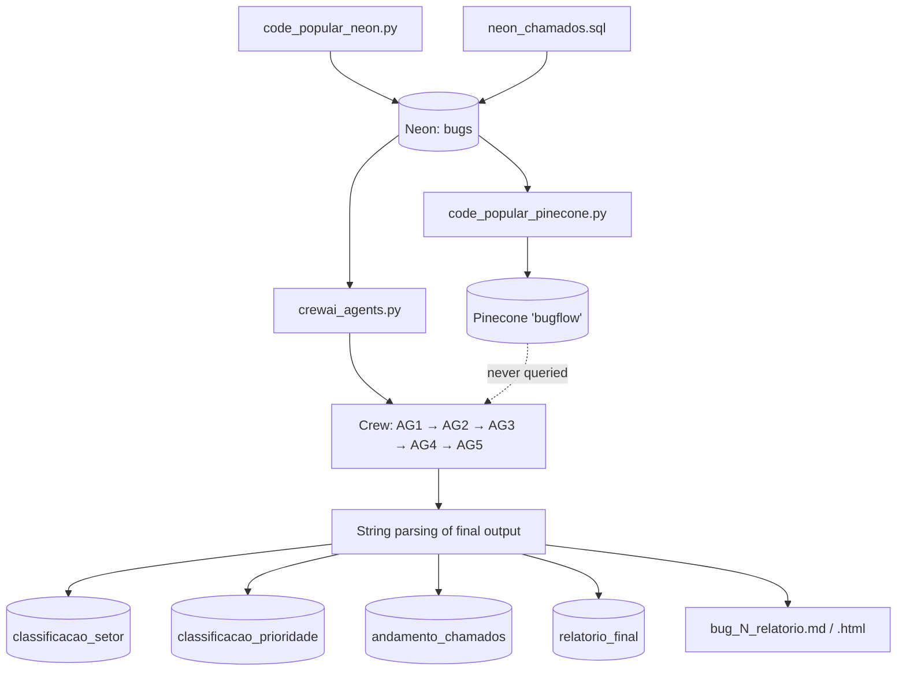

# Analysis of the Original Project ("BugFlow Multi Agents")

> Reference document. It describes the legacy Portuguese project in `project-three/`, what it does, what is wrong with it, and how the new specs address each problem. **Do not copy this file into the new repository.** It quotes Portuguese identifiers that should not leak into the English codebase.

---

## 1. What the Project Does

BugFlow is a Python command-line pipeline that triages software bugs with AI agents:

1. Bugs are stored in a PostgreSQL database hosted on **Neon**.
2. A script embeds the open bugs with OpenAI and stores the vectors in **Pinecone**.
3. The main script (`agents/crewai_agents.py`) loads every bug with status `Aberto` (open) and runs a **CrewAI** crew of five sequential agents:
   - **AG1** classifies the affected component (Frontend, Backend, Database, DevOps, Security, Integration, UI/UX, Infrastructure).
   - **AG2** classifies severity (Critico, Grave, Menor → critical, major, minor).
   - **AG3** writes a technical analysis (root cause, impact, debugging, solution, side effects).
   - **AG4** creates a resolution plan (status, developer, team, deadline, priority).
   - **AG5** writes documentation in Markdown and HTML with a Mermaid diagram.
4. The results are parsed from the crew output, inserted into several tables, and written to `bug_<id>_relatorio.md` / `.html`. The bug is marked `Processado`, or `Erro` on failure.
5. `tools/reprocessar_bug.py <id>` deletes a bug's results and reopens it.

## 2. File Inventory

| File | Role | State |
|---|---|---|
| `agents/crewai_agents.py` | Main pipeline: agents, tasks, parsing, persistence, file output | Works end to end, but with critical defects (section 4) |
| `tools/code_popular_neon.py` | Drops and creates `bugs`, inserts 20 sample bugs | Drops tables that don't exist in the SQL file |
| `tools/neon_chamados.sql` | DDL for `bugs` and 5 result tables | Conflicts with the populate script |
| `tools/code_popular_pinecone.py` | Embeds **open** bugs (ada-002) and upserts to Pinecone | Works; its output is never used |
| `tools/tool_pinecone.py` | Index and search helpers | Uses the removed pre-1.0 OpenAI API (`openai.Embedding.create`) |
| `tools/reprocessar_bug.py` | Reopens a bug and deletes its results | Guesses foreign-key columns by name |
| `teste_crewai_agents.py` | CrewAI + LangGraph prototype | Non-functional prototype |
| `teste-neon.py`, `teste_openai.py` | Connectivity tests | `teste-neon.py` prints the full DB URL, including the password |
| `bug_{1..4}_relatorio.md/.html` | Generated reports | All four describe **invented** bugs (section 4, C1) |
| `processo_diagrama.md`, `visualizar_diagrama.html` | Architecture diagram | The HTML diagram has a duplicate node ID and a style for an undefined node |
| `README.md` | Setup and usage documentation | Broken code fence; table names that don't match the code |
| `requirements.txt` | Dependencies | Includes unused `langgraph`, `matplotlib`, `networkx`, `langchain` agents, and `uv` itself |

## 3. Architecture (as built)



## 4. Defects Found

Severity: **C** = critical (wrong results), **H** = high, **M** = medium, **L** = low.

| ID | Sev. | Defect | Evidence | Addressed by |
|---|---|---|---|---|
| C1 | C | **The agents never receive the bug.** CrewAI only interpolates `kickoff(inputs=...)` into `{placeholders}` in task and agent text, and no task description contains one. The agents invent a plausible bug. | Every generated report describes a different, generic bug: `bug_1_relatorio.md` is "Bug #101 – UI rendering and JavaScript errors" (real bug 1: HTTP 500 in the auth API); `bug_4_relatorio.md` is "Bug #1023 – responsiveness" (real bug 4: SQL injection). | 003 FR-002 plus a mandatory placeholder test |
| C2 | C | **Results are scraped from the wrong text.** `str(resultado)` of a `CrewOutput` is only the *last* task's output (AG5). The code takes the first line containing words like `BACKEND` or `MENOR` (Portuguese for "smaller", a common word) as the classification. | `crewai_agents.py` lines 326–378 | Constitution III; 003 FR-006 (structured outputs per task) |
| C3 | C | **Silent fallback defaults.** Unknown component → `Backend`; unknown severity → `Menor`; failed insert → retried with `'Menor'` or `"Desenvolvedor Padrão"`. Wrong data looks legitimate. | `normalizar_componente`, `normalizar_prioridade`, retry blocks | Constitution III "no silent fallbacks"; 003 FR-008 |
| H1 | H | **Off-by-one in Markdown extraction.** `find('```markdown') + 10`, but the marker has 11 characters, so every report starts with a stray `n`. | Line 1 of all four `bug_*_relatorio.md` files is `n` | 004 FR-003 (templates render reports; nothing is extracted) |
| H2 | H | **Schema drift between scripts.** `code_popular_neon.py` drops `classificacao_componente`, `classificacao_severidade`, `gerenciamento_resolucao` and `documentacao_bug`, none of which exist in the SQL file. `DROP TABLE bugs CASCADE` removes the real child tables' foreign keys. Following the README order (populate, then SQL), `CREATE TABLE bugs` fails because the table already exists. | Both files; README §4 | 001 FR-013 (one idempotent schema file), FR-016 |
| H3 | H | **Results computed and then discarded.** `analise_tecnica` is created by the SQL but never written (a code comment claims it doesn't exist). `justificativa` and `impacto` are never stored. AG4's status, deadline, team and priority are parsed but not saved; the status is always `Atribuido`. | Lines 444–453, 480–530 | 003 FR-012, FR-013 |
| H4 | H | **Vector store unused and partly broken.** The index is never queried during triage. Only open bugs are indexed, so history is never searchable. `tool_pinecone.py` uses `openai.Embedding.create`, removed in `openai>=1.0` (the project requires `>=1.12`). | `tool_pinecone.py`; no Pinecone import in the main script | 002 (all bugs, working search), 003 FR-010, FR-011 |
| H5 | H | **Reports marked resolved.** Every `relatorio_final` row has `resolvido = True`, although nothing was resolved. | Line 601 | Column removed; 004 FR-011 |
| M1 | M | **Partial writes.** Every insert opens its own connection and transaction. A failure midway leaves half the results while the bug is still marked `Processado`. | Lines 350–620 | Constitution IV; 003 FR-014 |
| M2 | M | **Inconsistent vocabulary.** `'Produção'` in SQL vs. `'Producao'` in the seed; `chamado_id` vs. `bug_id` foreign-key names; AG1's backstory lists 6 components while its task lists 8. | SQL, seed, agent definitions | Product overview §5.2 (canonical enums); FR-004 of 003 (prompts generated from enums) |
| M3 | M | **Invented people.** AG4 assigns fictional developers ("João Silva", "Maria Silva") that look real. | Generated reports | 003 FR-006 (`assignee_profile`, never a name) |
| M4 | M | **LLM-authored HTML and Mermaid.** No validation; HTML is saved only if Markdown extraction succeeded; the Mermaid can have syntax errors. | Lines 553–582 | 004 FR-003, FR-006, FR-007 |
| M5 | M | **High temperature (0.7) for classification**, which gives inconsistent labels across runs. | Line 53 | 003 FR-005 (0.2) |
| L1 | L | **Dead code and unused dependencies.** Many unused LangChain imports (agents, memory, prompts, callbacks). `langgraph`, `matplotlib` and `networkx` are only used by a non-functional prototype that passes a raw OpenAI client as `llm` and never uses its `Crew`. | Imports; `teste_crewai_agents.py` | Constitution VII |
| L2 | L | **Secret leak.** `teste-neon.py` prints the full connection string, including the password. | Line 12 | Constitution VI; 001 FR-021 |
| L3 | L | **No tests, no packaging; scripts depend on the working directory.** Reports are written to the current directory; `.env` is loaded from different relative paths in different scripts. | All scripts | Constitution V; 001 (package + CLI + tests) |
| L4 | L | **Fragile reopen script.** It finds reference columns by substring (`bug`, `chamado`, `id_`). `conn.rollback()` inside the loop can discard earlier deletions while the final commit still reopens the bug. | `reprocessar_bug.py` | 005 FR-002, FR-003 |
| L5 | L | **Documentation drift.** The README has a broken code fence (§1), ASCII diagrams naming tables that don't exist, and a `CHECK` example referencing the wrong table. | `README.md` | Specs as the source of truth; README written per feature |
| L6 | L | **Broken diagram.** `visualizar_diagrama.html` reuses node ID `J` for "Documentação Final" and "OpenAI API", and styles an undefined node `M`. | Lines 79–98 | 004 FR-006 (generated diagrams) |

## 5. What Is Worth Keeping

- **The agent pipeline idea**: specialized roles in a fixed order, each building on the previous one.
- **Enumerated values enforced with `CHECK` constraints** in the database.
- **The normalization concept** for LLM enum values, done strictly with exact matches instead of substrings.
- **Dual persistence**: structured data in the database plus human-readable report files.
- **Reprocessing a single bug.**
- **The 20 sample bugs**, a realistic and varied data set (translated in 001 Appendix A).
- **Embeddings with enriched text** (description + steps + version + environment).

## 6. Legacy → New Naming Map

| Legacy (Portuguese) | New (English) |
|---|---|
| table `bugs` | `bugs` |
| `descricao` | `description` |
| `equipe` (free text) | `reporting_team` (Team code) |
| `status`: `Aberto` / `Processado` / `Erro` | `status`: `open` / `processed` / `failed` |
| `data_abertura` | `opened_at` |
| `passos_reproducao` | `reproduction_steps` |
| `versao_sistema` | `system_version` |
| `ambiente`: `Producao` / `Homologacao` / `Desenvolvimento` / `Testes` | `environment`: `production` / `staging` / `development` / `testing` |
| `classificacao_setor` (`setor`) | `component_classifications` (`component`) |
| `classificacao_prioridade` (`prioridade`: `Critico` / `Grave` / `Menor`) | `severity_classifications` (`severity`: `critical` / `major` / `minor`) |
| `analise_tecnica` | `technical_analyses` |
| `andamento_chamados` (`responsavel`, `status`: `Atribuido`…) | `resolution_plans` (`assigned_team`, `assignee_profile`, `status`: `assigned`…) |
| `relatorio_final` (`conclusao`, `resolvido`) | `bug_reports` |
| AG1 Classificador de Componente | Component Classifier |
| AG2 Classificador de Severidade | Severity Classifier |
| AG3 Analista Técnico de Bugs | Technical Analyst |
| AG4 Gerenciador de Resolução | Resolution Manager |
| AG5 Documentador de Bugs | Bug Documenter |
| `python agents/crewai_agents.py` | `bugflow triage` |
| `code_popular_neon.py` + `neon_chamados.sql` | `bugflow db init` + `bugflow db seed` |
| `code_popular_pinecone.py` | `bugflow index` |
| `tool_pinecone.py` | `bugflow search` + similar-bug service |
| `reprocessar_bug.py <id>` | `bugflow reopen <id>` |
| `teste-neon.py`, `teste_openai.py` | `bugflow check` |
| `bug_N_relatorio.md` / `.html` | `reports/bug-N-report.md` / `.html` |
| `NEON_DB_URL` | `DATABASE_URL` |
| `text-embedding-ada-002` | `text-embedding-3-small` (same 1,536 dimensions) |

## 7. Key Takeaway

The original project **looked finished**. It ran, it wrote tables, and its reports were nicely formatted. Yet its core output was fiction, because one essential requirement ("each agent must see the bug") was never written down or checked. Spec-driven development exists to prevent exactly this: make requirements explicit, make them testable, and verify them before calling anything done.
