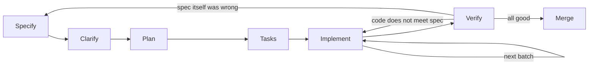

# BugFlow Spec-Driven Development Walkthrough

> **Who this is for:** developers new to Spec-Driven Development (SDD) who want to rebuild BugFlow from zero, in English, with an AI coding assistant such as Claude Code.
> **How to use it:** follow it top to bottom. Keep it open next to your editor. Every step says what to do, why, which prompt to use, and how to know you are done.

---

## Contents

1. [SDD in ten minutes](#1-sdd-in-ten-minutes)
2. [What is in this kit](#2-what-is-in-this-kit)
3. [Step 0 — Prerequisites](#3-step-0--prerequisites)
4. [Step 1 — Create the new repository](#4-step-1--create-the-new-repository)
5. [Step 2 — Own the constitution](#5-step-2--own-the-constitution)
6. [Step 3 — Understand the product overview](#6-step-3--understand-the-product-overview)
7. [Step 4 — The feature loop, in detail (feature 001)](#7-step-4--the-feature-loop-in-detail-feature-001)
8. [Step 5 — Feature 002: Semantic bug index](#8-step-5--feature-002-semantic-bug-index)
9. [Step 6 — Feature 003: Triage agents](#9-step-6--feature-003-triage-agents)
10. [Step 7 — Feature 004: Bug reports](#10-step-7--feature-004-bug-reports)
11. [Step 8 — Feature 005: Bug reprocessing](#11-step-8--feature-005-bug-reprocessing)
12. [Step 9 — End-to-end demo](#12-step-9--end-to-end-demo)
13. [Handling change: when a spec is wrong](#13-handling-change-when-a-spec-is-wrong)
14. [Your turn: add feature 006 with the templates](#14-your-turn-add-feature-006-with-the-templates)
15. [Tips, pitfalls and FAQ](#15-tips-pitfalls-and-faq)
16. [Appendix: prompt cheat sheet](#16-appendix-prompt-cheat-sheet)

---

## 1. SDD in ten minutes

### 1.1 The problem SDD solves

When you build by chatting with an AI ("create a CrewAI script that classifies bugs…"), your real requirements live only in your head and in a chat history that disappears. The AI fills every gap with a plausible guess, and nobody notices which guesses were wrong.

**The original project is a perfect real example.** Its code passed each bug to `crew.kickoff(inputs=...)`, but no task prompt contained a `{description}` placeholder, so **the agents never saw the bugs**. They invented generic ones. `bug_1_relatorio.md` documents "Bug #101 – UI rendering and JavaScript errors", while bug 1 in the database is "HTTP 500 in the authentication API". The code ran, the tables filled up, the reports looked professional, and the content was fiction.

Why did nobody catch it? Because the sentence *"each agent must receive the bug's description"* was never written down, so nobody checked it.

In this kit that sentence exists (`specs/003-triage-agents/spec.md`, **FR-002**), and it requires an automated test. That is SDD in one example.

### 1.2 The core idea

> **Write the intent down as versioned, reviewable documents *before* the code. Then let the AI implement from those documents in small steps, while you review at defined checkpoints (gates).**

The documents become the project's long-term memory. Chats are disposable; specs are not.

### 1.3 The artifacts

| Artifact | Answers | Scope | Changes when… |
|---|---|---|---|
| `constitution.md` | What rules apply to *everything*? | Whole project | Rarely, through an explicit amendment |
| `product-overview.md` | What words and values do we all share? | Whole project | A domain concept is added or changed |
| `spec.md` | **What** should this feature do, and **why**? | One feature | Requirements are clarified or change |
| `plan.md` | **How** will we build it? | One feature | The design or a library changes |
| `tasks.md` | In which small steps? How do we verify each? | One feature | Work progresses (checkboxes, log) |
| `AGENTS.md` | How must the AI behave in this repo? | Whole project | You notice the AI repeating a mistake |

**A quick test for spec vs. plan:** if you swapped Python for Go, `spec.md` should not change, but `plan.md` and `tasks.md` would.

### 1.4 The loop



**Gates** are the points where *you* approve before moving on:

| Gate | You approve | Main question |
|---|---|---|
| 1 | `spec.md` | "Is this what I want, and is it testable?" |
| 2 | `plan.md` | "Is this a sound, simple design that respects the constitution?" |
| 3 | `tasks.md` | "Are the steps small, ordered and verifiable?" |
| 4 | each implementation batch | "Does the diff do exactly these tasks, with passing tests?" |
| 5 | verification log | "Does the software meet every acceptance scenario?" |

### 1.5 Vocabulary you'll see everywhere

| Term | Meaning |
|---|---|
| **FR-###** | Functional requirement: one testable behavior. |
| **NFR-###** | Non-functional requirement: performance, security, reliability. |
| **SC-###** | Success criterion: a measurable outcome for the feature. |
| **MUST / SHOULD / MAY** | Mandatory / recommended / optional. |
| **User story (US)** | "As a *persona*, I want *capability*, so that *benefit*." |
| **Acceptance scenario** | "**Given** state, **when** action, **then** observable result." Each one becomes a test or a manual check. |
| **`[NEEDS CLARIFICATION: …]`** | An inline marker for something undecided. A spec cannot be approved while one remains. |
| **Traceability** | Each task says which FRs it implements; each FR can be traced to code and tests. |
| **Spec drift** | Code and spec slowly disagree. SDD prevents it by always updating the spec first. |

### 1.6 Five golden rules

1. **Change the spec before the code.** Never "just tweak the code" when behavior changes.
2. **Small batches.** 2–5 tasks, then stop, review, commit.
3. **Fresh AI context per phase.** The files carry the memory, not the chat.
4. **You own the decisions.** The AI proposes, asks and implements; you decide.
5. **"Done" means verified**: every acceptance scenario checked, not "it runs on my machine".

---

## 2. What is in this kit

```
sdd-kit/
├── README.md                      index of the kit
├── WALKTHROUGH.md                 this guide
├── ORIGINAL-PROJECT-ANALYSIS.md   what was wrong with the legacy project (reference)
├── AGENTS.md                      rules for the AI assistant
├── CLAUDE.md                      makes Claude Code load AGENTS.md
└── specs/
    ├── constitution.md
    ├── product-overview.md
    ├── _templates/                spec, plan and tasks templates for new features
    ├── 001-project-foundation/    spec.md, plan.md, tasks.md
    ├── 002-semantic-bug-index/
    ├── 003-triage-agents/
    ├── 004-bug-reports/
    └── 005-bug-reprocessing/
```

**Why five features instead of one big spec?**

- Each feature is small enough for you to review properly and for the AI to hold in context.
- You practice the full loop five times. By feature 005 it will feel natural.
- Each feature leaves the project in a working, testable state.

**Plans and tasks are pre-written. Is that still SDD?** Yes. Normally you (with the AI) would write `plan.md` and `tasks.md` after approving the spec. They are provided here to save time and to show what good ones look like. **You still perform every gate**: read, question, change, approve. Treat them as a senior colleague's draft, not as gospel. Section 14 has you write a feature's documents yourself.

**One important caveat:** the code blocks in `plan.md` files are *sketches*. Libraries like CrewAI and Pinecone change their APIs. `AGENTS.md` tells the AI to check the installed version and report differences, and when that happens you update the plan (section 13.2).

---

## 3. Step 0 — Prerequisites

### 3.1 Accounts and keys

| Service | What to do | You'll get |
|---|---|---|
| **OpenAI** | Create an account at platform.openai.com, add billing credit, create an API key. | `OPENAI_API_KEY` |
| **Neon** | Create a project named `bugflow`. Click **Connect** and copy the connection string. Then open **Branches → New branch**, name it `test`, and copy *its* connection string too. | `DATABASE_URL` (main branch), `TEST_DATABASE_URL` (test branch) |
| **Pinecone** | Create an account and an API key. **Don't create the index**; feature 002 creates it for you. | `PINECONE_API_KEY` |

> **Why a separate Neon branch for tests?** Integration tests drop and recreate tables. A Neon branch is an isolated copy of the database, so tests can never destroy your real data.

### 3.2 Tools

Install `uv`, which manages Python versions, virtual environments and dependencies:

```bash
curl -LsSf https://astral.sh/uv/install.sh | sh
```

Install Python 3.12 through uv:

```bash
uv python install 3.12
```

You also need:

- **git**
- **Claude Code** (desktop app or CLI), or another assistant that reads `AGENTS.md`
- An editor with a Markdown preview (VS Code works well)

### 3.3 Know two Claude Code features

| Feature | Why it matters for SDD | How |
|---|---|---|
| **Plan mode** (read-only) | Use it for reviews and clarifications, so the AI cannot edit files while you're still deciding. | In the CLI, press `Shift+Tab` until plan mode is shown. In the desktop app, choose it in the mode selector. |
| **Fresh sessions** | Each phase starts clean and reads the specs from disk. | Start a new session (or `/clear` in the CLI). |

`CLAUDE.md` (copied in Step 1) makes Claude Code load `AGENTS.md` automatically at the start of every session.

---

## 4. Step 1 — Create the new repository

⏱️ ~5 minutes

**1. Create the folder:**

```bash
mkdir -p ~/projects/bugflow
```

**2. Copy the kit files the new repo needs** (the specs and the AI rules, *not* the walkthrough or the legacy analysis):

```bash
cp -r /home/samuel/classroom/ai-pro-expert/project-three/sdd-kit/specs /home/samuel/classroom/ai-pro-expert/project-three/sdd-kit/AGENTS.md /home/samuel/classroom/ai-pro-expert/project-three/sdd-kit/CLAUDE.md ~/projects/bugflow/
```

**3. Initialize git:**

```bash
cd ~/projects/bugflow && git init
```

**4. Make the first commit.** The specs come before any code:

```bash
git add . && git commit -m "docs: add constitution, product overview and feature specs"
```

**Expected result:**

```
~/projects/bugflow/
├── AGENTS.md
├── CLAUDE.md
└── specs/
```

> **Why not copy `ORIGINAL-PROJECT-ANALYSIS.md`?** It quotes Portuguese names (`descricao`, `chamados`…). If the AI reads them, some may leak into your English code. Keep it for yourself.

---

## 5. Step 2 — Own the constitution

⏱️ ~20 minutes · 📄 `specs/constitution.md`

### 5.1 Why this comes first

The constitution holds the rules every later decision must follow. Once code exists, changing a rule like "no ORM" or "LLM output must be validated" is expensive. Now it's free.

### 5.2 Read it and decide

Read each principle and ask: **"Would I reject a pull request that violates this?"** If the answer is no, weaken or remove the principle. A constitution nobody enforces is noise.

Then confirm the technology table. These are the decisions most worth a second thought:

| Decision in the kit | Keep it if… | Change it if… |
|---|---|---|
| Python 3.12 + uv | You're fine with modern tooling | Your environment requires pip/poetry |
| CrewAI | You want to stay close to the original project | You prefer another agent framework, which changes plans 003–004 |
| Default LLM `openai/gpt-4o` | You want a known baseline | You prefer another model or provider (it is just a setting) |
| Neon + psycopg 3, raw SQL | You want to learn SQL-level integrity | You want an ORM, which changes every plan |
| argparse | Zero extra dependencies | You prefer Typer or Click |

### 5.3 Optional: let the AI critique it

Start a session **in plan mode** and use:

```text
Read specs/constitution.md and specs/product-overview.md. Do not modify any file.
Act as a critical reviewer. List up to 10 problems: principles that are vague,
that conflict with each other, that cannot be verified, or that are missing for a
CLI that uses LLMs, PostgreSQL and a vector store. For each, propose a concrete rewrite.
```

Accept only what you agree with. **You** edit the file.

### 5.4 If you change anything

1. Edit the principle or table row.
2. Bump the version (`1.0.0` → `1.1.0` for additions, `2.0.0` for redefinitions) and add a row to the amendment log.
3. Search the other specs for affected mentions, for example:

```bash
grep -rn "gpt-4o" specs/
```

4. Commit:

```bash
git commit -am "docs(constitution): ratify v1.0.0"
```

✅ **Done when:** you'd defend every principle in a code review, and the file is committed.

---

## 6. Step 3 — Understand the product overview

⏱️ ~15 minutes · 📄 `specs/product-overview.md`

This file is the **shared vocabulary**. Each feature spec refers to it instead of redefining terms.

Focus on:

- **§5.1 Glossary.** Every term the specs use.
- **§5.2 Canonical enumerations.** The exact codes stored in the database, such as `ui_ux` and `critical`. They are defined **once** here. In code they become Python enums; in the database they become `CHECK` constraints; a test keeps them identical. The original project spelled the same value three different ways; this prevents that.
- **§7 Roadmap.** Features are built strictly in order 001 → 005.
- **§8–9.** The final CLI and configuration, so you know where you're heading.

**Exercise (2 minutes):** explain in your own words what happens when bug #12 ("Credentials exposed in the Git repository") is triaged, using only glossary terms. If you get stuck on a concept, the glossary is missing something. Add it now.

✅ **Done when:** you can explain the difference between *component*, *severity*, *priority* and *resolution status* without looking.

---

## 7. Step 4 — The feature loop, in detail (feature 001)

This section is the heart of the guide. Every later feature repeats these same sub-steps, so later sections only highlight what's different.

📁 `specs/001-project-foundation/`

### 7.1 Create a feature branch

```bash
git switch -c 001-project-foundation
```

> Branch name = folder name. It makes it obvious which spec a branch implements.

### 7.2 Gate 1 — Review the spec yourself

⏱️ ~20 minutes · 📄 `spec.md`

**Understand the structure** (every spec in this kit uses it):

| Section | Purpose | What to check |
|---|---|---|
| 1. Summary | The feature in 2–4 sentences | Would a teammate understand it? |
| 2. Why | The problem | Is the motivation real? |
| 3. User stories + acceptance scenarios | Behavior from the user's view | Is there an error scenario for each story? |
| 4. Functional requirements | Precise, testable rules | Could two developers implement one differently? |
| 5. Non-functional requirements | Quality attributes | Are they measurable ("< 2 seconds", not "fast")? |
| 6. Edge cases | Unusual situations | What else could go wrong? |
| 7. Success criteria | How we know the feature worked | Measurable? |
| 8. Out of scope | What we won't build | Does it stop gold-plating? |
| 9. Clarifications | Decision log | Do you agree with each decision? |

**Review checklist.** Tick each item mentally:

- [ ] Every FR describes **one** observable behavior.
- [ ] No FR is vague ("handle errors properly" ❌, "exit with code 1 and print `Bug #N not found.`" ✅).
- [ ] Every user story has at least one failure scenario.
- [ ] Exit codes and messages are exact where users or scripts depend on them.
- [ ] The spec says **what**, not **how**. (Command names and outputs *are* "what" for a CLI product; class names are not.)
- [ ] You agree with the Clarifications.

Anything you doubt, mark it inline, e.g. `[NEEDS CLARIFICATION: should db seed also accept a custom JSON file?]`.

### 7.3 Clarify with the AI

⏱️ ~15 minutes · 🧠 **plan mode, new session**

```text
We are using Spec-Driven Development. Read AGENTS.md, specs/constitution.md,
specs/product-overview.md and specs/001-project-foundation/spec.md.
Do not modify any file and do not write code.

Act as a meticulous QA engineer and ask me up to 8 clarification questions about
the spec, most important first. Focus on: ambiguous requirements, missing error
cases, contradictions with the constitution or product overview, and acceptance
scenarios that cannot be tested as written.
For each question, propose 2-3 concrete options and say which you recommend and why.
Also resolve any [NEEDS CLARIFICATION] markers I left.
```

**How to handle the answers:**

1. For each question, **decide**. Accepting the recommendation is fine if you understand it.
2. Update `spec.md`: fix the FR or scenario and add a line to §9, e.g.
   `- Q: Should db seed accept a custom file? → A: No, out of scope; sample data only.`
   You can ask the AI (outside plan mode) to apply your decisions: *"Apply these decisions to spec.md: 1-B, 2-A, 3-no change. Record each in §9 Clarifications."*
3. When no `[NEEDS CLARIFICATION]` markers remain, change the header to `Status | Approved`.
4. Commit:

```bash
git commit -am "docs(001): clarify and approve spec"
```

> 💡 **Lesson:** questions are cheap now and expensive after implementation. A good clarification session always finds *something*.

### 7.4 Gate 2 — Review the plan

⏱️ ~20 minutes · 📄 `plan.md`

**What to check:**

- **Constitution Check table.** Is every principle honestly addressed?
- **Dependencies.** Is each one justified? Could the standard library do it?
- **Data model.** Do column names and constraints match the spec and the product overview?
- **Traceability table.** Does every FR map to a module *and* a test?
- **Error handling table.** Does it match the spec's exit codes and messages?

Then run a **cross-artifact consistency analysis**. This is one of the most valuable SDD habits: humans miss inconsistencies between documents, and AI is good at finding them.

🧠 **Plan mode, new session:**

```text
Read specs/constitution.md, specs/product-overview.md and all three files in
specs/001-project-foundation/. Do not modify files.

Check consistency across these documents and report:
1. Requirements (FR/NFR/SC) not covered by any task in tasks.md.
2. Tasks that do not trace to any requirement.
3. Contradictions between spec, plan, tasks, constitution and product overview
   (names, values, defaults, exit codes, messages, table or column names).
4. Plan decisions that violate a constitution principle.
5. Requirements ambiguous enough that two developers would implement them differently.

Output a table: # | Severity (high/medium/low) | Location | Problem | Suggested fix.
```

Fix what matters (spec issues in `spec.md`, design issues in `plan.md`), set the plan status to `Approved`, and commit.

### 7.5 Gate 3 — Review the tasks

⏱️ ~10 minutes · 📄 `tasks.md`

A good task:

- is small: one focused AI batch, or under an hour of human work;
- names its **files**;
- references **requirements** (`Refs`);
- has a concrete **Verify** step (a command plus the expected result);
- comes after the tasks it depends on (`[P]` marks tasks that can run in parallel).

Look at **Suggested Batches** at the bottom. That's your implementation rhythm. Commit any changes.

### 7.6 Implement in batches

⏱️ 1–3 hours total, spread over several sessions · 🔨 **normal mode (not plan mode)**

**For each batch:**

**① Start a new session** and use this prompt (change the task range per batch):

```text
We are building BugFlow using Spec-Driven Development.
Active feature: specs/001-project-foundation/.

Read AGENTS.md, specs/constitution.md, specs/product-overview.md and all three
files of the active feature.

Implement ONLY tasks T001-T002 from tasks.md, in order.
For each task: write tests first where it applies, implement, run the task's
Verify step and the quality gate, then mark the task [x] in tasks.md.
If anything in the specs is ambiguous, contradictory or impossible with the
installed library versions, STOP and ask me before continuing.

When the batch is done, stop and report: tasks completed, files changed,
verification commands with their output, and any deviation from plan.md.
```

**② While it works:** read along. If it asks a question, answer it. If your answer changes *behavior*, note it; you'll put it in the spec in step ④.

**③ Review the batch yourself.** Don't skip this; it's Gate 4.

See which files changed:

```bash
git status
```

Read the diff:

```bash
git diff
```

Run the quality gate yourself:

```bash
uv run ruff check . && uv run pytest
```

Ask yourself:

- Did it do **only** the requested tasks?
- Do the tests actually test the requirement, or just that the code runs?
- Anything surprising? Ask the AI *why* before accepting it.

**④ Update the specs if reality taught you something** (a question you answered, an API difference). Put the change in the right document (see the table in §13).

**⑤ Commit the batch:**

```bash
git add . && git commit -m "feat(001): project setup and env template (T001-T002)"
```

**Batches for feature 001:**

| Batch | Tasks | Note |
|---|---|---|
| A | T001–T002 | **After this batch, create your `.env`** (see below). |
| B | T003–T007 | Core blocks: enums, settings, security helpers, logging. |
| C | T008–T010 | Schema and the enum-consistency test. Try breaking the test on purpose, as the task says. |
| D | T011–T014 | The CLI. Run the commands yourself. |
| E | T015–T017 | Integration tests, README, acceptance. |

**Creating `.env` after batch A:**

```bash
cp .env.example .env
```

Open `.env` in your editor and fill in `DATABASE_URL`, `TEST_DATABASE_URL` and `OPENAI_API_KEY`. `.env` is git-ignored; confirm with:

```bash
git check-ignore .env
```

### 7.7 Gate 5 — Verify against the spec

⏱️ ~30 minutes

**① Automated evidence review.** 🧠 Plan mode, new session:

```text
Read specs/001-project-foundation/spec.md and review the current implementation
and tests. Do not modify anything.

For every FR, NFR, SC and acceptance scenario, report one of:
- MET: cite the test name or file:line that proves it
- PARTIAL: explain what is missing
- NOT MET: explain
Finish with a prioritized list of gaps.
```

**② Manual acceptance.** Run the scenarios against real services and fill in the **Verification Log** at the bottom of `tasks.md`. For 001:

| Scenario | Command | Expected |
|---|---|---|
| US1.1 | `uv run bugflow --help` | Lists `check` and `db` |
| US3.1 | `uv run bugflow db init` | `Schema ready. Tables: bugs` |
| US3.2 | `uv run bugflow db init` (again) | Same output, no error |
| US4.1 | `uv run bugflow db seed` | `Inserted 20 sample bugs.` |
| US4.2 | `uv run bugflow db seed` (again) | Refuses, exit code 1 (`echo $?`) |
| US4.3 | `uv run bugflow db seed --reset`, then answer `y` | Reseeded, IDs 1–20 |
| US4.5 | `echo "" \| uv run bugflow db seed --reset` | Exit code 2, nothing changed |
| US2.1 | `uv run bugflow check` | `[OK]` for database and openai |
| US2.2 | `OPENAI_API_KEY=sk-invalid uv run bugflow check` | `[FAIL] openai`, exit 1 |
| US2.4 | Look at the `check` output | No password or full URL visible |
| US1.3 | `env -u DATABASE_URL uv run bugflow db init` (temporarily rename `.env` first) | `Configuration error: DATABASE_URL is not set`, exit 2 |

**③ Fix gaps** by running more implementation batches ("Fix the gaps: …"), then verify again.

### 7.8 Close the feature

1. Set `Status | Implemented` in `spec.md` and `plan.md`.
2. Confirm the Definition of Done from the constitution.
3. Commit, merge and tag. Commit:

```bash
git commit -am "docs(001): mark feature as implemented"
```

Switch to main:

```bash
git switch main
```

Merge:

```bash
git merge --no-ff 001-project-foundation -m "Merge feature 001-project-foundation"
```

Tag:

```bash
git tag feature-001
```

🎉 **You have completed one full SDD loop.** The next four features repeat it.

---

## 8. Step 5 — Feature 002: Semantic bug index

📁 `specs/002-semantic-bug-index/` · Branch `002-semantic-bug-index`

### What you'll learn

- Designing a **reusable interface** in the spec (FR-013) that a later feature depends on.
- Handling **library API drift**: the Pinecone SDK has changed a lot across versions.
- Using verification to **collect data** for a later decision.

### Loop checklist

1. Branch → 2. Review spec → 3. Clarify (§7.3 prompt, with the folder name changed) → 4. Review plan + consistency analysis (§7.4) → 5. Review tasks → 6. Implement batches → 7. Verify → 8. Close.

### Feature-specific notes

- **Add `PINECONE_API_KEY` to `.env`** before batch A.
- **Batch A (T001) will probably find API differences** in the Pinecone SDK. That's expected. Update `plan.md` §5.4 with the real calls **before** batch B, and commit it as `docs(002): align plan with pinecone SDK vX`. This is the plan doing its job as a living document.
- **Fakes matter.** Batch B builds `FakePinecone` and `FakeOpenAIEmbeddings`. Review them carefully: fake behavior that differs from the real service hides bugs.

### Manual verification highlights

Index everything (creates the index on the first run):

```bash
uv run bugflow index
```

Search by text:

```bash
uv run bugflow search "users get HTTP 500 when logging in"
```

Search by bug:

```bash
uv run bugflow search --bug-id 4
```

⚠️ **Record the top-5 scores** of these two searches in the verification log (SC-002). You'll use them in feature 003 to choose `SIMILAR_BUGS_MIN_SCORE`. Scores from `text-embedding-3-small` are often lower than you'd expect, so a threshold of 0.75 might exclude everything.

✅ **Done when:** US2.1 and US2.2 pass, scores are recorded, and the feature is merged.

---

## 9. Step 6 — Feature 003: Triage agents

📁 `specs/003-triage-agents/` · Branch `003-triage-agents`

This is the core of BugFlow, and the feature where SDD pays off most.

### What you'll learn

- **Prompts are specifications.** They live in `plan.md` Appendix A/B, and you review them like code.
- **Structured outputs and validation**: the LLM fills schemas, and code decides everything else.
- **Evaluating AI behavior** against reference labels instead of eyeballing it.
- **Designing failure**: what happens when the AI is wrong.

### Read these requirements with extra care

| Requirement | Why it matters |
|---|---|
| FR-002 | The fix for the original project's biggest defect. Its test is mandatory. |
| FR-006, FR-007, FR-008 | Validation rules, normalization without substring matching, no silent defaults. |
| FR-009 | The AI may not invent related bug IDs; code filters them. |
| FR-013 | Status and due date are computed by code, not chosen by the AI. |
| FR-014, FR-015 | All-or-nothing persistence and status guards. |
| Clarifications §9 | The decisions that differ from the original project, and why. |

### Clarification tip

While clarifying, explicitly ask the AI to challenge the **prompts** in plan Appendix B:

```text
Also review the agent and task prompts in specs/003-triage-agents/plan.md
Appendix A and B as an expert prompt engineer. For each prompt, list risks
(ambiguity, bias toward a label, missing guidance, conflicts with the output schema)
and propose minimal edits. Do not modify files.
```

You are the domain expert. Accept only changes you understand.

### Batches and cost control

| Batch | Tasks | Cost | Note |
|---|---|---|---|
| A | T001 | free | **Stop after T001** and update plan §5.9 with the real CrewAI API. |
| B | T002–T005 | free | Validation. Read the normalization synonym tables. |
| C | T006–T007 | free | Run `uv run bugflow db init` afterwards; you'll see 5 tables. |
| D | T008–T010 | free | T009 copies prompts **verbatim** from the plan. If you want different prompts, change the plan first. |
| E | T011–T012 | free | Everything is tested with fakes. |
| F | T013–T014 | 💰 real LLM | Start with **one** bug. |
| G | T015–T016 | small | Close. |

### The first real run (T013)

Triage one bug only:

```bash
uv run bugflow triage --bug-id 4
```

Inspect the result in the **Neon SQL editor** with the queries from `plan.md` §9. Ask yourself: is it about SQL injection on the login page? If not, **don't patch the code**. Follow the change process: edit the prompt in plan Appendix B, re-run T009, and triage again. Until feature 005 exists, reset the data like this:

```bash
uv run bugflow db seed --reset --yes && uv run bugflow index
```

### Evaluation (T014)

Run all bugs:

```bash
uv run bugflow triage
```

Fill in the **Evaluation Table** in `tasks.md` by comparing each stored component with spec Appendix A. The target is ≥ 18/20.

- **If you hit the target:** record it and move on.
- **If you miss it:** look for a pattern (e.g. "frontend vs ui_ux confusion") and improve the *definitions* in the product overview or the *prompt rules* in the plan. Re-run and record both attempts. That iteration log is valuable documentation.

Then **calibrate `SIMILAR_BUGS_MIN_SCORE`** using the scores from 002. Update the default in spec §4 FR-020 and §9 Clarifications with your reasoning, then in `.env.example`.

✅ **Done when:** ≥ 18/20 components are acceptable, the partial-results query returns 0 rows, and 5 analyses have been reviewed by you.

---

## 10. Step 7 — Feature 004: Bug reports

📁 `specs/004-bug-reports/` · Branch `004-bug-reports`

### What you'll learn

- **Separating content from presentation**: the AI writes plain text, templates format it.
- **Determinism as a requirement** (FR-008), and how to verify it with checksums.
- **Golden-file tests** for rendered output.

### Feature-specific notes

- **Batch B (T006):** paste one generated diagram into https://mermaid.live. Seeing it render builds confidence before any real data flows.
- **Batch C (T007–T008):** golden files are *reviewed by you*. Open `bug-42-report.md` in a Markdown preview and `bug-42-report.html` in a browser. If you want a different layout, change FR-004 or plan §5.7 **first**, then regenerate.
- **The timestamp trap:** plan §5.3 explains why timestamps are rendered with minute precision. It's a subtle determinism bug that the plan prevents; notice how writing the requirement down forced the design to address it.

### Manual verification highlights

Triage one bug and open its report:

```bash
uv run bugflow triage --bug-id 6
```

Determinism check (US3.1). Save checksums:

```bash
sha256sum reports/* > /tmp/reports-before.txt
```

Delete the reports:

```bash
rm -rf reports
```

Regenerate without the LLM:

```bash
uv run bugflow report --all
```

Compare (no output means identical):

```bash
sha256sum reports/* | diff /tmp/reports-before.txt -
```

✅ **Done when:** the reports look good in both formats, diagrams render, and checksums are identical.

---

## 11. Step 8 — Feature 005: Bug reprocessing

📁 `specs/005-bug-reprocessing/` · Branch `005-bug-reprocessing`

### What you'll learn

- Specifying **destructive operations** safely: confirmation, non-interactive rules, rollback.
- Using a **test as a guard for future changes** (FR-003: the allowlist test fails if someone adds a result table and forgets to update reopen).

### Feature-specific notes

This is a small feature (6 tasks, 2 batches). Try running the loop **faster but without skipping gates**. That's the skill you're building.

### Manual verification highlights

Reopen a processed bug:

```bash
uv run bugflow reopen 3
```

Triage it again:

```bash
uv run bugflow triage --bug-id 3
```

Then run the integrity query from `specs/003-triage-agents/plan.md` §9 in the Neon SQL editor. It must return zero rows.

✅ **Done when:** the full cycle works and the verification log is complete.

---

## 12. Step 9 — End-to-end demo

With all five features merged, run the whole product from a clean state to prove it works as specified.

Check all services:

```bash
uv run bugflow check
```

Create the schema:

```bash
uv run bugflow db init
```

Load fresh sample data:

```bash
uv run bugflow db seed --reset --yes
```

Index all bugs:

```bash
uv run bugflow index
```

Triage everything:

```bash
uv run bugflow triage
```

Retry any failures:

```bash
uv run bugflow reopen --all-failed --yes && uv run bugflow triage
```

List the reports:

```bash
ls reports/
```

Open a few HTML reports in the browser, and compare with the original project's output: every report is now about the *actual* bug.

---

## 13. Handling change: when a spec is wrong

Specs will be wrong sometimes. That's normal. What matters is **where you make the change first**.

### 13.1 Decision table

| What changed? | Update first | Then |
|---|---|---|
| Behavior a user can observe (output, rules, exit codes) | `spec.md` | `plan.md` → `tasks.md` → code |
| Design, modules, libraries, SQL | `plan.md` | `tasks.md` → code |
| Order or size of work | `tasks.md` | code |
| A shared term or enum value | `product-overview.md` | affected specs → plans → code |
| A project-wide rule | `constitution.md` (amendment) | everything affected |
| The code has a bug but the spec is right | code only | add a test that would have caught it |

### 13.2 Example A — small plan-only change

*During 003 T001, the AI reports that CrewAI's `TaskOutput` exposes a different attribute name than the plan says.*

1. Behavior is unchanged, so **don't touch** `spec.md`.
2. Update the sketch in `plan.md` §5.9 and note the version.
3. Commit `docs(003): align plan with crewai vX.Y API`.
4. Continue implementing.

### 13.3 Example B — a behavior change

*After using BugFlow you decide severity needs a fourth level, `blocker`, above `critical`.*

1. **Product overview:** add `blocker` to the Severity table with a definition.
2. **003 spec:** check the FRs that mention severities; add a Clarification entry explaining why.
3. **003 plan:** the `CHECK` constraint must change. But `CREATE TABLE IF NOT EXISTS` never alters an existing table, and 001 declared migrations out of scope. **You've discovered a missing feature.**
4. Write `specs/006-schema-migrations/spec.md` using the template (section 14) and implement it first.
5. Then update the 003 plan, add tasks (a new task list section "Change: blocker severity"), implement, verify, and re-evaluate accuracy.

Prompt to start a change:

```text
I want to change the product: <describe the change and why>.
Read AGENTS.md, specs/constitution.md, specs/product-overview.md and all specs.
Do not write code. Produce an impact analysis:
1. Every document section that must change (file + section + proposed new text).
2. Any new feature this change requires.
3. Risks to existing data or behavior.
4. A proposed order of work.
```

---

## 14. Your turn: add feature 006 with the templates

Now practice writing the documents yourself. Pick one idea:

| Idea | Size | Teaches |
|---|---|---|
| `bugflow show <id>`: print a bug's triage results in the terminal | small | Specifying output formats |
| `bugflow stats`: counts per component, severity and team | small | Aggregations, table output |
| `006-schema-migrations`: versioned SQL migrations | medium | Evolving data safely |
| Webhook notification for critical bugs | medium | External integrations, secrets, retries |
| Prompt evaluation harness (`bugflow eval`) | medium | Measuring AI quality systematically |

### 14.1 Draft the spec

```bash
mkdir -p specs/006-bug-show-command && cp specs/_templates/spec-template.md specs/006-bug-show-command/spec.md
```

🧠 Plan mode is off here (the AI writes a file), but the content is WHAT only:

```text
Read AGENTS.md, specs/constitution.md, specs/product-overview.md and the specs of
features 001-005 for context and style.
Fill in specs/006-bug-show-command/spec.md (already copied from the template) for
this idea: <describe your idea in 3-5 sentences, including who uses it and why>.

Rules: describe only WHAT and WHY, never HOW. Every requirement must be testable.
Include error scenarios. Mark every decision you cannot make with
[NEEDS CLARIFICATION: question]. Do not create plan.md or tasks.md.
```

Then run **Clarify** (§7.3) and approve it (Gate 1).

### 14.2 Generate the plan

```text
The spec specs/006-bug-show-command/spec.md is approved.
Read AGENTS.md, the constitution, the product overview, the approved spec, and the
plans of features 001-005 to learn the existing architecture and conventions.
Create specs/006-bug-show-command/plan.md from specs/_templates/plan-template.md.
Reuse existing modules instead of creating new ones where possible. Complete the
Constitution Check honestly and fill in the traceability table for every requirement.
Do not write code.
```

Review it and run the **consistency analysis** (§7.4) — Gate 2.

### 14.3 Generate the tasks

```text
The plan specs/006-bug-show-command/plan.md is approved.
Create specs/006-bug-show-command/tasks.md from specs/_templates/tasks-template.md.
Tasks must be small, ordered by dependency, name their files, reference requirement
IDs, and have a concrete Verify step. Tests come before implementation for
deterministic logic. Include a final acceptance verification task, suggested batches,
and a verification log with one row per acceptance scenario. Do not write code.
```

Review it (Gate 3), then implement and verify exactly as in §7.6–7.8.

---

## 15. Tips, pitfalls and FAQ

### 15.1 Tips

- **Keep sessions short and single-purpose.** Clarify in one, implement a batch in another, verify in a third.
- **Always read the diff before committing.** The AI will occasionally "helpfully" change something unrelated.
- **Put repeated corrections into `AGENTS.md`.** If you tell the AI the same thing twice, it belongs there.
- **Write the verification log honestly.** A `FAIL` with a follow-up is far more useful than a fake `PASS`.
- **Commit specs separately from code** (`docs(...)` vs `feat(...)`), so the history shows decisions and implementation clearly.
- **Use `--bug-id` and `--limit`** during development to keep LLM costs low.

### 15.2 Common pitfalls

| Symptom | Likely cause | Fix |
|---|---|---|
| The AI implements tasks you didn't ask for | Vague prompt | Always name the exact task range; point to `AGENTS.md` §3 |
| The AI marks tasks `[x]` without running Verify | Not reviewing batch reports | Ask for the verification output; reject the batch until it's provided |
| Code and spec disagree after a few weeks | Changing code directly | Follow §13.1; run the §7.7 verification prompt periodically |
| Tests pass but behavior is wrong | Missing acceptance scenario | Add the scenario to the spec **first**, then a test, then fix the code |
| The AI "forgets" decisions from yesterday | Decisions only lived in chat | Record every decision in the spec's Clarifications |
| A library call in the plan doesn't exist | API drift | Expected. Update the plan (§13.2) |
| Integration tests wiped your data | Wrong database URL | Tests must use `TEST_DATABASE_URL` only (a Neon branch) |
| Triage results are generic | Placeholder missing or prompt too weak | Check FR-002's test; improve the prompts in the plan |

### 15.3 FAQ

**Isn't this just waterfall?**
No. Waterfall specifies the *whole system* up front and freezes it. SDD specifies *one small feature* at a time, keeps documents alive, and loops back whenever reality teaches you something (§13).

**How detailed should a spec be?**
Detailed enough that two developers (or two AI sessions) would build the same observable behavior. If an acceptance scenario can't be turned into a test or a concrete manual check, it's not detailed enough.

**Should the AI write the specs?**
The AI is a great *drafter* and *critic*. But the decisions in a spec are yours. Use the AI to draft (§14.1) and to find gaps (§7.3, §7.4). Never approve a spec you haven't read line by line.

**Do I need GitHub Spec Kit or another SDD tool?**
No. This kit uses plain Markdown and prompts, so you learn the concepts without tooling. It follows the same artifact model as GitHub's Spec Kit, so moving to it later is easy:

| This kit | Spec Kit equivalent |
|---|---|
| `specs/constitution.md` + §5 | `/speckit.constitution` (`.specify/memory/constitution.md`) |
| `spec.md` + §7.2 | `/speckit.specify` |
| Clarify prompt (§7.3) | `/speckit.clarify` |
| `plan.md` + §7.4 | `/speckit.plan` |
| `tasks.md` + §7.5 | `/speckit.tasks` |
| Consistency prompt (§7.4) | `/speckit.analyze` |
| Batch prompt (§7.6) | `/speckit.implement` |

(Command names change between tool versions; check the Spec Kit documentation.)

**Can I use Cursor, Copilot or another assistant?**
Yes. `AGENTS.md` is a widely supported convention, and all prompts in this guide are tool-agnostic. Only plan mode and `CLAUDE.md` are Claude Code-specific.

**Can I change the tech stack (e.g. LangGraph instead of CrewAI)?**
Yes, and it's a great exercise. Specs stay nearly identical, which proves they describe WHAT, not HOW. Amend the constitution's technology table, then rewrite the affected plans and tasks (003 and 004 mostly).

---

## 16. Appendix: prompt cheat sheet

Replace `<NNN-feature>` with the active feature folder.

### P1 — Critique the constitution (plan mode)

```text
Read specs/constitution.md and specs/product-overview.md. Do not modify any file.
Act as a critical reviewer. List up to 10 problems: vague, conflicting, unverifiable
or missing principles. For each, propose a concrete rewrite.
```

### P2 — Clarify a spec (plan mode)

```text
We are using Spec-Driven Development. Read AGENTS.md, specs/constitution.md,
specs/product-overview.md and specs/<NNN-feature>/spec.md.
Do not modify any file and do not write code.
Ask me up to 8 clarification questions, most important first: ambiguous requirements,
missing error cases, contradictions, untestable scenarios. For each, propose 2-3
options with a recommendation. Also resolve any [NEEDS CLARIFICATION] markers.
```

### P3 — Apply clarification decisions (normal mode)

```text
Apply these decisions to specs/<NNN-feature>/spec.md: <1-B, 2-A, ...>.
Update the affected requirements and scenarios, and record each decision in
§9 Clarifications as "Q: ... → A: ... (rationale)". Do not change anything else.
```

### P4 — Cross-artifact consistency analysis (plan mode)

```text
Read specs/constitution.md, specs/product-overview.md and all files in
specs/<NNN-feature>/. Do not modify files.
Report: (1) requirements not covered by tasks, (2) tasks not tracing to requirements,
(3) contradictions in names/values/defaults/exit codes/messages across documents,
(4) plan decisions violating the constitution, (5) ambiguous requirements.
Output a table: # | Severity | Location | Problem | Suggested fix.
```

### P5 — Implement a batch (normal mode, new session)

```text
We are building BugFlow using Spec-Driven Development.
Active feature: specs/<NNN-feature>/.
Read AGENTS.md, specs/constitution.md, specs/product-overview.md and all three
files of the active feature.
Implement ONLY tasks <T00X-T00Y> from tasks.md, in order. For each task: tests first
where applicable, implement, run its Verify step and the quality gate, mark it [x].
If anything is ambiguous, contradictory or impossible with the installed library
versions, STOP and ask me.
When done, report: tasks completed, files changed, verification output, deviations.
```

### P6 — Verify a feature (plan mode, new session)

```text
Read specs/<NNN-feature>/spec.md and review the implementation and tests.
Do not modify anything. For every FR, NFR, SC and acceptance scenario report
MET (cite test or file:line), PARTIAL or NOT MET (explain). End with prioritized gaps.
```

### P7 — Fix verification gaps (normal mode)

```text
Fix these gaps found during verification of specs/<NNN-feature>/: <list>.
Each fix must include a test that would have caught the gap. Do not change
behavior that is not listed. Report the verification output when done.
```

### P8 — Impact analysis for a change (plan mode)

```text
I want to change the product: <change and reason>.
Read AGENTS.md, the constitution, the product overview and all specs. Do not write code.
Produce: (1) every document section that must change, with proposed text,
(2) any new feature required, (3) risks to data or behavior, (4) order of work.
```

### P9 — Resume after a break (plan mode)

```text
Read AGENTS.md and all files in specs/<NNN-feature>/. Do not modify anything.
Summarize: which tasks are done, which is next, open questions in the spec,
and anything in the verification log that is not PASS.
```

### P10 — Draft a new spec from the template (normal mode)

```text
Read AGENTS.md, specs/constitution.md, specs/product-overview.md and existing specs
for style. Fill in specs/<NNN-feature>/spec.md (copied from the template) for this
idea: <idea>. WHAT and WHY only, testable requirements, error scenarios included,
[NEEDS CLARIFICATION: ...] for undecided points. Do not create plan.md or tasks.md.
```

---

**Happy building.** Remember: the goal isn't perfect documents. It's making every important decision explicit, reviewed and verified, so the software does what you actually intended.
