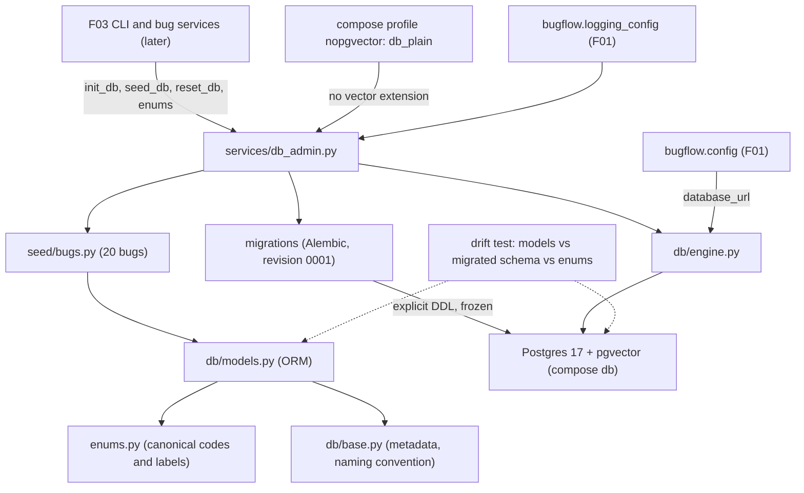

# Spec: F02. Schema, Migrations and Seed

**Complexity:** medium (about a dozen new modules, one migration with 10 tables, database-level constraints on every enum, one compose change, no HTTP endpoints).

## 1. Technical Overview

**What.** Create the data layer every later backend feature builds on: SQLAlchemy ORM models for all ten application tables, one Alembic migration chain (the base revision creates the `vector` extension), a canonical enum module (codes, English labels, definitions), a packaged 20-bug seed dataset, and the three service functions `init_db`, `seed_db` and `reset_db`. Every enum is protected by a named database CHECK constraint. A compose profile adds a plain Postgres service (no pgvector) so the "pgvector missing" error path can be exercised against a real server.

**Why.** F03 builds the bug services, run recorder and the `bugflow db ...` commands on top of these tables, enums and services. A single schema definition path (models plus one explicit migration plus a drift test) removes the original project's schema/seed drift (H2), and one enum module removes vocabulary drift (M2).

**Scope.**

Included:
- Canonical enum module `bugflow.enums` with the eleven enums of the PRD table, English labels and definitions.
- ORM models and metadata for `bugs`, `bug_embeddings`, `component_classifications`, `severity_classifications`, `technical_analyses`, `resolution_plans`, `bug_reports`, `runs`, `run_steps`, `run_logs`.
- Alembic environment inside the package, migration `0001` with explicit DDL, `backend/alembic.ini` for developer tooling.
- Engine and session helpers (the URL is passed in; `bugflow.config` stays the only environment reader).
- Services `init_db`, `seed_db`, `reset_db` with typed results and database errors.
- Seed dataset of 20 English bugs, all `open`, fixed `opened_at` dates within a 90-day window.
- Compose profile `nopgvector` with service `db_plain` (image `postgres:17`).
- Test support for databases: provisioning of the `TEST_DATABASE_URL` database and per-test schema reset.

Excluded:
- `bugflow db init|seed|reset` and `check` commands, run records written by those operations, confirmation prompts, printed messages such as `Seeded 20 bugs` (F03).
- Bug services, list/filter/search, the run recorder (F03).
- Writing embeddings, similarity search, LLM client (F04); any use of the vector column beyond creating it.
- Triage result writes (F05), reports (F07), reopen (F08).
- An approximate-nearest-neighbor index on `bug_embeddings` (exact cosine scan is enough for the demo).
- Deleting bugs, bulk import, authentication, cloud databases (PRD Section 7).

**Cross-cutting concerns integrated:** secret safety (error messages never carry the connection URL), English-only text, per-worktree isolation (the new compose service uses an ephemeral port).

## 2. Architecture Impact

Affected components:

- `backend/src/bugflow/enums.py` (new)
- `backend/src/bugflow/db/` (new package: base, models, engine, errors)
- `backend/src/bugflow/migrations/` (new: Alembic environment and versions)
- `backend/src/bugflow/seed/` (new: dataset)
- `backend/src/bugflow/services/db_admin.py` (new)
- `backend/pyproject.toml`, `backend/uv.lock`, `backend/alembic.ini`, `docker-compose.yml` (modified or new)
- `backend/tests/` (new unit and integration tests, database fixtures)

Data flow: callers (F03) obtain settings from `bugflow.config`, build an engine from `settings.database_url` and pass it to `init_db`/`reset_db`, or open a session for `seed_db`. `init_db` first checks that the server offers the `vector` extension, then runs Alembic to head on a connection supplied through `config.attributes`. Alembic's `env.py` never reads the environment.

## 3. Technical Decisions

| Decision | Chosen Approach | Alternative Considered | Trade-off |
|----------|----------------|----------------------|-----------|
| Data access | SQLAlchemy 2.x declarative models, psycopg 3 driver, `pgvector` package for the `Vector(1536)` type | SQLModel; raw psycopg | Matches the existing `postgresql+psycopg://` URL scheme and the PRD stack; four new runtime dependencies (user decision) |
| Enum storage | `VARCHAR` plus a named `CHECK` per enum column | Native `CREATE TYPE ... AS ENUM` | Adding a code later is a constraint change, not `ALTER TYPE`; violations name the constraint (user decision) |
| Migration source | Hand-written, frozen migration `0001` with explicit DDL, plus a drift test (models vs migrated schema vs enum module) | Migration that calls `metadata.create_all` | Two textual descriptions of the schema exist, so the drift test is mandatory and must fail on any difference (user decision) |
| Migrations location | Inside the package (`bugflow/migrations/`), Alembic `Config` built in code, plus a thin `backend/alembic.ini` for `alembic revision` | `backend/migrations/` outside the package | `init_db` works from any working directory and when installed as a wheel; developers still get the Alembic CLI |
| Plain Postgres for the pgvector error path | Compose profile `nopgvector`, service `db_plain` (`postgres:17`), ephemeral loopback port discovered with `docker compose port` | Ad-hoc `docker run` in tests | One service mechanism for everything; no new `.env` variable, so the F01 variable set stays exact (user decision) |
| Primary keys | `integer GENERATED BY DEFAULT AS IDENTITY` for bugs, runs, steps; `bigint` identity for logs | UUIDs | PRD ids are small integers (`--bug 3`, `referenced_similar_bug_ids` list of int) |
| Service signatures | `init_db(engine)`, `reset_db(engine)`, `seed_db(session)`; each performs its own atomic transaction | Caller-managed commit | DDL and seeding are administrative operations; atomic by construction. F03 wraps them with run records |
| `reset_db` mechanism | Drop every table in the metadata plus `alembic_version`, keep the extension, then run `init_db` | `DROP SCHEMA public CASCADE` | Never touches objects the application did not create; the result is the exact post-`init_db` state |
| Dynamic DDL identifiers | Table names come only from `Base.metadata` and the fixed name `alembic_version`, rendered by SQLAlchemy schema constructs | String-built SQL | Satisfies the project rule on allowlisted identifiers; no free-text SQL anywhere |

### Assumptions and Decisions (review and override as needed)

1. **New dependencies** (confirmed by the user): `sqlalchemy`, `alembic`, `psycopg[binary]`, `pgvector`, latest stable, pinned in `uv.lock`. Verify each API against the installed version before use.
2. **Constraint naming.** Every constraint and index has an explicit name: `ck_<table>_<column>` for CHECKs, `pk_`, `fk_<table>_<column>`, `ix_<table>_<column>`, `uq_<table>_<columns>`. A naming convention on the metadata enforces this so Alembic comparisons are stable.
3. **Column limits.** `bugs.title` varchar(120), `description` and `reproduction_steps` varchar(5000), `system_version` varchar(50). Minimum-length rules (1 character) are validation in F03, not database constraints. Enum columns are `varchar(20)`.
4. **Agent output columns.** The PRD lists only some columns for result tables. Everything an agent produces is stored (F05: "everything each agent produced is stored"), so the classification tables also hold the justification (and `user_impact` for severity), and `bug_reports` holds `executive_summary`, `key_takeaways` and `next_steps`. Lists are `jsonb` arrays guarded by `jsonb_typeof` CHECKs. Length limits mirror the PRD agent tables.
5. **`runs.started_at`** is `NOT NULL DEFAULT now()` and means "when the run record was created"; `finished_at` is nullable. This gives F10's "10 most recent runs" a stable ordering.
6. **Foreign keys.** Result tables and `bug_embeddings`: `bug_id` references `bugs` with `ON DELETE CASCADE`. `runs.bug_id` references `bugs` with `ON DELETE SET NULL`. Result tables' `run_id` references `runs` with the default `RESTRICT`. `run_steps`, `run_logs`: `run_id` references `runs` with `ON DELETE CASCADE`. The product has no bug deletion; these rules only keep the schema self-consistent.
7. **Seed dataset.** Python module `bugflow/seed/bugs.py` with a frozen dataclass per bug (the stored fields plus `intended_component` and `intended_severity`, which are never stored). Fixed UTC `opened_at` values from 2026-06-01 through 2026-08-29 (an 89-day span). The three PRD examples are included verbatim in substance. Titles are unique. Distributions follow the PRD tables exactly.
8. **Seed idempotency.** `seed_db` matches seed bugs by exact title against `bugs.title`, inserts only the missing ones in dataset order inside one transaction (all or nothing), and returns `created` and `already_present` counts. Seed bugs are inserted with `status='open'` and the dataset's `opened_at`; `updated_at` takes the default.
9. **`init_db` ordering.** Check connectivity, then check that `pg_available_extensions` lists `vector`, then run Alembic to head. A server lacking `vector` fails before any DDL, leaving the database untouched. Alembic uses transactional DDL (one transaction per run), so a failing migration rolls back completely.
10. **Errors.** `BugflowDatabaseError` (base) with `DatabaseUnavailableError("Cannot connect to the database")` and `PgvectorUnavailableError("pgvector extension is not available; use the pgvector/pgvector image")`. The driver exception is not chained (`raise ... from None`) so no URL or credential can reach logs or tracebacks.
11. **Logging.** The services log through `bugflow.logging_config.get_logger("bugflow.db")`: migration applied, seed counts, reset steps. Never the URL.
12. **Labels.** English labels are fixed in the table in section 5.1. Definitions exist for `Component` and `Severity` (verbatim from the PRD); other enums have no definition (`None`).
13. **Test database provisioning** (convention for later features): integration tests read `TEST_DATABASE_URL` through `bugflow.config`; if the database does not exist, a fixture creates it by connecting to the maintenance database `postgres` on the same server (identifier quoted with `psycopg.sql.Identifier`); a function-scoped fixture then drops and recreates the `public` schema so every test starts empty. Integration tests never touch `DATABASE_URL`. If `TEST_DATABASE_URL` is unset, they skip with an English message.
14. **Conventions reused from F01:** pytest layout `tests/unit` and `tests/integration` with the `integration` marker; canary secrets from `tests/conftest.py`; `tests/fixtures/` (still empty) and `tests/mocks/` (still empty); persistent test state is created by pytest fixtures and, for the seeded state, by calling `seed_db` itself.
15. **Quality gates** confirmed by the user, all from `backend/`: `uv run ruff format .`, `uv run ruff check .`, `uv run pytest`. No wrapper script exists.
16. **F01 interactions.** The F01 hygiene tests scan `backend/src` for environment access: `migrations/env.py` and the engine helpers must not read the environment. The F01 contract's `ps` item counts started services, so the profile-gated `db_plain` must not start by default.
17. **Contract surfaces.** `Service` (consumer: F03), `CLI` (the new compose profile, same style as F01's database service items), a `Database` extension surface (direct SQL against the migrated schema), and `Repository` (same extension F01 introduced). No HTTP, UI, Worker or Event signals exist in the PRD for F02.

### PRD Traceability

| PRD block | Where it lands in this spec |
|---|---|
| Consumes: F01 settings, logger, running Postgres | §2 data flow, §3 assumptions 9 to 11, §5.2 engine helpers |
| Provides: schema from one migration source | §4 migrations, §6 data model |
| Provides: canonical enum module | §4 `enums.py`, §5.1 |
| Provides: 20-bug dataset and `init_db`, `seed_db`, `reset_db` | §4 seed and services, §5.3 |
| Capabilities: migrations, enums, tables, seed dataset, `seed_db`, `reset_db` | §5, §6 |
| Experience | Outputs are returned as typed results; printing belongs to F03 (§1 Excluded) |
| Error Handling | §3 assumptions 9 and 10, §5.3 error table, §7 tests |

## 4. Component Overview

**Backend (`backend/`)**

| File Path | New/Modified | Purpose | Key Responsibilities |
|-----------|--------------|---------|---------------------|
| `backend/pyproject.toml` | Modified | Dependencies | Add the four runtime dependencies from assumption 1; keep the F01 settings |
| `backend/uv.lock` | Modified | Lock file | Regenerated by `uv sync` |
| `backend/alembic.ini` | New | Developer tooling | Points `script_location` at the in-package migrations; contains no URL or secret |
| `backend/src/bugflow/enums.py` | New | Canonical enums | Eleven `StrEnum` classes, label and definition tables, `all_enums()` descriptor helper |
| `backend/src/bugflow/db/__init__.py` | New | Package marker | Re-exports `Base`, engine helpers |
| `backend/src/bugflow/db/base.py` | New | Declarative base | Naming convention, shared column helpers, CHECK-from-enum helper |
| `backend/src/bugflow/db/models.py` | New | ORM models | All ten tables, constraints, indexes (section 6) |
| `backend/src/bugflow/db/engine.py` | New | Engine and sessions | `create_db_engine(url)`, session factory; no environment access |
| `backend/src/bugflow/db/errors.py` | New | Database errors | `BugflowDatabaseError`, `DatabaseUnavailableError`, `PgvectorUnavailableError` |
| `backend/src/bugflow/migrations/env.py` | New | Alembic environment | Uses the connection passed through `config.attributes`; transactional DDL; metadata from `bugflow.db.models` |
| `backend/src/bugflow/migrations/script.py.mako` | New | Revision template | Standard Alembic template |
| `backend/src/bugflow/migrations/versions/0001_initial_schema.py` | New | Initial migration | Extension, 10 tables, constraints, indexes, explicit literal enum codes |
| `backend/src/bugflow/seed/__init__.py` | New | Package marker | |
| `backend/src/bugflow/seed/bugs.py` | New | Seed dataset | 20 frozen `SeedBug` records and the seed window constants |
| `backend/src/bugflow/services/__init__.py` | New | Package marker | |
| `backend/src/bugflow/services/db_admin.py` | New | Admin services | `init_db`, `seed_db`, `reset_db`, result models |

**Infrastructure**

| File Path | New/Modified | Purpose | Key Responsibilities |
|-----------|--------------|---------|---------------------|
| `docker-compose.yml` | Modified | Plain Postgres | Add `db_plain` under profile `nopgvector`; the existing `db` service is unchanged |

**Tests (`backend/tests/`)**

| File Path | New/Modified | Purpose |
|-----------|--------------|---------|
| `tests/unit/test_enums.py` | New | Codes, labels, definitions |
| `tests/unit/test_models_metadata.py` | New | Tables, columns, constraints derived from the metadata |
| `tests/unit/test_seed_dataset.py` | New | Dataset shape and distributions |
| `tests/unit/test_db_errors.py` | New | Error messages |
| `tests/unit/test_schema_sources.py` | New | Static checks: one schema definition path |
| `tests/integration/conftest.py` | New | Database provisioning, per-test reset, plain-server fixture |
| `tests/integration/test_init_db.py` | New | `init_db` behavior and drift check |
| `tests/integration/test_constraints.py` | New | Database-level constraints |
| `tests/integration/test_seed_db.py` | New | `seed_db` behavior |
| `tests/integration/test_reset_db.py` | New | `reset_db` behavior |
| `tests/integration/test_compose_plain_db.py` | New | The `nopgvector` profile |

**Database migrations**

| Migration File | Tables Affected | Operation | Notes |
|----------------|-----------------|-----------|-------|
| `0001_initial_schema.py` | all ten application tables, `alembic_version` | CREATE | Begins with `CREATE EXTENSION IF NOT EXISTS vector` |

## 5. Interface Contracts

F02 exposes no HTTP endpoints; its interfaces are Python modules consumed by F03.

### 5.1 Canonical enums (`bugflow.enums`)

Each enum is a `StrEnum` whose member values are the stored codes. A registry maps every enum to its members' `label` and `definition`. `all_enums()` returns descriptors in the order below (`name`, `values` as `code`, `label`, `definition`).

| Enum | Codes and English labels |
|---|---|
| `BugStatus` | `open` Open, `processing` Processing, `processed` Processed, `failed` Failed |
| `Environment` | `production` Production, `staging` Staging, `development` Development, `testing` Testing |
| `Team` | `frontend` Frontend, `backend` Backend, `data` Data, `devops` DevOps, `security` Security, `qa` QA, `support` Support, `product` Product |
| `Component` | `frontend` Frontend, `backend` Backend, `database` Database, `devops` DevOps, `security` Security, `integration` Integration, `ui_ux` UI/UX, `infrastructure` Infrastructure |
| `Severity` | `critical` Critical, `major` Major, `minor` Minor |
| `ResolutionStatus` | `planned` Planned, `needs_info` Needs info, `deferred` Deferred, `wont_fix` Won't fix |
| `Priority` | `urgent` Urgent, `high` High, `medium` Medium, `low` Low |
| `Seniority` | `junior` Junior, `mid` Mid, `senior` Senior, `lead` Lead |
| `RunType` | `triage` Triage, `index` Index, `seed` Seed, `init` Init, `reset` Reset |
| `RunStatus` | `queued` Queued, `running` Running, `succeeded` Succeeded, `failed` Failed |
| `StepStatus` | `pending` Pending, `running` Running, `succeeded` Succeeded, `failed` Failed, `skipped` Skipped |

Definitions: `Component` and `Severity` carry the PRD definitions verbatim (for example `security`: authentication, authorization, data exposure, vulnerabilities; `critical`: data loss, security breach, or complete failure of a core function with no workaround). All other enums have `definition = None`.

### 5.2 Engine helpers (`bugflow.db.engine`)

- `create_db_engine(url: str) -> Engine`: builds an engine with pre-ping enabled; never reads the environment and never logs the URL.
- `session_factory(engine) -> sessionmaker[Session]`: plain session factory (F03 defines the request/service conventions).

### 5.3 Admin services (`bugflow.services.db_admin`)

| Function | Input | Output | Behavior |
|---|---|---|---|
| `init_db(engine)` | SQLAlchemy engine | `InitResult(applied_revisions: list[str], current_revision: str)` | Idempotent. Applies all pending migrations. Second call returns an empty `applied_revisions` and changes nothing |
| `seed_db(session)` | SQLAlchemy session | `SeedResult(created: int, already_present: int)` | Inserts missing seed bugs by title in one transaction and commits; rolls back and re-raises on failure |
| `reset_db(engine)` | SQLAlchemy engine | `InitResult` of the recreated schema | Drops every application table and `alembic_version`, keeps the `vector` extension, then runs `init_db`. Does not seed |

| Situation | Behavior |
|---|---|
| Server unreachable | `DatabaseUnavailableError`, message `Cannot connect to the database`; no URL, host or credential in message or chain |
| `vector` not offered by the server | `PgvectorUnavailableError`, message `pgvector extension is not available; use the pgvector/pgvector image`; raised before any DDL, database left unchanged |
| Migration fails midway | The transaction rolls back (no partial tables, no revision stamped); the underlying error propagates with its message |
| Seed run twice | Second run creates 0, reports 20 already present, exit-neutral (no exception) |
| Insert with a value outside an enum | Rejected by the database CHECK constraint (`IntegrityError`, SQLSTATE 23514, constraint name `ck_<table>_<column>`) |

### 5.4 Compose profile

`docker compose --profile nopgvector up -d --wait db_plain` starts `postgres:17` with the same `POSTGRES_USER`, `POSTGRES_PASSWORD`, `POSTGRES_DB` interpolation as `db`, published on `127.0.0.1` with an ephemeral host port (discover it with `docker compose port db_plain 5432`), data directory on `tmpfs`, and a `pg_isready` health check. A plain `docker compose up -d` starts only `db`.

## 6. Data Model

All timestamps are `timestamptz`. Enum columns are `varchar(20)` guarded by `CHECK (col IN (...))` named `ck_<table>_<column>`, with codes taken from `bugflow.enums` in the models and written as frozen literals in migration `0001`.

**Table: `bugs`**

| Column | Type | Nullable | Default | Description |
|--------|------|----------|---------|-------------|
| `id` | `integer` identity | No | generated | Primary key |
| `title` | `varchar(120)` | No | - | |
| `description` | `varchar(5000)` | No | - | |
| `reproduction_steps` | `varchar(5000)` | No | - | |
| `system_version` | `varchar(50)` | No | - | |
| `environment` | `varchar(20)` | No | - | `Environment` |
| `reporting_team` | `varchar(20)` | No | - | `Team` |
| `status` | `varchar(20)` | No | `'open'` | `BugStatus` |
| `opened_at` | `timestamptz` | No | `now()` | |
| `updated_at` | `timestamptz` | No | `now()` | ORM refreshes it on update |

Indexes: `ix_bugs_status (status)`, `ix_bugs_opened_at (opened_at)`. Constraints: `pk_bugs`, `ck_bugs_environment`, `ck_bugs_reporting_team`, `ck_bugs_status`.

**Table: `bug_embeddings`**: `bug_id integer` PK and FK to `bugs.id` (cascade); `embedding vector(1536)` not null; `text_hash varchar(64)` not null; `embedded_at timestamptz` not null default `now()`. Constraints: `pk_bug_embeddings`, `fk_bug_embeddings_bug_id`. No vector index.

**Table: `component_classifications`**: `bug_id` PK/FK (cascade); `run_id integer` not null FK to `runs.id`; `component varchar(20)` not null (`Component`); `justification varchar(600)` not null; `created_at` default `now()`. Constraints: `pk_`, `fk_..._bug_id`, `fk_..._run_id`, `ck_component_classifications_component`.

**Table: `severity_classifications`**: same shape; `severity varchar(20)` (`Severity`); `justification varchar(600)`; `user_impact varchar(400)`. Constraint `ck_severity_classifications_severity`.

**Table: `technical_analyses`**: `bug_id` PK/FK (cascade); `run_id` FK; `root_cause varchar(800)`; `technical_impact varchar(600)`; `debugging_approach jsonb`; `proposed_solution varchar(800)`; `side_effects jsonb`; `referenced_similar_bug_ids jsonb`; `created_at`. Constraints: `ck_technical_analyses_debugging_approach`, `ck_technical_analyses_side_effects`, `ck_technical_analyses_referenced_similar_bug_ids`, each `jsonb_typeof(col) = 'array'`.

**Table: `resolution_plans`**: `bug_id` PK/FK (cascade); `run_id` FK; `resolution_status varchar(20)` (`ResolutionStatus`); `assigned_team varchar(20)` (`Team`); `assignee_profile jsonb` (object with `role`, `seniority`, `skills`); `target_days integer`; `priority varchar(20)` (`Priority`); `notes varchar(600)` not null default `''`; `created_at`. Constraints: `ck_resolution_plans_resolution_status`, `ck_resolution_plans_assigned_team`, `ck_resolution_plans_priority`, `ck_resolution_plans_target_days` (`target_days BETWEEN 1 AND 90`), `ck_resolution_plans_assignee_profile` (`jsonb_typeof = 'object'`), `ck_resolution_plans_assignee_seniority` (`assignee_profile->>'seniority'` is one of the `Seniority` codes).

**Table: `bug_reports`**: `bug_id` PK/FK (cascade); `run_id` FK; `executive_summary varchar(600)`; `key_takeaways jsonb` array; `next_steps jsonb` array; `markdown text` null; `html text` null; `created_at`. Constraints: `ck_bug_reports_key_takeaways`, `ck_bug_reports_next_steps` (array type).

**Table: `runs`**

| Column | Type | Nullable | Default | Description |
|--------|------|----------|---------|-------------|
| `id` | `integer` identity | No | generated | Primary key |
| `type` | `varchar(20)` | No | - | `RunType` |
| `bug_id` | `integer` | Yes | - | FK to `bugs.id`, `ON DELETE SET NULL` |
| `status` | `varchar(20)` | No | `'queued'` | `RunStatus` |
| `progress_done` | `integer` | No | `0` | `CHECK >= 0` |
| `progress_total` | `integer` | No | `0` | `CHECK >= 0` |
| `error` | `text` | Yes | - | |
| `started_at` | `timestamptz` | No | `now()` | Record creation time |
| `finished_at` | `timestamptz` | Yes | - | |

Indexes: `ix_runs_bug_id`, `ix_runs_started_at`. Constraints: `ck_runs_type`, `ck_runs_status`, `ck_runs_progress_done`, `ck_runs_progress_total`.

**Table: `run_steps`**: `id integer` identity PK; `run_id` FK (cascade) not null; `position integer` not null (`ck_run_steps_position`: `>= 1`); `agent_key varchar(30)` not null; `status varchar(20)` not null default `'pending'` (`StepStatus`); `input jsonb` null; `output jsonb` null; `error text` null; `started_at timestamptz` null; `duration_ms integer` null (`ck_run_steps_duration_ms`: `>= 0`). Unique `uq_run_steps_run_id_position (run_id, position)`.

**Table: `run_logs`**: `id bigint` identity PK; `run_id` FK (cascade) not null; `logged_at timestamptz` not null default `now()`; `level varchar(10)` not null; `message text` not null. Index `ix_run_logs_run_id_id (run_id, id)` (cursor reads for F06).

**Cross-database notes:** PostgreSQL only (pgvector, `jsonb`, identity columns, `timestamptz`).

**Migration shape (no code):** one revision `0001` with no parent; first operation `CREATE EXTENSION IF NOT EXISTS vector`; then tables in dependency order (`bugs`, `runs`, `bug_embeddings`, the five result tables, `run_steps`, `run_logs`), then indexes. `downgrade` drops tables in reverse order and leaves the extension.

## 7. Testing Strategy

Unit tests need no database. Integration tests (marker `integration`, run only with `uv run pytest -m integration`) use `TEST_DATABASE_URL` through `bugflow.config`, never `DATABASE_URL`, and require the compose `db` service. Tests that need a server without pgvector start `db_plain` through the compose profile and tear it down with `down -v`.

| Test File | Test Type | Target | Coverage Goal |
|-----------|-----------|--------|---------------|
| `tests/unit/test_enums.py` | Unit | `bugflow.enums` | 100% |
| `tests/unit/test_models_metadata.py` | Unit | `bugflow.db.models`, `bugflow.db.base` | 95% |
| `tests/unit/test_seed_dataset.py` | Unit | `bugflow.seed.bugs` | 100% |
| `tests/unit/test_db_errors.py` | Unit | `bugflow.db.errors`, error mapping | 100% |
| `tests/unit/test_schema_sources.py` | Unit (static inspection) | repository layout | n/a |
| `tests/integration/test_init_db.py` | Integration | `init_db`, migrations | all branches |
| `tests/integration/test_constraints.py` | Integration | schema constraints | every constraint |
| `tests/integration/test_seed_db.py` | Integration | `seed_db` | all branches |
| `tests/integration/test_reset_db.py` | Integration | `reset_db` | all branches |
| `tests/integration/test_compose_plain_db.py` | Integration (Docker) | compose profile | n/a |

**`test_enums.py`**

| Test Function | Description | Assertions |
|---------------|-------------|------------|
| `test_codes_match_prd_tables` | Parametrized over the eleven enums | member values equal the PRD code lists, in order |
| `test_codes_are_snake_case_and_unique` | All enums | regex match, no duplicates |
| `test_every_member_has_label` | All members | non-empty label; unique within the enum |
| `test_label_overrides` | `ui_ux`, `wont_fix`, `needs_info`, `devops`, `qa` | `UI/UX`, `Won't fix`, `Needs info`, `DevOps`, `QA` |
| `test_component_and_severity_definitions` | Those two enums | every member has a non-empty definition; others are `None` |
| `test_all_enums_descriptor_order` | `all_enums()` | eleven descriptors in the section 5.1 order with code, label, definition |

**`test_models_metadata.py`**

| Test Function | Description | Assertions |
|---------------|-------------|------------|
| `test_table_set` | Metadata table names | exactly the ten tables |
| `test_every_enum_column_has_check` | Each enum column | a CHECK named `ck_<table>_<column>` whose literal codes equal the enum module |
| `test_seniority_check_covers_assignee_profile` | JSON seniority check | codes equal `Seniority` |
| `test_constraint_names_follow_convention` | All constraints and indexes | explicit names matching the convention |
| `test_embedding_dimension` | `bug_embeddings.embedding` | vector type with 1536 dimensions |
| `test_bug_column_limits` | `bugs` | lengths 120, 5000, 5000, 50 |

**`test_seed_dataset.py`**

| Test Function | Description | Assertions |
|---------------|-------------|------------|
| `test_twenty_unique_bugs` | Dataset | 20 records, unique titles |
| `test_field_limits_and_enums` | Every record | within column limits; enum values valid |
| `test_environment_distribution` | Counts | production 8, staging 5, development 4, testing 3 |
| `test_team_distribution` | Counts | qa 5, support 5, product 2, frontend 2, backend 2, devops 2, data 1, security 1 |
| `test_intended_component_distribution` | Design-intent field | frontend 3, backend 4, database 3, devops 2, security 2, integration 2, ui_ux 2, infrastructure 2 |
| `test_intended_severity_distribution` | Design-intent field | critical 4, major 9, minor 7 |
| `test_opened_at_window` | Dates | timezone-aware UTC, all within an 89-day span |
| `test_prd_examples_present` | Three PRD example titles | present |

**`test_db_errors.py`**: `test_unavailable_message_exact`, `test_pgvector_message_exact`, `test_messages_never_contain_canary_url` (exact text and `str()` of exceptions, with the canary URL).

**`test_schema_sources.py`**

| Test Function | Description | Assertions |
|---------------|-------------|------------|
| `test_seed_uses_application_models` | AST of `seed/bugs.py` and `services/db_admin.py` | imports from `bugflow.db.models`; defines no `Table`, `Column` or DDL |
| `test_ddl_only_in_models_and_migrations` | Scan `backend/src` | `CREATE TABLE` and `Table(` appear only in `db/models.py`, `db/base.py` and `migrations/` |
| `test_base_revision_creates_vector_extension` | Parse the revision graph | the only base revision contains `CREATE EXTENSION IF NOT EXISTS vector` |
| `test_migrations_env_reads_no_environment` | AST of `migrations/env.py` | no `os.environ`, `os.getenv` |

**`tests/integration/conftest.py` fixtures:** `test_engine` (creates the `TEST_DATABASE_URL` database if missing, skips if unset), `fresh_schema` (drops and recreates `public` before each test), `initialized_db` (`init_db` applied), `seeded_db`, `probe_bug` and `probe_run` (valid rows used as parents by constraint tests), `plain_engine` (starts `db_plain`, builds its URL from the published port and the default credentials, tears down).

**`test_init_db.py`**

| Test Function | Description | Assertions |
|---------------|-------------|------------|
| `test_creates_tables_and_extension` | Empty database | ten tables plus `alembic_version`; `vector` installed; revision list non-empty |
| `test_second_run_is_noop` | Run twice | second result has no applied revisions; schema snapshot unchanged |
| `test_no_drift_between_models_and_migration` | Alembic metadata comparison | no differences in tables, columns, indexes, foreign keys |
| `test_check_constraints_match_enum_module` | Read CHECK definitions from `pg_constraint` | literal codes equal the enum module for every enum column |
| `test_pgvector_missing_fails_clearly` | `plain_engine` | `PgvectorUnavailableError` with the exact message; no tables created |
| `test_unreachable_database_message` | URL with canary password on a closed port | `DatabaseUnavailableError`, exact message, no canary, no host or port |
| `test_failed_migration_rolls_back` | Temporary revision chain with a failing second operation | no new tables, no revision stamped, error propagates |
| `test_init_logs_without_url` | Capture logs | an entry per applied revision; canary URL absent |

**`test_constraints.py`** (parametrized): `test_enum_columns_reject_unknown_codes` for every enum column listed in section 6 (expects SQLSTATE 23514 and the constraint name); `test_valid_codes_accepted`; `test_bug_defaults` (status `open`, timestamps set); `test_title_over_length_rejected`; `test_description_over_length_rejected`; `test_embedding_dimension_enforced`; `test_one_result_row_per_bug`; `test_target_days_bounds` (0 and 91 rejected, 1 and 90 accepted); `test_json_array_columns_reject_objects`; `test_assignee_profile_seniority_enforced`; `test_run_step_position_unique`.

**`test_seed_db.py`**: `test_creates_twenty_open_bugs`, `test_distribution_by_environment_and_team`, `test_second_run_adds_nothing`, `test_partial_presence_inserts_only_missing`, `test_seed_is_atomic_on_failure`, `test_matches_by_title`.

**`test_reset_db.py`**: `test_removes_all_data` (bugs, runs, steps, logs, embeddings emptied), `test_leaves_valid_schema` (head revision, drift check clean, extension present), `test_does_not_seed`, `test_reset_on_fresh_initialized_db`, `test_seed_works_after_reset`.

**`test_compose_plain_db.py`**: `test_default_up_starts_only_db`, `test_profile_service_is_loopback_and_ephemeral`, `test_plain_server_lacks_vector`.
