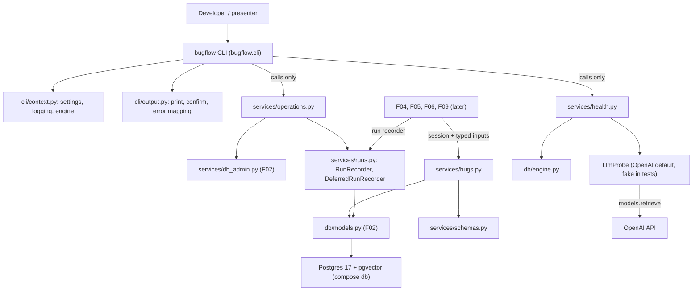

# Spec: F03. Service Layer, Bug Management and CLI Skeleton

**Complexity:** medium (about twenty new modules, no new tables, no HTTP endpoints, one external SDK probe, a CLI restructure).

## 1. Technical Overview

**What.** Build the service layer that F04 to F09 extend: the service conventions and typed errors, the bug services (create, get, update while open, list with filters, sort, search and pagination), the status transition rule, a run recorder that persists progress incrementally, and a three-part health check. Turn the F01 CLI stub into a command registry with output helpers and add `bugflow check`, `bugflow db init`, `bugflow db seed` and `bugflow db reset [--yes]`. The existing `init_db`, `seed_db` and `reset_db` (F02) are wrapped by recorded operations so each creates a run record with timestamps and log lines.

**Why.** F04 (index, search) and F05 (triage) need a run recorder and bug services; F09 exposes the same services over HTTP; F07 and F08 register CLI commands. Fixing the conventions once (services never own commits for bug data, errors are typed, the CLI contains no logic) keeps the CLI and the future API identical in behavior.

**Scope.**

Included:
- Service conventions (`bugflow/services/__init__.py`) and typed errors: validation with per-field messages, not found, state conflict, schema not initialized.
- Pydantic input and output models for bugs; bug services `create_bug`, `get_bug`, `update_bug`, `list_bugs`.
- Status transition table and `ensure_transition_allowed`.
- Run recorder: create run, start, update progress, append log, finish; scoped helper for foreground operations; a deferred recorder for `init` and `reset`.
- Recorded operations `run_init`, `run_seed`, `run_reset` over the F02 services.
- Health check service for database, vector search and LLM, with an injectable LLM probe and an OpenAI-backed default probe.
- CLI package with a registration mechanism, output helpers, and the commands `check`, `db init`, `db seed`, `db reset`.
- New dependency `openai`; connect timeout on the engine helper.
- Test doubles for the LLM probe in `backend/tests/mocks/`.

Excluded:
- Embeddings, indexing, similarity search (F04); triage agents, the claim operation, result writes (F05); background execution and event streaming (F06); reports (F07); reopen (F08); REST API and `serve` (F09).
- A transition service that changes bug status (F05 claims and finishes, F08 reopens); F03 only defines and exposes the rule.
- New tables, new migrations, or new environment variables.
- Authentication, deleting bugs, bulk import (PRD Section 7).

**Cross-cutting concerns integrated:** secret safety (recorder and CLI redact before persisting or printing; the LLM probe maps SDK errors to fixed messages), English-only text, the F02 error style (fixed messages, no URL).

## 2. Architecture Impact

Affected components:

- `backend/src/bugflow/services/` (errors, schemas, bugs, runs, operations, health; `db_admin.py` from F02 unchanged)
- `backend/src/bugflow/cli/` (replaces `backend/src/bugflow/cli.py`)
- `backend/src/bugflow/db/engine.py` (connect timeout)
- `backend/pyproject.toml`, `backend/uv.lock`
- `backend/tests/` (unit, integration, mocks)



Data flow: a CLI command loads settings (only commands do; `--version` never does), configures logging, builds an engine from `settings.database_url`, and calls one service function. Bug services take a SQLAlchemy `Session` and typed inputs, flush but never commit (the caller owns the transaction, which F05 needs for its single-transaction result write). The run recorder opens its own short transaction per write so progress is visible to other connections immediately.

## 3. Technical Decisions

| Decision | Chosen Approach | Alternative Considered | Trade-off |
|----------|----------------|----------------------|-----------|
| LLM reachability probe | `openai` SDK, `models.retrieve(<chat model>)`, client built with the configured timeout and zero retries, injectable `LlmProbe` | One-token chat completion | Validates key, network and model name at no token cost; does not prove generation works (user decision) |
| List ordering and paging | Default `opened_at` descending; `status` by lifecycle rank, `severity` by criticality rank (untriaged last); `asc` or `desc`; out-of-range paging rejected with field errors; page past the end returns no items and the true total | Alphabetical codes, clamped paging | More query code (rank `CASE` expressions); no silent changes to caller input (user decision) |
| Bug service transactions | Services flush, never commit; the caller commits | Commit inside each service | F05 must write all results and the status in one transaction; F09 will own request transactions |
| Run recorder transactions | Every recorder call opens its own session and commits | Join the caller's session | Progress and logs are visible to other connections at once (F06 and F12 stream them); the recorder cannot be rolled back with the caller's work |
| Runs for `init` and `reset` | Deferred recorder: remember start time and log lines in memory, write the run and its logs after the operation, when the schema exists | Skip run records for these operations | The `runs` table does not exist before `init` and is wiped by `reset`; deferral satisfies "every operation creates a run record" |
| CLI structure | Package `bugflow/cli/` with `commands/` modules each exposing `register(app)`, explicit module list in `cli/__init__.py` | Single growing `cli.py` | Later features add one module and one list entry; the `bugflow.cli:main` entry point is unchanged |
| Keeping the CLI thin | Static test allowlists the imports of CLI modules; they call `bugflow.services` and output helpers only | Convention only | A mechanical guard for the "no business logic" rule |
| Atomic edit guard | `UPDATE ... WHERE id = :id AND status = 'open'`; zero rows then distinguishes not found from state conflict | Read-then-write | Race-free against a concurrent triage claim |

### Assumptions and Decisions (review and override as needed)

1. **New dependency** (confirmed): `openai`, latest stable, pinned in `uv.lock`. Verify the SDK API against the installed version. No other dependency is added (`typer`, `pydantic`, `sqlalchemy` already exist).
2. **No schema change.** F03 uses the F02 tables as they are. The existing indexes `ix_bugs_status` and `ix_bugs_opened_at` serve the list queries.
3. **Validation.** Input models forbid unknown fields and enforce: title 1 to 120, description 1 to 5,000, reproduction steps 1 to 5,000, system version 1 to 50 characters, with at least one non-whitespace character (values are stored as given, never trimmed). `environment` and `reporting_team` must be exact enum codes. Pydantic errors are translated to `FieldError(field, message)` with fixed English messages: `is required`, `must not be empty`, `must be at most <N> characters`, `must be one of: <codes>`, `is not allowed`. The offending value is never included. `validate_payload(model, payload)` is the single translation point for CLI and API.
4. **Update semantics.** `BugUpdate` has the same optional fields as `BugCreate` (not status, not dates); at least one field is required, otherwise a validation error on field `update`. Only provided fields change; `updated_at` is refreshed. Not open: `StateConflictError("Bug <id> is not open and cannot be edited")`. Unknown id: `NotFoundError("Bug <id> not found")`.
5. **Status transitions.** `ALLOWED_TRANSITIONS`: `open` to `processing`; `processing` to `processed` or `failed`; `processed` to `open`; `failed` to `open`. `ensure_transition_allowed(current, new)` raises `StateConflictError("Status change from '<current>' to '<new>' is not allowed")` otherwise (including identical statuses).
6. **List query.** Text search is a case-insensitive substring match over title and description with `%`, `_` and the escape character escaped, so user text is never a pattern; blank or whitespace-only search means no search. `component` and `severity` filters and the `component`/`severity` fields of `BugRead` come from `LEFT JOIN`s on the classification tables (so untriaged bugs have null values). Tie-break: `opened_at` descending then `id` descending for status and severity sorts; for an `opened_at` sort the `id` follows the sort direction. `total` counts all rows matching the filters.
7. **Run recorder rules.** Statuses move only `queued` to `running` to `succeeded` or `failed`; `finish_run` is allowed from `queued` or `running` (a run that fails before starting is still finishable). Operating on a finished run raises `StateConflictError("Run <id> is already finished")`; an unknown run raises `NotFoundError("Run <id> not found")`. All log messages and error texts pass through the F01 `Redactor` seeded with `settings.secret_values()` before being stored. `started_at` is the creation time (F02 decision).
8. **Recorded operations.** `run_seed` first requires an initialized schema (current revision equals head) and otherwise raises `SchemaNotInitializedError("Database schema is not initialized; run 'bugflow db init'")`. Progress counters: seed `done = total = 20` (created plus already present); init and reset `done = total =` number of applied revisions. Log lines: one per applied revision, and `Seeded <n> bugs` or `<n> bugs already present, nothing to do` (partial: `Seeded <n> bugs (<m> already present)`). A failed operation is recorded as `failed` with the redacted error text when the `runs` table exists; when it does not (for example the database is unreachable) nothing is recorded and the error is still reported.
9. **Health check.** `check_health(settings, engine, llm_probe=None)` returns `HealthReport(database, vector_search, llm)`, each a `CheckResult(ok, message)`. Database: a trivial query; failure message `Cannot connect to the database`. Vector search: ok when the `vector` extension is available on the server (same test as `init_db`); when the database is unreachable the message is `Database unreachable; vector search not checked`; when the server lacks it, `pgvector extension is not available; use the pgvector/pgvector image`. LLM: with no key, `OPENAI_API_KEY is not set` and no call is made; otherwise the probe runs. The default probe maps SDK failures to fixed messages: authentication `OpenAI authentication failed`, connection `Cannot reach the OpenAI API`, timeout `OpenAI request timed out`, anything else `OpenAI request failed`. Raw SDK messages are never shown. Each check is independent: one failing never prevents the others. `check` does not create a run record (it is not an operation in the PRD list).
10. **Engine helper.** `create_db_engine` gains a 10-second driver connect timeout so an unreachable host fails promptly (the only change to F02 code).
11. **CLI output.** Results go to stdout; errors and the confirmation prompt text go to stderr/stdout as shown below; service log lines go to stderr at the configured `LOG_LEVEL`. Exit codes: 0 success, 1 failure (including `check` with any failed line), 2 usage errors (Typer). Messages: `check` prints exactly three lines `database: ok|failed: <reason>`, `vector search: ...`, `llm: ...`. `db init` prints `Applied migration <revision>` per revision or `Database schema is already up to date`. `db seed` prints the seed messages of assumption 8. `db reset` prints `This deletes all data. Type 'yes' to continue:` unless `--yes`; any answer other than `yes` (case-insensitive, trimmed) or end of input prints `Aborted: nothing was deleted` and exits 1; on success it prints `Database reset: schema recreated, no data loaded`.
12. **Error mapping.** `ConfigError`, `BugflowDatabaseError` and `ServiceError` print their fixed message to stderr and exit 1; any other exception prints `Unexpected error: <redacted text>` and exits 1. The CLI never prints stack traces or settings.
13. **Registration mechanism.** `bugflow/cli/__init__.py` holds an ordered tuple of command modules; each module has `register(app)`. Subgroups (`db`) are Typer sub-apps created in their module. Later features add their module to the tuple (F04: `index`, `search`; F05: `triage`; F07: `report`; F08: `reopen`).
14. **Test conventions reused from F01 and F02:** `tests/unit` and `tests/integration` with the `integration` marker; fixtures in conftest files; integration databases via `TEST_DATABASE_URL` with per-test schema reset (`fresh_schema`, `initialized_db`, `seeded_db`, `session`); canary secrets from `tests/conftest.py`; mocks live in `backend/tests/mocks/` (first use here: `fake_openai.py`); fixtures directory remains empty. CLI subprocess tests set `DATABASE_URL` to the test database URL in the child environment only.
15. **Quality gates** confirmed by the user, from `backend/`: `uv run ruff format .`, `uv run ruff check .`, `uv run pytest`. No wrapper script exists.
16. **Contract surfaces.** `Service` (consumers: F04, F05, F06, F09), `CLI`, and `Repository` (introduced by F01). The CLI surface's verification mode additionally allows direct database observation of the persisted side-effect, as the HTTP surface does, because run records and "deletes nothing" are persisted effects of a command. There is no HTTP, UI, Worker or Event signal in the F03 PRD block.
17. **Contract test double.** The LLM provider is replaced by an injectable test double (delivered by this feature under `backend/tests/mocks/`) for the successful-probe and authentication-failure health items; no contract item needs network access or a real key.
18. **F01/F02 interactions.** F01's hygiene tests require that only `bugflow.config` reads the environment: no new module reads it. The OpenAI SDK reads its own environment inside the library; the probe passes the key and timeout explicitly. F02's schema-source test requires that table definitions stay in `db/` and `migrations/`.

### PRD Traceability

| PRD block | Where it lands in this spec |
|---|---|
| Consumes: F02 schema, enums, services, run tables | §2 data flow, §4, §5.3 to §5.5 |
| Provides: service-layer conventions | §3 decisions, §5.1 |
| Provides: run recorder | §5.4 |
| Provides: bug services | §5.2 |
| Provides: health check service | §5.5 |
| Provides: CLI app with registration and output helpers | §3 decision on CLI structure, §5.6 |
| Capabilities (fields and limits, rules, list, check, run recorder, CLI, architecture rule) | §3 assumptions 3 to 13, §5 |
| Experience | §3 assumption 11, §5.6 |
| Error Handling | §3 assumptions 4, 8, 9, 12; §5.1 error table; §7 tests |

## 4. Component Overview

**Backend (`backend/`)**

| File Path | New/Modified | Purpose | Key Responsibilities |
|-----------|--------------|---------|---------------------|
| `backend/pyproject.toml` | Modified | Dependencies | Add `openai` |
| `backend/uv.lock` | Modified | Lock file | Regenerated by `uv sync` |
| `backend/src/bugflow/db/engine.py` | Modified | Engine helper | Add the driver connect timeout |
| `backend/src/bugflow/services/__init__.py` | Modified | Conventions | Module docstring stating the conventions of section 5.1 |
| `backend/src/bugflow/services/errors.py` | New | Typed errors | `ServiceError`, `ValidationFailedError`, `NotFoundError`, `StateConflictError`, `SchemaNotInitializedError`, `FieldError` |
| `backend/src/bugflow/services/schemas.py` | New | Models | `BugCreate`, `BugUpdate`, `BugRead`, `BugListQuery`, `BugPage`, `RunRead`, `RunLogRead`, `validate_payload` |
| `backend/src/bugflow/services/bugs.py` | New | Bug services | `create_bug`, `get_bug`, `update_bug`, `list_bugs`, `ALLOWED_TRANSITIONS`, `ensure_transition_allowed` |
| `backend/src/bugflow/services/runs.py` | New | Run recorder | `RunRecorder`, `RunContext`/`recorded_run`, `DeferredRunRecorder` |
| `backend/src/bugflow/services/operations.py` | New | Recorded operations | `run_init`, `run_seed`, `run_reset`, schema-initialized check |
| `backend/src/bugflow/services/health.py` | New | Health check | `check_health`, `HealthReport`, `CheckResult`, `LlmProbe`, `OpenAILlmProbe` |
| `backend/src/bugflow/cli.py` | Removed | Replaced by a package | Content moves to `cli/__init__.py` |
| `backend/src/bugflow/cli/__init__.py` | New | CLI app | Typer app, `--version` callback (no settings), command module tuple, `main()` |
| `backend/src/bugflow/cli/context.py` | New | CLI bootstrap | Load settings, configure logging, build engine |
| `backend/src/bugflow/cli/output.py` | New | Output helpers | Print lines, print errors, typed confirmation, error-to-exit-code mapping |
| `backend/src/bugflow/cli/commands/__init__.py` | New | Package marker | |
| `backend/src/bugflow/cli/commands/check.py` | New | `check` | Print the three lines, exit code |
| `backend/src/bugflow/cli/commands/db.py` | New | `db init`, `db seed`, `db reset` | Parse arguments, confirm, call operations, print |

**Tests (`backend/tests/`)**

| File Path | New/Modified | Purpose |
|-----------|--------------|---------|
| `tests/mocks/fake_openai.py` | New | Fake OpenAI client and fake `LlmProbe` (success, authentication failure, timeout, connection error) |
| `tests/unit/test_service_schemas.py` | New | Validation and field errors |
| `tests/unit/test_status_transitions.py` | New | Transition table |
| `tests/unit/test_list_query_model.py` | New | List query validation |
| `tests/unit/test_llm_probe.py` | New | Error mapping of the default probe |
| `tests/unit/test_health_unit.py` | New | Health composition with fakes |
| `tests/unit/test_cli_commands.py` | New | Command behavior with fake services |
| `tests/unit/test_cli_output.py` | New | Output helpers and error mapping |
| `tests/unit/test_cli_thin.py` | New | Import allowlist for CLI modules |
| `tests/unit/test_deferred_recorder.py` | New | Deferred buffering semantics (no database) |
| `tests/integration/test_bug_services.py` | New | Create, get, update |
| `tests/integration/test_bug_list.py` | New | Filters, sort, search, paging |
| `tests/integration/test_run_recorder.py` | New | Recorder lifecycle and visibility |
| `tests/integration/test_operations.py` | New | Recorded init, seed, reset |
| `tests/integration/test_health.py` | New | Health against real databases |
| `tests/integration/test_cli_subprocess.py` | New | The CLI as a child process |

**Database:** no migrations.

## 5. Interface Contracts

F03 exposes no HTTP endpoints; its interfaces are Python modules (consumed by F04 to F09) and the CLI.

### 5.1 Service-layer conventions (`bugflow.services`)

- Services take a session (or an engine / session factory for administrative operations) plus typed inputs, and return Pydantic models; they never return ORM objects.
- Bug services flush and never commit. Administrative operations and the run recorder manage their own transactions.
- Business rules live only in `bugflow.services`; the CLI and the API (F09) call them.
- Errors derive from `ServiceError`; messages are fixed English text without secrets or URLs.

| Error | When | Message |
|---|---|---|
| `ValidationFailedError` | Input rejected | `Validation failed`; carries `field_errors` (list of `field`, `message`) |
| `NotFoundError` | Unknown bug or run | `Bug <id> not found` / `Run <id> not found` |
| `StateConflictError` | Edit of a non-open bug, forbidden status change, operating on a finished run | see assumptions 4, 5, 7 |
| `SchemaNotInitializedError` | Seed before init | `Database schema is not initialized; run 'bugflow db init'` |

### 5.2 Bug services (`bugflow.services.bugs`)

| Function | Input | Output | Behavior |
|---|---|---|---|
| `create_bug(session, data: BugCreate)` | validated model | `BugRead` | Inserts with status `open` and `opened_at` now; flushes |
| `get_bug(session, bug_id)` | int | `BugRead` | Includes `component` and `severity` (null before triage); `NotFoundError` otherwise |
| `update_bug(session, bug_id, data: BugUpdate)` | int, model | `BugRead` | Atomic conditional update, only while `open` |
| `list_bugs(session, query: BugListQuery)` | model | `BugPage` | Filters, search, sort, pagination |
| `ensure_transition_allowed(current, new)` | `BugStatus` pair | none | Raises `StateConflictError` when not allowed |

`BugRead` JSON shape (for F09):

```json
{
  "id": 7,
  "title": "Checkout button does nothing on Safari 17",
  "description": "Clicking \"Place order\" shows no response and no network call.",
  "reproduction_steps": "Add an item, go to checkout in Safari 17, click the button.",
  "system_version": "web 3.8.2",
  "environment": "production",
  "reporting_team": "support",
  "status": "open",
  "opened_at": "2026-07-14T12:00:00Z",
  "updated_at": "2026-07-14T12:00:00Z",
  "component": null,
  "severity": null
}
```

`BugListQuery` fields: `status`, `component`, `severity`, `environment`, `reporting_team` (optional enum codes), `search` (optional text up to 200 characters), `sort_by` (`opened_at` default, `status`, `severity`), `sort_dir` (`desc` default, `asc`), `page` (default 1, at least 1), `page_size` (default 20, 1 to 100). `BugPage` has `items`, `total`, `page`, `page_size`.

### 5.3 Recorded operations (`bugflow.services.operations`)

| Function | Output | Behavior |
|---|---|---|
| `run_init(engine)` | `InitResult` | Deferred recorder; records an `init` run after the schema exists |
| `run_seed(engine)` | `SeedResult` | Requires an initialized schema; direct recorder with live log and progress; records a `seed` run |
| `run_reset(engine)` | `InitResult` | Deferred recorder; records a `reset` run after the schema is recreated |

### 5.4 Run recorder (`bugflow.services.runs`)

| Method | Effect |
|---|---|
| `create_run(run_type, bug_id=None, total=0) -> int` | Inserts a `queued` run, committed immediately |
| `start_run(run_id)` | `queued` to `running` |
| `update_progress(run_id, done, total=None)` | Writes counters |
| `append_log(run_id, level, message)` | Appends a redacted line (`logged_at` now) |
| `finish_run(run_id, status, error=None)` | `succeeded` or `failed`, sets `finished_at`, stores the redacted error |
| `get_run(run_id) -> RunRead`, `get_run_logs(run_id) -> list[RunLogRead]` | Read helpers |
| `recorded_run(recorder, run_type, bug_id=None)` | Context manager: creates and starts a run, finishes `succeeded` on exit, or `failed` with the redacted error before re-raising |

`DeferredRunRecorder` has the same logging and progress calls but keeps them in memory, then `persist(session_factory, status, error)` writes the run with its original `started_at`, the log lines with their original times, and `finished_at` now.

### 5.5 Health check (`bugflow.services.health`)

`check_health(settings, engine, llm_probe=None) -> HealthReport`. `LlmProbe` is a protocol with one method that raises `LlmProbeError(message)` on failure. Messages follow assumption 9.

### 5.6 CLI (`bugflow` console script)

| Command | Behavior |
|---|---|
| `bugflow --version`, `--help` | Unchanged from F01 plus the command list; `--version` loads no settings |
| `bugflow check` | Three lines, e.g. `database: ok`, `vector search: ok`, `llm: failed: OPENAI_API_KEY is not set`; exit 1 when any line failed |
| `bugflow db init` | `Applied migration 0001` or `Database schema is already up to date` |
| `bugflow db seed` | `Seeded 20 bugs` or `20 bugs already present, nothing to do` |
| `bugflow db reset [--yes]` | Prompt, then `Database reset: schema recreated, no data loaded`; `Aborted: nothing was deleted` and exit 1 otherwise |

Every command description in `--help` is a one-line English sentence.

## 6. Data Model

F03 changes no schema. It reads and writes the F02 tables as follows.

| Table | Used by | Access |
|---|---|---|
| `bugs` | bug services | insert, select, conditional update, filtered/sorted/paged select |
| `component_classifications`, `severity_classifications` | list and get | `LEFT JOIN` on `bug_id` for `component` and `severity` |
| `runs` | run recorder | insert, status and progress updates, finish |
| `run_logs` | run recorder | append only |

Run state machine: `queued` to `running` to `succeeded` or `failed`; `queued` to `failed` is allowed; terminal states are final.

Rank expressions for sorting come from enum declaration order: `BugStatus` (`open`, `processing`, `processed`, `failed`) and `Severity` (`critical`, `major`, `minor`); untriaged rows sort last in both directions.

## 7. Testing Strategy

Unit tests need no database or network. Integration tests (marker `integration`, run only with `uv run pytest -m integration`) use `TEST_DATABASE_URL` and the compose `db` service; the plain server fixture from F02 is reused for the missing-pgvector health case.

| Test File | Test Type | Target | Coverage Goal |
|-----------|-----------|--------|---------------|
| `tests/unit/test_service_schemas.py` | Unit | `services.schemas`, `services.errors` | 100% |
| `tests/unit/test_status_transitions.py` | Unit | transition table | 100% |
| `tests/unit/test_list_query_model.py` | Unit | `BugListQuery` | 100% |
| `tests/unit/test_llm_probe.py` | Unit | `OpenAILlmProbe` | 100% |
| `tests/unit/test_health_unit.py` | Unit | `services.health` | 95% |
| `tests/unit/test_deferred_recorder.py` | Unit | `DeferredRunRecorder` buffering | 95% |
| `tests/unit/test_cli_commands.py` | Unit (Typer `CliRunner`) | `cli.commands` | 95% |
| `tests/unit/test_cli_output.py` | Unit | `cli.output`, `cli.context` | 100% |
| `tests/unit/test_cli_thin.py` | Unit (static) | CLI import allowlist | n/a |
| `tests/integration/test_bug_services.py` | Integration | create, get, update | all branches |
| `tests/integration/test_bug_list.py` | Integration | `list_bugs` | all branches |
| `tests/integration/test_run_recorder.py` | Integration | `RunRecorder` | all branches |
| `tests/integration/test_operations.py` | Integration | recorded operations | all branches |
| `tests/integration/test_health.py` | Integration | `check_health` | all branches |
| `tests/integration/test_cli_subprocess.py` | Integration (child process) | the CLI end to end | n/a |

**`test_service_schemas.py`**

| Test Function | Description | Assertions |
|---------------|-------------|------------|
| `test_valid_payload_accepted` | Full valid payload | model built, enums typed |
| `test_boundaries_accepted` | Lengths 120, 5000, 5000, 50 | accepted |
| `test_over_length_rejected_per_field` | One field over its limit, parametrized | `ValidationFailedError` with that field only |
| `test_empty_and_whitespace_only_rejected` | `""` and `"   "` | field error `must not be empty` |
| `test_invalid_enum_lists_allowed_codes` | `environment="sandbox"`, near-miss `"Production"` | message lists the allowed codes; never the value |
| `test_multiple_errors_reported_together` | Two bad fields | two field errors |
| `test_unknown_field_rejected` | Extra key | `is not allowed` |
| `test_update_requires_a_field` | Empty update | error on field `update` |
| `test_update_forbids_status_and_dates` | `status`, `opened_at` in update | rejected |

**`test_status_transitions.py`**: `test_allowed_pairs` (five pairs), `test_forbidden_pairs` (every other pair including identical), `test_message_text`.

**`test_list_query_model.py`**: defaults; `page=0`, `page_size=0` and `101` rejected with the field named; `page_size=100` accepted; unknown `sort_by` rejected; blank search normalized to none.

**`test_llm_probe.py`**: success path calls `models.retrieve` once with the configured model, zero retries, configured timeout; authentication error maps to `OpenAI authentication failed`; connection error; timeout; unknown error; none of the messages contains the key or the SDK text.

**`test_health_unit.py`**: no key means `llm` failed with the exact message and the probe is not called; each check is independent when another raises; `all_ok` semantics; report text never contains canary secrets.

**`test_deferred_recorder.py`**: buffered lines keep order and original timestamps; `persist` arguments carry the original start time; failure status carries a redacted error.

**`test_cli_commands.py`**

| Test Function | Description | Assertions |
|---------------|-------------|------------|
| `test_help_lists_commands_in_english` | `--help`, `db --help` | `check`, `init`, `seed`, `reset` listed with descriptions |
| `test_version_loads_no_settings` | `--version` with settings patched to raise | exit 0 |
| `test_check_prints_three_lines` | Fake health report | exact lines, exit 1 when any failed, 0 when all ok |
| `test_init_prints_migrations` | Fake operation results | per-revision lines and the up-to-date line |
| `test_seed_messages` | created 20, already present 20, partial | the three messages |
| `test_reset_yes_flag_skips_prompt` | `--yes` | operation called once |
| `test_reset_requires_typed_yes` | input `yes`, `YES`, `no`, empty, end of input | confirmed only for the first two; others exit 1 and call nothing |
| `test_errors_map_to_exit_one` | `ConfigError`, database error, service error, unexpected error | message on stderr, exit 1, no traceback |

**`test_cli_output.py`**: print helpers write to the right streams; confirmation returns false on end of input; unexpected-error text is redacted; context builds engine and logging only when called.

**`test_cli_thin.py`**: AST scan of `bugflow/cli/**`: imports limited to the standard library, `typer`, `bugflow.config`, `bugflow.logging_config`, `bugflow.db.engine`, `bugflow.db.errors`, `bugflow.services.*` and `bugflow.cli.*`; no `sqlalchemy`, `alembic`, `openai` or `bugflow.db.models` import; every command module imports from `bugflow.services`.

**`test_bug_services.py`**: create returns `open` with timestamps; created bug readable by `get_bug`; `get_bug` null component and severity; unknown id; update changes only given fields and advances `updated_at`; update of `processing`, `processed`, `failed` bugs raises the exact conflict message and changes nothing; update of an unknown id; concurrent-claim simulation (status changed between read and update) yields conflict, not a lost update.

**`test_bug_list.py`** (fixture of 25 bugs as in the contract): default page and order; page 2; page size 5 page 3; page past the end; each filter alone; combined filters; case-insensitive search in title and in description; wildcard characters in search are literal; no match; sort by `opened_at` both directions; sort by `status`; sort by `severity` both directions with untriaged last; `total` unaffected by paging; `component` and `severity` in items; invalid paging rejected.

**`test_run_recorder.py`**: create (queued, null bug, zero progress); lifecycle transitions; illegal transitions raise; progress updates; ordered log lines; finish succeeded and failed; redaction of canary key in logs and errors; second session sees a log line immediately (no caller commit); `recorded_run` success and failure paths; unknown run.

**`test_operations.py`**: `run_init` on an empty database creates one `init` run with log lines after the schema exists; second `run_init` records another run with the up-to-date line; `run_seed` before init raises `SchemaNotInitializedError`; `run_seed` records a `seed` run with progress 20 of 20 and the messages; `run_reset` leaves exactly one `reset` run; a failing seed marks its run `failed` with a redacted error and re-raises; an unreachable database records nothing and raises the database error.

**`test_health.py`**: initialized database with a fake successful probe (all ok); missing key; probe authentication failure; unreachable database (database and vector search failed, llm still evaluated); plain server (database ok, vector search failed with the pgvector message); no secret in any message.

**`test_cli_subprocess.py`**: `--help`, `db --help`; init twice; seed twice; seed before init; reset with `--yes`, with typed `yes`, with `no`, with closed stdin; `check` with no key; `check` against an unreachable database; missing `DATABASE_URL`; run records observed with direct queries after each operation.
