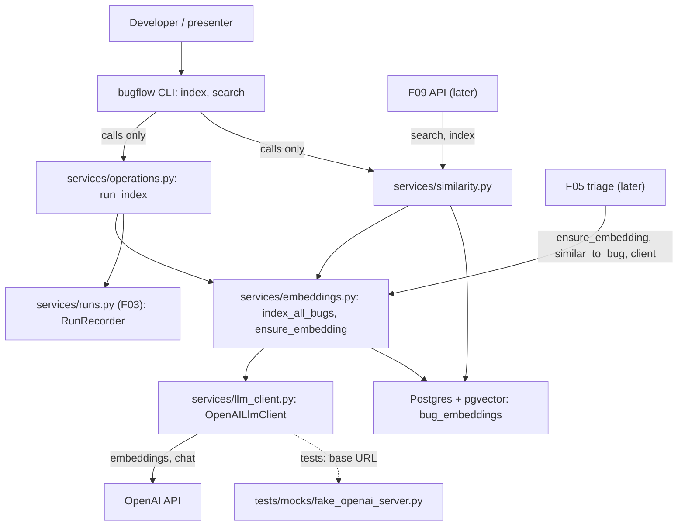

# Spec: F04. Embeddings Index and Similar Search

**Complexity:** medium (about ten new modules, one shared client wrapper with retry, no new tables, no HTTP endpoints, a local OpenAI stand-in for tests).

## 1. Technical Overview

**What.** Build the similarity layer on top of the F02 `bug_embeddings` table: a shared LLM client wrapper (embeddings and chat, timeout, bounded retry, fixed error messages), the embedding text builder with a hash for stale detection, `ensure_embedding`, `index_all_bugs` (batches of up to 20, run progress and logs), cosine-similarity `search_similar` and `similar_to_bug`, a recorded `run_index` operation, and the CLI commands `bugflow index` and `bugflow search "<text>" [--limit N]`.

**Why.** F05 passes similar past bugs to the Technical Analyst (`ensure_embedding`, `similar_to_bug`) and reuses the client wrapper for the agents, so retry and timeout behavior is identical everywhere. F09 and F14 expose the same search over HTTP and the UI.

**Scope.**

Included:
- `OpenAILlmClient`: `embed(texts)` and `chat(messages, temperature)`, timeout from settings, up to `LLM_MAX_RETRIES` retries with backoff for transient errors, fixed secret-free error messages.
- Embedding text builder, query text builder and `text_hash`.
- `ensure_embedding`, `index_all_bugs`, `run_index`.
- `search_similar`, `similar_to_bug`, their input validation, result models and the empty-index hint.
- CLI: `index` and `search`, registered in the F03 command registry; validation errors now print their field messages.
- A local stand-in for the OpenAI API (stdlib HTTP server) under `backend/tests/mocks/`, used by in-process and CLI verification.

Excluded:
- Triage agents, prompts, the claim operation (F05); background execution, `start_run`, event streaming (F06); REST endpoints (F09); search page (F14).
- An approximate-nearest-neighbor vector index (exact cosine scan; PRD Section 7 keeps pgvector local and the dataset is small).
- Re-ranking, hybrid or keyword search, embedding models other than the configured one, LLM providers other than OpenAI.
- Any schema change, migration, new table or new environment variable.

**Cross-cutting concerns integrated:** secret safety (fixed error messages, redaction in run records, the key is never in any message), English-only text, the F03 service conventions (services flush and do not commit; operations and the recorder own their transactions).

## 2. Architecture Impact

Affected components:

- `backend/src/bugflow/services/llm_client.py`, `embeddings.py`, `similarity.py` (new)
- `backend/src/bugflow/services/operations.py`, `errors.py`, `health.py` (modified)
- `backend/src/bugflow/cli/commands/index.py`, `search.py` (new); `cli/__init__.py`, `cli/context.py`, `cli/output.py` (modified)
- `backend/tests/mocks/fake_openai_server.py`, `backend/tests/` (new tests)



Data flow: a CLI command bootstraps settings and an engine (F03), builds a lazy client factory and calls one service. `index` runs inside a recorded `index` run; every batch is embedded with one API call and written in its own committed transaction, so progress is visible and a failing batch writes nothing. `search` validates the query, checks that something is indexed (no API call otherwise), embeds the query with the same client and orders stored vectors by cosine distance.

## 3. Technical Decisions

| Decision | Chosen Approach | Alternative Considered | Trade-off |
|----------|----------------|----------------------|-----------|
| Fake OpenAI for verification | Local stdlib HTTP stand-in under `tests/mocks/`; the SDK honors its own base-URL environment variable, and the wrapper also takes an explicit `base_url` argument (user decision) | Add `OPENAI_BASE_URL` to Settings; skip CLI success items | No config or F01 contract change; relies on the SDK's documented variable (verify against the installed version) |
| Retries | The wrapper does its own loop (SDK retries set to 0): `LLM_MAX_RETRIES` extra attempts for connection errors, timeouts, 429 and 5xx, backoff 0.5 s then 1.0 s (doubling), injectable sleep | SDK built-in retry | Counts and delays are testable and identical for F05; a little more code |
| Client creation | Lazy factory (`get_client`) passed to services | Build the client eagerly in the CLI | A missing key fails inside the recorded run (the run log shows `OPENAI_API_KEY is not set`) and search over an empty index needs no key |
| Index semantics | Always re-embeds every bug (rebuild), upserts by `bug_id`, one committed transaction per batch of 20 | Skip unchanged bugs; all-or-nothing run | A failed batch writes nothing but earlier batches stay (PRD: "no partial vectors for the failed batch"); rebuild costs one call per 20 bugs |
| `similar_to_bug` freshness | Ensures the bug's own embedding first (re-embeds if missing or stale) | Require a prior `ensure_embedding` | One extra hash check per call; results are never stale (PRD user story) |
| Stale detection | `text_hash` is the SHA-256 of the embedding model name and the enriched text | Hash of the text only | Changing `OPENAI_EMBEDDING_MODEL` also refreshes every vector |
| Search before indexing | Return no items and the hint `No bugs are indexed; run index` without calling the API | Embed first, then find nothing | No key or cost needed to learn that nothing is indexed |
| Score | Cosine similarity, `1 - cosine distance`, computed by pgvector | Raw distance | Higher is more similar; matches the 0 to 1 display of F14 |

### Assumptions and Decisions (review and override as needed)

1. **No new dependency, schema or variable.** `openai` (F03) and `pgvector` (F02) suffice; the stand-in uses only the standard library. The installed SDK must honor its base-URL environment variable for the CLI items; if it does not, the user decision should be revisited before implementing.
2. **Client wrapper API.** `OpenAILlmClient(api_key, *, base_url=None, timeout_seconds, max_retries, embedding_model, chat_model, sleep=time.sleep, client_factory=None)` with `embed(texts) -> list[list[float]]` (same order as the input) and `chat(messages, *, temperature=0.0) -> str`. `OpenAILlmClient.from_settings(settings)` calls `settings.require_openai_key()` (so a missing key raises `ConfigError("OPENAI_API_KEY is not set")`) and takes timeout, retries and model names from settings. Temperature above 0.2 raises `ValueError` before any request (PRD project rule, used by F05).
3. **Error messages** (fixed, no SDK text, no key): authentication `OpenAI authentication failed` (never retried); rate limit `OpenAI rate limit exceeded`; server error `OpenAI service unavailable`; connection `Cannot reach the OpenAI API`; timeout `OpenAI request timed out`; any other rejected request such as 400 `OpenAI request failed` (never retried); wrong vector size `OpenAI returned an unexpected embedding size` (never retried). All are `LlmError`, a `ServiceError`. The constants of F03's `health.py` move to `llm_client.py` and are re-exported from `health.py` so existing imports keep working.
4. **Embedding text.** Five labeled lines in this order: `Title`, `Description`, `Steps to reproduce`, `System version`, `Environment` (the environment code). Status, reporting team and dates are not part of the text, so changing them never triggers a re-embed. The query text is the user's text trimmed of surrounding whitespace (the same module owns both builders so the rule stays in one place).
5. **Hash.** SHA-256 hex (64 characters, fits `text_hash`) of `"<embedding model>\n<enriched text>"`.
6. **Batches and progress.** Batch size is the constant 20. Bugs are processed in `id` order. After each batch the run progress and a log line (`Embedded batch <n> of <m> (<k> bugs)`) are recorded. The run's total is the bug count at the start.
7. **`run_index(engine, get_client, redactor=None)`.** Requires an initialized schema (otherwise `SchemaNotInitializedError`), records a run of type `index` through `recorded_run`, calls `get_client()` inside the run, then `index_all_bugs`. A failure marks the run `failed` with the redacted error and re-raises.
8. **Missing key.** Unset or empty `OPENAI_API_KEY` fails the `index` run with `OPENAI_API_KEY is not set` (F01 and F13 wording); an invalid key fails it with `OpenAI authentication failed` (F04 wording). PRD F04's "missing/invalid" is read as these two cases.
9. **Search validation.** Text is trimmed; blank text raises `EmptySearchTextError("Search text must not be empty")` (a `ServiceError`); text longer than 500 characters gives a field error on `text`; `limit` outside 1 to 20 gives a field error on `limit` with the message `must be between 1 and 20`. Default limit is the constant 5. Validation happens before any index check or API call.
10. **Search results.** `SimilarBug(bug_id, title, status, score)` ordered by score descending, ties by `bug_id`. Indexed bugs only. `search_similar` returns `SearchResult(items, hint)`; the hint is set only when nothing is indexed. `similar_to_bug` returns a list and excludes the bug itself; with no other indexed bug it returns an empty list.
11. **`ensure_embedding(session, client, bug_id) -> bool`** flushes and does not commit (caller owns the transaction, as F05 needs); it returns whether the embedding was refreshed. `embedded_at` is set with `clock_timestamp()` on every write and is untouched when nothing changed. Unknown bug: `NotFoundError`.
12. **CLI output.** `bugflow index` prints `Indexed <done>/<total> bugs`. `bugflow search` prints a header line `SCORE  ID  TITLE  STATUS` and one line per result in the form `<score with 2 decimals>  <id>  <title>  <status>` (two-space separators); with no indexed bug it prints the hint and exits 0. Errors go to stderr with exit code 1 (F03 conventions); `--limit` outside 1 to 20 prints `Validation failed: limit: must be between 1 and 20`.
13. **Change to F03 code.** `cli/output.py:error_message` appends field errors for `ValidationFailedError` (`Validation failed: <field>: <message>`, joined with `; `). F03's unit test for the unchanged message is updated accordingly. `cli/context.py` exposes a lazy `get_client` built with `OpenAILlmClient.from_settings`.
14. **Stand-in server** (`tests/mocks/fake_openai_server.py`, run with `PYTHONPATH=tests uv run python -m mocks.fake_openai_server`, prints `listening http://127.0.0.1:<port>` on start): `POST /v1/embeddings` returns deterministic 1,536-dimension, L2-normalized vectors built from hashed lowercase word tokens plus a small constant component (never a zero vector), so texts sharing more words are more similar; accepts only the key `sk-test-valid` (others get an OpenAI-shaped 401); `POST /v1/chat/completions` returns a fixed reply; `GET /v1/models/<id>` succeeds. A control interface can script the next embedding responses (status codes, a delay, a wrong vector size) and returns the record of received requests (path, key accepted or not, model, number of inputs, temperature) and resets it.
15. **Conventions reused:** pytest layout, `integration` marker, `TEST_DATABASE_URL` with per-test schema reset, `tests/mocks/` for doubles, canary secrets, the F03 `seed_db`-based persistent state. In-process items pass the stand-in URL as `base_url`; CLI items set the SDK base-URL variable in the child environment only.
16. **Quality gates** confirmed by the user, from `backend/`: `uv run ruff format .`, `uv run ruff check .`, `uv run pytest`. No wrapper script exists.
17. **Contract surfaces.** `Service` (consumers: F05 and F09, which depend on F04 per PRD Section 8) and `CLI`. The CLI mode allows database observation of persisted effects, as in F03. No HTTP, UI, Worker or Event signal exists in the F04 PRD block.
18. **F03 interactions.** `test_cli_thin` allows CLI modules to import `bugflow.services.*`, so `index` and `search` import the wrapper and services from there and never `openai`. F01's hygiene test forbids environment access in `src`: nothing here reads the environment (the SDK reads its own variable internally).

### PRD Traceability

| PRD block | Where it lands in this spec |
|---|---|
| Consumes: F03 bug services, run recorder, conventions, CLI | §2 data flow, §3 decisions, §4 |
| Provides: index service and `ensure_embedding` | §5.3, §5.4 |
| Provides: `search_similar`, `similar_to_bug` | §5.5 |
| Provides: shared LLM client wrapper | §5.1, §5.2 |
| Capabilities (embedded text, embeddings, index, search, `ensure_embedding`, CLI, wrapper) | §3 assumptions 2 to 12, §5, §6 |
| Experience | §3 assumption 12, §5.6 |
| Error Handling | §3 assumptions 3, 8, 9; §5.2 error table; §7 tests |

## 4. Component Overview

**Backend (`backend/`)**

| File Path | New/Modified | Purpose | Key Responsibilities |
|-----------|--------------|---------|---------------------|
| `backend/src/bugflow/services/llm_client.py` | New | Shared LLM client | `OpenAILlmClient`, `LlmError`, message constants, retry loop, size and temperature guards |
| `backend/src/bugflow/services/embeddings.py` | New | Embedding layer | Text and query builders, hash, `ensure_embedding`, `index_all_bugs`, upsert |
| `backend/src/bugflow/services/similarity.py` | New | Search | `search_similar`, `similar_to_bug`, validation, `SimilarBug`, `SearchResult`, `DEFAULT_SEARCH_LIMIT` |
| `backend/src/bugflow/services/operations.py` | Modified | Recorded operations | Add `run_index`, `index_message` |
| `backend/src/bugflow/services/errors.py` | Modified | Typed errors | Add `EmptySearchTextError` |
| `backend/src/bugflow/services/health.py` | Modified | Health check | Import and re-export the message constants from `llm_client.py` |
| `backend/src/bugflow/cli/commands/index.py` | New | `index` command | Build context, call `run_index`, print the summary |
| `backend/src/bugflow/cli/commands/search.py` | New | `search` command | Parse text and `--limit`, call `search_similar`, print the table or hint |
| `backend/src/bugflow/cli/__init__.py` | Modified | Registry | Add the two modules to `COMMAND_MODULES` |
| `backend/src/bugflow/cli/context.py` | Modified | Bootstrap | Lazy `get_client` |
| `backend/src/bugflow/cli/output.py` | Modified | Output helpers | Print field errors of `ValidationFailedError` |

**Tests (`backend/tests/`)**

| File Path | New/Modified | Purpose |
|-----------|--------------|---------|
| `tests/mocks/fake_openai_server.py` | New | HTTP stand-in for the OpenAI API with scripting, request log, and the shared deterministic embedder |
| `tests/unit/test_embedding_text.py` | New | Text, query and hash rules |
| `tests/unit/test_llm_client.py` | New | Retry, backoff, mapping, guards (SDK client faked) |
| `tests/unit/test_search_validation.py` | New | Query validation |
| `tests/unit/test_fake_openai_embedder.py` | New | Determinism and shape of the stand-in vectors |
| `tests/unit/test_cli_index_search.py` | New | Command behavior with fake services |
| `tests/unit/test_cli_output.py` | Modified | Field errors in messages |
| `tests/integration/test_llm_client_http.py` | New | The wrapper against the stand-in |
| `tests/integration/test_ensure_embedding.py` | New | Staleness rules |
| `tests/integration/test_index_all.py` | New | Batches, rebuild, failures |
| `tests/integration/test_search.py` | New | `search_similar` |
| `tests/integration/test_similar_to_bug.py` | New | `similar_to_bug` |
| `tests/integration/test_run_index.py` | New | Recorded index operation |
| `tests/integration/test_cli_index_search.py` | New | The CLI as a child process against the stand-in |

**Database:** no migrations; `bug_embeddings` is used as created by F02.

## 5. Interface Contracts

F04 exposes no HTTP endpoints; its interfaces are Python modules (consumed by F05 and F09) and the CLI.

### 5.1 LLM client wrapper (`bugflow.services.llm_client`)

| Method | Input | Output | Behavior |
|---|---|---|---|
| `embed(texts)` | list of strings | list of float vectors | One API request with the configured embedding model; checks every vector has 1,536 dimensions |
| `chat(messages, temperature=0.0)` | role/content messages | reply text | One request with the configured chat model; temperature above 0.2 raises before any request |

Every request uses the configured timeout. Attempts per call are `1 + max_retries`.

### 5.2 Error table

| Situation | Retried | Error message |
|---|---|---|
| 401 invalid or missing credentials | No | `OpenAI authentication failed` |
| 429 | Yes | `OpenAI rate limit exceeded` (after the last retry) |
| 500 or above | Yes | `OpenAI service unavailable` |
| Connection failure | Yes | `Cannot reach the OpenAI API` |
| Timeout | Yes | `OpenAI request timed out` |
| Other 4xx | No | `OpenAI request failed` |
| Vector of a different size | No | `OpenAI returned an unexpected embedding size` |
| Unset key (client creation) | n/a | `OPENAI_API_KEY is not set` (`ConfigError`) |

### 5.3 Embedding services (`bugflow.services.embeddings`)

- `ensure_embedding(session, client, bug_id) -> bool`: creates or refreshes the bug's embedding when it is missing or its `text_hash` differs from the current text and model; flushes, never commits; `True` when it wrote.
- `index_all_bugs(session_factory, client, on_batch=None) -> IndexResult(indexed, total)`: embeds every bug (any status) in batches of 20, upserting by `bug_id`, one committed transaction per batch; `on_batch(done, total, batch_number, batch_count, batch_size)` is called after each batch.

### 5.4 Recorded operation (`bugflow.services.operations`)

`run_index(engine, get_client, redactor=None) -> IndexResult`: described in assumption 7. `index_message(result)` returns `Indexed <indexed>/<total> bugs`.

### 5.5 Similarity services (`bugflow.services.similarity`)

| Function | Output | Behavior |
|---|---|---|
| `search_similar(session, get_client, text, k=5)` | `SearchResult(items, hint)` | Validates, returns the hint when nothing is indexed, else embeds the query and returns the top `k` by cosine similarity |
| `similar_to_bug(session, get_client, bug_id, k=5)` | `list[SimilarBug]` | Ensures the bug's own embedding, then returns the top `k` of the other indexed bugs |

`SimilarBug` JSON shape (for F09):

```json
{ "bug_id": 7, "title": "Checkout button does nothing on Safari 17", "status": "open", "score": 0.8312 }
```

### 5.6 CLI

| Command | Behavior |
|---|---|
| `bugflow index` | `Indexed 20/20 bugs`; a run of type `index` with progress and one log line per batch |
| `bugflow search "<text>" [--limit N]` | Header line then up to `N` lines (default 5, 1 to 20); the hint line when nothing is indexed |
| `bugflow --help` | Lists `index` and `search` with one-line English descriptions |

| CLI error | Message (stderr, exit 1) |
|---|---|
| Missing key (index) | `OPENAI_API_KEY is not set` |
| Invalid key | `OpenAI authentication failed` |
| Empty search text | `Search text must not be empty` |
| Limit out of range | `Validation failed: limit: must be between 1 and 20` |
| Index before init | `Database schema is not initialized; run 'bugflow db init'` |

## 6. Data Model

F04 changes no schema.

| Table | Used by | Access |
|---|---|---|
| `bug_embeddings` | embedding services, similarity | upsert by `bug_id` (`INSERT ... ON CONFLICT DO UPDATE` setting vector, hash and `embedded_at`); select by `bug_id`; cosine-ordered select with `LIMIT` |
| `bugs` | embedding services, similarity | read the five text fields; join for `title` and `status` in results |
| `runs`, `run_logs` | `run_index` | via the F03 recorder |

Similarity query shape: select `bug_id`, `title`, `status` and `1 - (embedding <=> :query)` from `bug_embeddings` joined to `bugs`, optionally excluding one `bug_id`, ordered by distance ascending then `bug_id`, limited to `k`. The vector is passed as a bound parameter; no SQL is built from text.

## 7. Testing Strategy

Unit tests need no database or network. Integration tests (marker `integration`, run only with `uv run pytest -m integration`) use `TEST_DATABASE_URL`, the compose `db` service and, where needed, the stand-in server started on an ephemeral loopback port (fixtures start and stop it).

| Test File | Test Type | Target | Coverage Goal |
|-----------|-----------|--------|---------------|
| `tests/unit/test_embedding_text.py` | Unit | text, query, hash | 100% |
| `tests/unit/test_llm_client.py` | Unit (SDK faked, sleep injected) | `OpenAILlmClient` | 100% |
| `tests/unit/test_search_validation.py` | Unit | search validation | 100% |
| `tests/unit/test_fake_openai_embedder.py` | Unit | stand-in embedder | n/a |
| `tests/unit/test_cli_index_search.py` | Unit (`CliRunner`) | `cli.commands.index`, `search` | 95% |
| `tests/integration/test_llm_client_http.py` | Integration | wrapper against the stand-in | all branches |
| `tests/integration/test_ensure_embedding.py` | Integration | `ensure_embedding` | all branches |
| `tests/integration/test_index_all.py` | Integration | `index_all_bugs` | all branches |
| `tests/integration/test_search.py` | Integration | `search_similar` | all branches |
| `tests/integration/test_similar_to_bug.py` | Integration | `similar_to_bug` | all branches |
| `tests/integration/test_run_index.py` | Integration | `run_index` | all branches |
| `tests/integration/test_cli_index_search.py` | Integration (child process) | the CLI end to end | n/a |

**`test_embedding_text.py`**

| Test Function | Description | Assertions |
|---------------|-------------|------------|
| `test_enriched_text_has_five_labeled_lines` | Sample bug | exact line order and labels |
| `test_status_team_and_dates_not_in_text` | Bug variants | text unchanged |
| `test_text_changes_with_each_text_field` | Edit each of the five fields | text and hash change |
| `test_hash_depends_on_model` | Two model names | different hashes, 64 hex characters |
| `test_query_text_is_trimmed_input` | Padded text | trimmed, otherwise verbatim |

**`test_llm_client.py`** (SDK client faked; sleep recorded)

| Test Function | Description | Assertions |
|---------------|-------------|------------|
| `test_embed_returns_vectors_in_order` | Three texts | three vectors, one request, configured model |
| `test_sdk_retries_disabled_and_timeout_passed` | Constructor arguments | `max_retries=0`, configured timeout |
| `test_transient_errors_are_retried_up_to_the_limit` | 429, 5xx, connection, timeout | `1 + max_retries` attempts, then the mapped message |
| `test_backoff_delays` | Two retries | sleeps of 0.5 and 1.0 seconds |
| `test_success_after_a_retry` | Fail once then succeed | result returned, two attempts |
| `test_authentication_error_not_retried` | 401 | one attempt, message exact, key absent |
| `test_other_client_errors_not_retried` | 400 | one attempt, `OpenAI request failed` |
| `test_wrong_vector_size_rejected` | 3-dimension vector | `OpenAI returned an unexpected embedding size` |
| `test_chat_temperature_guard` | 0.3 | `ValueError`, no request |
| `test_chat_returns_text_with_default_temperature` | Default call | reply text, temperature 0.0, chat model |
| `test_from_settings_requires_key` | No key | `ConfigError` with the exact message |
| `test_error_messages_never_contain_key_or_sdk_text` | All mapped errors | canary key and raw text absent |

**`test_search_validation.py`**: blank and whitespace-only text raise the exact message; 501-character text gives a field error on `text`; limit 0, 21 and negative give a field error on `limit` with the exact message; limit 1 and 20 accepted; defaults; validation precedes any client call.

**`test_fake_openai_embedder.py`**: same text gives the same vector; vectors have 1,536 dimensions and unit length; never a zero vector; more shared words give higher cosine similarity than fewer.

**`test_cli_index_search.py`**: `index` prints the summary and maps errors to exit 1; `search` default limit 5, `--limit 20`, `--limit 21` rejected with the field message, empty text, the hint line, row format with two-decimal scores; both commands import no `openai` (also covered by F03's thin-commands test).

**`test_cli_output.py` (modified)**: validation errors print `Validation failed: <field>: <message>` joined with `; `; other service errors unchanged.

**`test_llm_client_http.py`** (stand-in): vectors have 1,536 dimensions and the request carries `text-embedding-3-small`; a scripted 429 then success is retried; three 429s fail after three requests; 500s similarly; 401 once; 400 once; delayed response with timeout 1 s and no retries times out; closed port gives the connection message; scripted wrong size; chat reply, temperature and model in the request; key is `sk-test-valid`.

**`test_ensure_embedding.py`**: missing creates (hash length, dimension, one request); unchanged does nothing (no request, `text_hash` and `embedded_at` unchanged); title change refreshes (hash differs, `embedded_at` later); environment change refreshes; reporting-team and status change do not; unknown bug; provider failure leaves no row.

**`test_index_all.py`**: 20 bugs of mixed status in one request of 20 inputs; 45 bugs in requests of 20, 20 and 5; progress callback sequence; rebuild keeps one row per bug and refreshes `embedded_at`; failing second batch keeps the first batch and writes nothing for the second; zero bugs makes no request.

**`test_search.py`**: default limit 5; limit 20; limit 21 and 0 rejected without any request; ordering on the three-bug fixture; empty text; empty index gives items empty and the hint without any request; over-long text; invalid key; score within -1 to 1 and non-increasing.

**`test_similar_to_bug.py`**: excludes the bug itself; one indexed bug gives an empty list; unindexed bugs are not returned; stale own embedding is refreshed first; limit bounds; unknown bug.

**`test_run_index.py`**: success records an `index` run with progress and a log line per batch; failure records `failed` with a redacted error and re-raises; missing key records `OPENAI_API_KEY is not set` and makes no request; uninitialized schema raises `SchemaNotInitializedError`; empty table indexes zero.

**`test_cli_index_search.py`** (child process; stand-in on an ephemeral port; SDK base-URL variable in the child environment): `--help` lists both commands; `index` twice; `index` with an invalid key, with no key, before init; `search` default, `--limit 20`, `--limit 21`, empty text, before indexing, invalid key; database observations after each command.
