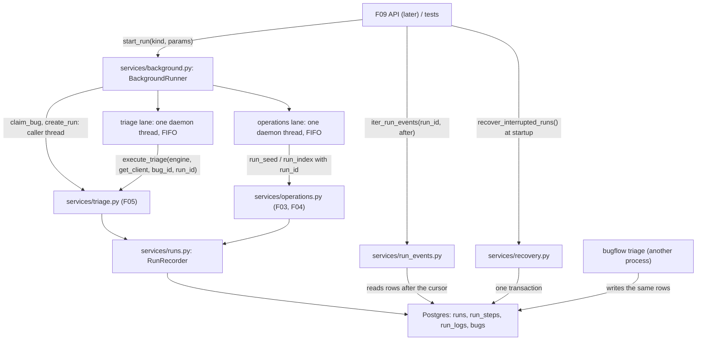

# Spec: F06. Background Runs and Progress

**Complexity:** medium (three new service modules, two small additive changes to existing recorded-operation code, a threaded in-process runner, a cursor-based event source and crash recovery; no new tables, endpoints, commands, dependencies or environment variables).

## 1. Technical Overview

**What.** Add the in-process background layer on top of the F05 triage service and the F03/F04 recorded operations:

- A `BackgroundRunner` whose `start_run(kind, params)` validates the request, claims the bug (for triage), creates the run record and queues the work, then returns the run id(s) at once. Two single-thread lanes execute the work: a triage lane (one triage at a time, in request order) and an operations lane (index and seed, one at a time).
- "Triage all": one run per `open` bug, all claimed and created up front in bug-id order, executed sequentially by the triage lane; a failed bug never stops the batch.
- An event source, `read_run_events` (one non-blocking read) and `iter_run_events` (a blocking generator that polls every 500 ms until the run is finished), that derives step, log and run events from persisted rows after an opaque cursor. It works for any run, including a run started by the CLI in another process.
- Startup recovery, `recover_interrupted_runs`, that marks runs left `queued` or `running` as `failed` with the reason `interrupted`, closes their open steps, and returns stuck `processing` bugs to `failed`.

**Why.** F09 exposes `POST /triage-runs`, `/admin/db/seed` and `/admin/index` (202 with run ids), `GET /runs/{id}/events` (SSE) and the startup hook through exactly these functions, and F12/F13 render the persisted steps and logs they stream. The PRD concurrency rule (a rejected claim creates no run) and the crash story (no bug stays `processing`) are implemented here, on top of the F05 claim and the F05 single-transaction result write.

**Scope.**

Included:
- `BackgroundRunner`, `RunKind`, `StartResult`, parameter validation, the two lanes and the final-state safety net.
- `read_run_events`, `iter_run_events`, the event models and the cursor format.
- `recover_interrupted_runs` and `RecoveryResult`.
- `recorded_run` and the recorded `run_seed` / `run_index` operations gain an optional existing `run_id`, so background seed and index reuse them unchanged.
- Test infrastructure: runner and state fixtures, helpers (no stand-in change).

Excluded:
- REST endpoints, SSE framing, the FastAPI lifespan that calls recovery (F09); the Agent trace and Operations UI (F12, F13).
- Report rendering and its hook (F07) and reopen (F08). The F05 result-hook registry is not touched; hooks keep running inside the F05 final transaction, now on a lane thread.
- Any new CLI command. `bugflow triage` and `bugflow index` stay foreground (PRD F09: "the CLI calls a service in the foreground").
- External queues, multiple worker processes, cancellation of a queued or running run, retry of failed runs, a durable queue, run priorities.
- A schema change, a migration, a new table, a new environment variable or a new dependency.

**Cross-cutting concerns integrated:** secret safety (all stored text goes through the F03 redactor; recovery and safety-net texts are fixed strings), English-only text, the F03 service conventions (services take engines or sessions and return Pydantic models; each recorder call commits on its own).

## 2. Architecture Impact

Affected components:

- `backend/src/bugflow/services/background.py`, `run_events.py`, `recovery.py` (new)
- `backend/src/bugflow/services/runs.py`, `operations.py` (modified, additive)
- `backend/tests/` (new unit and integration tests, fixtures, helpers)



Data flow, triage: the caller thread validates the params, calls `claim_bug` (conditional update; a rejection raises before anything else), creates a `queued` run through `RunRecorder.create_run`, puts `(run_id, bug_id)` on the triage queue and returns the run id. The triage-lane thread takes the item and calls `execute_triage`, which starts the run, creates the five pending steps and writes steps and logs incrementally; progress is therefore visible to any reader of the database. Data flow, seed and index: the caller checks the schema, creates a `queued` run, queues it on the operations lane; the lane calls `run_seed` / `run_index` with that run id, which move it to `running` and finish it. Readers (`iter_run_events`) never talk to the runner: they poll the persisted rows, so the same code serves runs started by the CLI.

## 3. Technical Decisions

| Decision | Chosen Approach | Alternative Considered | Trade-off |
|----------|----------------|----------------------|-----------|
| Execution model | Two daemon `threading.Thread` lanes (triage, operations) fed by `queue.Queue`, started lazily on the first submission | `asyncio` tasks; a `ThreadPoolExecutor(max_workers=1)`; `multiprocessing` | The F03 to F05 code is synchronous (SQLAlchemy sessions, CrewAI); one thread per lane gives FIFO and "one at a time" with no extra dependency. A pool of one hides worker liveness; processes break the in-memory engine and hook registry |
| Claim vs run creation | Claim first, then create the run, in the caller thread, before queueing | Create the run first and claim inside the worker | A rejected claim creates no run (PRD concurrency rule) and the error reaches the caller synchronously, which F09 maps to 409 |
| "Triage all" claiming | Claim and create runs for all `open` bugs up front, in id order, then queue them | Create runs lazily as each bug reaches the front | `start_run` can return every run id at once and no other caller can take a queued bug; queued bugs show `processing` before their turn |
| Event source | Poll persisted rows, state-based, opaque cursor | Postgres `LISTEN/NOTIFY`; an in-memory pub/sub | Required to work for runs from another process (PRD); no schema change; steps have no change sequence, so the cursor remembers the last emitted status per step |
| Lanes | Triage and operations lanes are independent | One FIFO for everything | Seeding or indexing is not blocked behind a long "triage all"; each lane is still strictly one at a time |
| Existing recorded operations | `run_seed` and `run_index` take an optional `run_id` of a queued run | Reimplement seed and index in the runner; pre-create nothing | One implementation of messages, progress and failure recording; the run id can be returned before the work starts |
| Failure containment | Every lane task is wrapped by a safety net that finishes an unfinished run as `failed` and returns a `processing` bug to `failed` | Trust each operation to finish its run | A crash inside any operation cannot leave a run or bug stuck, and the lane thread survives |
| Recovery scope | Fail every `queued`/`running` run, then return every bug still `processing` to `failed` | Only bugs of the failed runs | Also heals a crash between claim and run creation; matches the user story "no bug stays stuck in `processing`" |

### Assumptions and Decisions (review and override as needed)

1. **No new dependency, schema, command or variable.** Only `threading`, `queue`, `time` and existing libraries are used. Nothing in `bugflow.config` changes. The F01 rule that only `config.py` reads the environment stays true.
2. **Module layout.** `services/background.py` (runner, kinds, params, lanes), `services/run_events.py` (events and cursor), `services/recovery.py` (recovery and the shared step-closing helper). They follow the F03 to F05 convention of Pydantic result models defined next to the service.
3. **Runner API.** `BackgroundRunner(engine, get_client, redactor=None, *, similar_k=DEFAULT_SEARCH_LIMIT, agent_runner=run_agent)` where `get_client` is the lazy client factory used by F04/F05 and `agent_runner` is the F05 `Runner` seam (default: the real CrewAI runner). Methods: `start_run(kind, params=None) -> StartResult`, `wait_idle(timeout=None) -> bool` (true when both lanes are empty and idle; for tests and orderly shutdown), `shutdown(timeout=None)` (stops accepting work, lets the running item finish, drops queued items; dropped runs stay `queued` and are failed by the next recovery). The PRD name `start_run(kind, params)` is the runner method; F09 builds one runner at startup and keeps it for the process lifetime.
4. **Kinds and params.** `RunKind` is a `StrEnum` with `triage`, `index`, `seed` (subset of the F02 `RunType`). `params` is a mapping. Triage accepts exactly one of `{"bug_id": <int>}` or `{"all": true}`; `index` and `seed` accept no keys. Validation uses the F03 `validate_payload` helper and raises `ValidationFailedError` with field errors: `kind` ("must be one of triage, index, seed"), `params` ("Specify exactly one of bug_id or all"), `params` ("must be empty") and per-field type errors (`bug_id`: "must be an integer"). Validation runs first, before any database access, so an invalid request never changes state. Messages never contain the offending value.
5. **Return value.** `StartResult(run_ids: list[int])` with a convenience property `run_id` that returns the only id (and raises `ValueError` otherwise). Single triage, index and seed return exactly one id; "triage all" returns one id per claimed bug in ascending bug-id order and an empty list when no bug is `open`.
6. **Single triage start.** In the caller thread: `claim_bug(engine, bug_id)` (raises `NotFoundError`, `StateConflictError` or `DatabaseUnavailableError` exactly as F05 defines, creating no run), then `RunRecorder.create_run(RunType.TRIAGE, bug_id, STEP_COUNT)`, then queue. If creating the run fails, the bug is returned to `failed` (conditional update) and the error propagates, mirroring `triage_bug`. The call does no network I/O and does not wait for the lane.
7. **Triage all start.** The caller thread lists the ids of `open` bugs in ascending order (same query as `triage_all`), then for each id claims the bug and creates its run; a claim lost to another process (`StateConflictError`, `NotFoundError`) skips that bug silently. Only after every run has been created are the items queued, in id order (all-or-nothing: if preparing a later bug raises an unexpected error, the runs and bugs prepared so far are finished `failed` with the error `not started` and returned to `failed`, and the error propagates).
8. **Seed and index start.** The caller checks `is_schema_initialized(engine)` (raises `SchemaNotInitializedError` before any run exists), creates a `queued` run (`bug_id` null, total 0) and queues it on the operations lane. The OpenAI client is built inside the run (`get_client` is called by `run_index`), so a missing key fails the recorded run, as in F04.
9. **Lane behavior.** Each lane owns one daemon thread named `bugflow-triage-lane` / `bugflow-operations-lane`, created on first use, looping on a FIFO queue. Items of a lane never overlap. A task is a callable plus the ids needed by the safety net. Daemon threads never block interpreter exit; unfinished queued items are handled by recovery on the next start. `shutdown` puts a stop marker in each queue and joins with the timeout.
10. **Task bodies.** Triage: `execute_triage(engine, get_client, bug_id, run_id, redactor, similar_k=similar_k, runner=agent_runner)`; the returned outcome is ignored (the persisted rows are the result). Seed: `run_seed(engine, redactor, run_id=run_id)`. Index: `run_index(engine, get_client, redactor, run_id=run_id)`. No `on_step` callback is given: progress travels only through persisted rows.
11. **Safety net.** After a task raises any `Exception` (F05 and `recorded_run` already finish the run for most failures, then re-raise), the lane runs one best-effort cleanup in its own transaction(s): if the run is still `queued` or `running`, finish it `failed` with the redacted exception text (or the F05 text when F05 already finished it, nothing is overwritten); close its still-open steps (`running` steps become `failed`, `pending` steps `skipped`, error `Run failed unexpectedly`); if the run has a bug that is still `processing`, return it to `failed` (conditional update). The exception is logged once at WARNING with the redacted text and no stack trace. The lane continues with the next item. Cleanup errors are logged and swallowed. Note the actual F05 behavior verified on the source: for a failure outside its agent loop `execute_triage` already finishes the run `failed` with the fixed text `Triage aborted by an unexpected error` and returns the bug to `failed`; the net therefore mainly closes steps there and fully handles seed/index and pre-run failures.
12. **Existing operations reused.** `recorded_run(recorder, run_type, bug_id=None, *, run_id=None)`: when `run_id` is given it skips `create_run` and starts that queued run, otherwise unchanged. `run_seed(engine, redactor=None, *, run_id=None)` and `run_index(engine, get_client, redactor=None, *, run_id=None)` pass it through. Behavior, messages (`Seeded 20 bugs`, `Indexed n/m bugs`, `Embedded batch ...`), progress counters and failure text are unchanged; default calls (CLI) are byte-for-byte as before. `run_init` and `run_reset` are not background kinds (PRD F09 runs them synchronously).
13. **Run timestamps.** `runs.started_at` is the creation time (the F02 column default), so for a queued run it is the time the request was accepted, not the time execution began. The time execution began is the `started_at` of the first step (triage) or the first log line. Sequential execution is therefore observed through step times and run `finished_at`, not through run `started_at`.
14. **Event models.** `StepEvent(type="step", cursor, step: RunStepRead)`, `LogEvent(type="log", cursor, log: RunLogRead)`, `RunStatusEvent(type="run", cursor, run: RunRead)`; `RunEvent` is their discriminated union on `type`. `EventPage(events: list[RunEvent], cursor: str, finished: bool)`. The event payloads are the existing F03 read models, so F09 can serialize them directly and the SSE names `step`, `log`, `run` map one to one to `type`.
15. **Cursor format (opaque to clients).** The string `<log_id>.<steps>.<run>`: `log_id` is the decimal id of the last emitted log line (0 when none); `steps` has one character per step position in order, the last emitted status of that step (`-` never emitted, `p` pending, `r` running, `s` succeeded, `f` failed, `k` skipped); `run` is `-` (never emitted) or one status character (`q` queued, `r` running, `s` succeeded, `f` failed) followed by the decimal `progress_done` last emitted. Example: `14.ssrpp.r2`. `after=None` is the start (`0..-`). Each event carries the cursor to pass as `after` to resume immediately after that event; the page carries the cursor after its last event (the given one when the page is empty). A malformed cursor raises `ValidationFailedError` with the field error `after` ("invalid cursor").
16. **Event rules.** One read: load the run row first (unknown run: `NotFoundError("Run <id> not found")`), then its steps ordered by position, then its logs with `id > log_id` ordered by id; then emit, in this order: a step event for every step whose status differs from the cursor, a log event for every new log line, and one run event when the status or `progress_done` differs from the cursor. The run row is read first, so a run seen as finished is followed by all of its steps and logs (every write precedes `finish_run`). Step events are state snapshots, not a history: a step that moved `pending` to `running` to `succeeded` between two reads yields one event with the latest row. An in-place change that keeps the status (the re-ask updating a running step's input) is not an event; it appears on the step's finishing event. `finished` is true when the run was `succeeded` or `failed` at the time of the read.
17. **Iterator.** `iter_run_events(engine, run_id, after=None, *, poll_interval=POLL_INTERVAL_SECONDS, sleep=time.sleep) -> Iterator[RunEvent]` with `POLL_INTERVAL_SECONDS = 0.5`. It validates the run and cursor eagerly (errors raise at the call, not at the first `next`), then loops: read a page, yield its events, stop when the page is finished, otherwise sleep the interval. A run that is already finished yields its remaining events once and ends. The generator holds no connection between polls and is safe to close at any time (client disconnect). `sleep` and the interval are injectable for unit tests.
18. **Recovery.** `recover_interrupted_runs(engine, redactor=None) -> RecoveryResult(interrupted_run_ids, recovered_bug_ids)`. In one transaction: lock the runs with status `queued` or `running`; for each, close open steps (`running` to `failed` with error `interrupted`, `pending` to `skipped`), add one ERROR log line `Run interrupted: the backend stopped before the run finished`, set status `failed`, error exactly `interrupted` and `finished_at`; then set every bug still `processing` to `failed` (refreshing `updated_at`). When the `runs` table does not exist (schema not initialized) it returns empty lists. An unreachable database raises `DatabaseUnavailableError`. Idempotent. Logged at INFO with counts only. The function must only be called at backend start, while no other process is executing runs: running it while a CLI triage is live would fail that run. Result rows need no cleanup because F05 writes them in the final transaction only.
19. **Concurrency across processes.** The only cross-process guard is the F05 conditional claim, unchanged. Two runner processes would each run their own lanes; this is out of scope (single local backend).
20. **Thread safety.** Engines are thread-safe; every service call opens its own session; the lanes share only the engine, the redactor and the client factory. The factory must tolerate being called from two threads (F09 should return a cached client; the F03 CLI context never starts a runner). The F05 result-hook registry is module-level and read-only at run time; hooks run on the triage-lane thread. CrewAI must work from a non-main thread: verify against the installed version (signal handlers are the usual trap) and report a deviation if it does not.
21. **No CLI change.** No command is added to `COMMAND_MODULES`. Runs started by the CLI are visible through the event source because they write the same rows.
22. **Stand-in.** No change to `tests/mocks/fake_openai_server.py`: role-based replies, scripting by role and message text, repeat counts and delays (all delivered by F05) are enough, including a long reply delay to keep a run in progress.
23. **Quality gates** (auto-included in batch mode, detected from the project, no wrapper script exists), run from `backend/`: `uv run ruff format .`, `uv run ruff check .`, `uv run pytest`. Integration tests run only on request with `uv run pytest -m integration`.
24. **Contract surfaces** (auto-applied: every surface with a PRD signal). `Service` (consumer: F09 depends on F06 per PRD Section 8 and consumes the runner, event source and recovery), `Worker` (the PRD capability is background execution), `E2E` (cross-process behavior: a run started by the CLI process and a crash of that process). No `CLI`, `HTTP API`, `UI` or `Event` surface: the F06 PRD block defines none.
25. **Conventions reused (Pattern Discovery).** Python 3.12 and `uv` in `backend/`; Postgres/pgvector via compose; SQLAlchemy sessions with `session_factory(engine)`; Pydantic frozen read models; typed errors from `services/errors.py`; `RunRecorder` commits per call; `pytest` layout `tests/unit`, `tests/integration` (marker `integration`, `TEST_DATABASE_URL`, per-test schema reset in `tests/integration/conftest.py`), `tests/mocks/` for the OpenAI stand-in, `tests/tests_helpers.py` for row helpers; fixtures create state declaratively (`add_bug`, `seed_db`); CLI items run the `bugflow` binary as a child process with `OPENAI_BASE_URL` pointing at the stand-in and no root `.env`; static-input path convention `backend/tests/fixtures/` (unused here, F06 has no static inputs). Conflicting-pattern note: none observed.

### PRD Traceability

| PRD block | Where it lands in this spec |
|---|---|
| Consumes: F05 triage service, bug claim, run steps and logs | §2 data flow, §3, §5.1, assumptions 6, 10 |
| Provides: `start_run(kind, params)` returning a run ID immediately | §5.1, assumptions 3 to 8 |
| Provides: `iter_run_events(run_id, after)` from persisted rows | §5.2, assumptions 14 to 17 |
| Provides: startup recovery of interrupted runs | §5.3, assumption 18 |
| Capabilities: background execution, queueing one at a time | assumptions 9, 10, 12; §3 |
| Capabilities: concurrency rule across processes | assumptions 6, 19 |
| Capabilities: "triage all" | assumption 7 |
| Capabilities: recovery | assumption 18 |
| Capabilities: event source and 500 ms poll interval | assumptions 15 to 17 |
| Experience: run id within 1 s; queued to running to succeeded or failed with progress | assumptions 6, 8, 10, 13; §5.1 |
| Error Handling: restart, simultaneous triage, unexpected exception | assumptions 11, 18; §5.4 |

## 4. Component Overview

**Backend (`backend/`)**

| File Path | New/Modified | Purpose | Key Responsibilities |
|-----------|--------------|---------|---------------------|
| `backend/src/bugflow/services/background.py` | New | Background runner | `RunKind`, `StartResult`, params validation, `BackgroundRunner`, the two lanes, the safety net |
| `backend/src/bugflow/services/run_events.py` | New | Event source | Event models, cursor parse/format, `read_run_events`, `iter_run_events`, `POLL_INTERVAL_SECONDS` |
| `backend/src/bugflow/services/recovery.py` | New | Startup recovery | `recover_interrupted_runs`, `RecoveryResult`, shared `close_open_steps` helper |
| `backend/src/bugflow/services/runs.py` | Modified | Run recorder | `recorded_run` accepts an existing queued `run_id` |
| `backend/src/bugflow/services/operations.py` | Modified | Recorded operations | `run_seed` and `run_index` accept `run_id` and pass it to `recorded_run` |

`services/triage.py`, `cli/__init__.py`, `agents/*` and `tests/mocks/*` are not modified.

**Tests (`backend/tests/`)**

| File Path | New/Modified | Purpose |
|-----------|--------------|---------|
| `tests/unit/test_background_params.py` | New | Kind and params validation |
| `tests/unit/test_background_lane.py` | New | Lane FIFO, one at a time, survival after a task error, shutdown (fake tasks, no database) |
| `tests/unit/test_run_events_cursor.py` | New | Cursor format, parsing, event derivation (pure functions) |
| `tests/unit/test_run_events_iter.py` | New | Iterator loop with a fake page reader and fake sleep |
| `tests/tests_helpers.py` | Modified | `wait_until`, run and step readers |
| `tests/integration/conftest.py` | Modified | Runner fixture, `streaming_state`, `interrupted_state`, failing client factories |
| `tests/integration/test_recorded_run_existing.py` | New | `recorded_run`, `run_seed`, `run_index` with an existing run id |
| `tests/integration/test_start_run.py` | New | Start, rejection, concurrency, validation |
| `tests/integration/test_start_triage_all.py` | New | Claiming and run creation for all open bugs |
| `tests/integration/test_run_events.py` | New | Events from a persisted run, cursors, iterator |
| `tests/integration/test_recovery.py` | New | Recovery rules |
| `tests/integration/test_background_triage.py` | New | Triage in the background, failures, runner survival |
| `tests/integration/test_background_triage_all.py` | New | Sequential batch, continue after failure, queueing |
| `tests/integration/test_background_operations.py` | New | Seed and index in the background |
| `tests/integration/test_cross_process_runs.py` | New | CLI-started run streamed from another process; kill and recover |

**Database:** no migrations; `runs`, `run_steps`, `run_logs`, `bugs` are used as created by F02. No new index is required: `run_logs` already has `(run_id, id)` and `run_steps` has the unique `(run_id, position)`.

## 5. Interface Contracts

F06 exposes no HTTP endpoints and no CLI commands; its interfaces are Python functions consumed by F09 and by tests.

### 5.1 Runner (`bugflow.services.background`)

| Function | Output | Behavior |
|---|---|---|
| `BackgroundRunner(engine, get_client, redactor=None, *, similar_k=5, agent_runner=run_agent)` | runner | Cheap to build; no thread starts until the first submission |
| `runner.start_run("triage", {"bug_id": 3})` | `StartResult(run_ids=[41])` | Claim, create the queued run, queue, return; the bug is `processing` |
| `runner.start_run("triage", {"all": True})` | `StartResult(run_ids=[41, 42, 43])` | One run per `open` bug in id order; empty list when none |
| `runner.start_run("index", {})` / `("seed", {})` | `StartResult(run_ids=[44])` | Queued run on the operations lane; refused when the schema is not initialized |
| `runner.wait_idle(timeout=None)` | `bool` | True when both lanes are empty and idle |
| `runner.shutdown(timeout=None)` | none | Stop accepting work; queued items are dropped |

Run status moves `queued` to `running` (set by `execute_triage` / `recorded_run` when the lane picks the item) to `succeeded` or `failed`; `progress_done` of a triage run counts succeeded steps out of 5.

Errors raised by `start_run` (nothing is created unless stated):

| Situation | Error |
|---|---|
| Unknown kind, invalid or missing params | `ValidationFailedError` with the field errors of assumption 4 |
| Triage of a `processing` bug | `StateConflictError("Bug <id> is already being processed")` |
| Triage of a `processed` bug | `StateConflictError("Bug <id> has already been processed; reopen it first")` |
| Unknown bug id | `NotFoundError("Bug <id> not found")` |
| Seed or index on an uninitialized schema | `SchemaNotInitializedError` |
| Database unreachable | `DatabaseUnavailableError` |

### 5.2 Events (`bugflow.services.run_events`)

| Function | Output | Behavior |
|---|---|---|
| `read_run_events(engine, run_id, after=None)` | `EventPage` | One non-blocking read per assumption 16 |
| `iter_run_events(engine, run_id, after=None, *, poll_interval=0.5, sleep=time.sleep)` | `Iterator[RunEvent]` | Blocking generator per assumption 17 |

Example events of a triage run at its start (cursor values abbreviated):

```json
[
  {"type": "step", "cursor": "0.p.-", "step": {"id": 101, "run_id": 41, "position": 1, "agent_key": "component_classifier", "status": "pending", "input": null, "output": null, "error": null, "started_at": null, "duration_ms": null}},
  {"type": "log", "cursor": "7.ppppp.-", "log": {"id": 7, "run_id": 41, "logged_at": "2026-10-06T18:00:01Z", "level": "INFO", "message": "AG1 Component Classifier started"}},
  {"type": "run", "cursor": "7.ppppp.r0", "run": {"id": 41, "type": "triage", "bug_id": 3, "status": "running", "progress_done": 0, "progress_total": 5, "error": null, "started_at": "2026-10-06T18:00:00Z", "finished_at": null}}
]
```

Cursor examples: `0..-` (start), `14.ssrpp.r2` (14 log lines emitted; steps 1 and 2 succeeded, step 3 running, steps 4 and 5 pending; run `running` with progress 2), `20.sssss.s5` (finished).

Errors: `NotFoundError("Run <id> not found")`; `ValidationFailedError` with field `after` for a malformed cursor; `DatabaseUnavailableError`.

### 5.3 Recovery (`bugflow.services.recovery`)

| Function | Output | Behavior |
|---|---|---|
| `recover_interrupted_runs(engine, redactor=None)` | `RecoveryResult(interrupted_run_ids, recovered_bug_ids)` | Assumption 18; call once at backend start |

### 5.4 Error table (behavior, not HTTP)

| Situation | Result |
|---|---|
| Backend restarts during a run | Next `recover_interrupted_runs` fails the run with `interrupted` and the bug returns to `failed`; the user can triage again |
| Two simultaneous triage starts for one bug | Exactly one run is created; the other caller gets `StateConflictError` |
| A lane task raises an unexpected exception | Run `failed` with the error text, bug returned to `failed`, open steps closed, the lane continues with the next item |
| Missing API key during a background index | Run `failed` with `OPENAI_API_KEY is not set` |
| Invalid API key during a background index | Run `failed` with `OpenAI authentication failed`; the key is in no stored text |

## 6. Data Model

F06 changes no schema.

| Table | Written by | Notes |
|---|---|---|
| `runs` | `RunRecorder` via `start_run` (create), lanes (via F05 and `recorded_run`), recovery | Created `queued` before `start_run` returns; `finished_at` set when final; recovery sets `error = 'interrupted'` |
| `run_steps` | F05 pipeline; recovery and the safety net close open steps | Read by the event source |
| `run_logs` | F05, `recorded_run` operations, recovery (one line per interrupted run) | Read by the event source ordered by `id` |
| `bugs` | claim (caller thread), F05, recovery, safety net | `status` `open`/`failed` to `processing` at start; `processing` to `failed` by recovery |

No migration is needed. The cursor is a derived value and is never stored.

## 7. Testing Strategy

Unit tests need no database, network or CrewAI call. Integration tests (marker `integration`, run only with `uv run pytest -m integration`) use `TEST_DATABASE_URL`, the compose `db` service and the F05 stand-in on an ephemeral port; fixtures start and stop it and shut the runner down after each test.

| Test File | Test Type | Target | Coverage Goal |
|-----------|-----------|--------|---------------|
| `tests/unit/test_background_params.py` | Unit | params validation | 100% |
| `tests/unit/test_background_lane.py` | Unit | lane class | 95% |
| `tests/unit/test_run_events_cursor.py` | Unit | cursor and event derivation | 100% |
| `tests/unit/test_run_events_iter.py` | Unit | iterator loop | 100% |
| `tests/integration/test_recorded_run_existing.py` | Integration | `recorded_run`, `run_seed`, `run_index` | all branches |
| `tests/integration/test_start_run.py` | Integration | `start_run` | all branches |
| `tests/integration/test_start_triage_all.py` | Integration | triage-all start | all branches |
| `tests/integration/test_run_events.py` | Integration | event source | all branches |
| `tests/integration/test_recovery.py` | Integration | recovery | all branches |
| `tests/integration/test_background_triage.py` | Integration | single triage in the background | all branches |
| `tests/integration/test_background_triage_all.py` | Integration | batch and queueing | all branches |
| `tests/integration/test_background_operations.py` | Integration | seed and index | all branches |
| `tests/integration/test_cross_process_runs.py` | Integration (child process) | CLI-started runs and crash | n/a |

**`test_background_params.py`**

| Test Function | Description | Assertions |
|---------------|-------------|------------|
| `test_triage_requires_exactly_one_target` | `{}`, both keys, `all` false only | `ValidationFailedError` with the `params` message |
| `test_bug_id_must_be_integer` | `"3"`, `3.5`, `None` | field error on `bug_id`, no value echoed |
| `test_index_and_seed_take_no_params` | non-empty params | field error `params` "must be empty" |
| `test_unknown_kind` | `"reset"`, `"init"`, `""` | field error `kind` |
| `test_valid_requests_parse` | each valid shape | parsed target |

**`test_background_lane.py`**: items run in submission order; two items never overlap (a barrier proves it); a task that raises does not stop the thread and the next item runs; the safety-net callback receives the exception text once; the thread starts lazily and is a daemon; `wait_idle` is true only when empty and idle; `shutdown` drops queued items and joins; a submission after shutdown raises.

**`test_run_events_cursor.py`**: format and parse round trip for the examples of §5.2; malformed cursors (empty, letters, wrong separators, unknown status character, negative id) rejected; derivation emits a step event only for changed statuses, only new logs, a run event only when status or progress changed; ordering steps then logs then run; per-event cursors resume exactly after each event; a step skipping states yields one event; an unchanged re-ask input yields no event; steps beyond the cursor length count as unseen.

**`test_run_events_iter.py`**: sleeps exactly the poll interval between non-final pages and not after the final page; default interval is 0.5; ends after a finished page; yields a page's events before sleeping; already finished run ends after one poll; closing the generator mid-run stops polling; eager validation (unknown run, bad cursor raise at the call).

**`test_recorded_run_existing.py`**: `recorded_run` with an existing queued id creates no second run, moves it to `running` and finishes it; with a finished or unknown id it raises; `run_seed(run_id=...)` leaves one `seed` run with progress 20 of 20; `run_index(run_id=...)` likewise; a failure marks the given run `failed`; calls without `run_id` behave as before.

**`test_start_run.py`**: triage start returns within 1 s while the stand-in delays the reply; the run exists `queued` or `running`; bug `processing`; the claim rejections and their messages with no run created; unknown bug; failed bug accepted; two threads starting the same bug (one id, one `StateConflictError`, one run row); validation errors create nothing; index start creates a run; seed on an uninitialized schema raises `SchemaNotInitializedError` and creates nothing.

**`test_start_triage_all.py`**: ids returned in bug-id order with one run per open bug; non-open bugs skipped and unchanged; empty list when none open and no run; a bug claimed elsewhere between listing and claiming is skipped (patched claim); all-or-nothing failure path (patched run creation) leaves no `processing` bug and no `queued` run.

**`test_run_events.py`**: full read of the `streaming_state` run (counts, order, payloads, cursors, not finished); resume after a cursor with new rows; unchanged cursor gives an empty page and the same cursor; finished run ends with the run event and `finished`; events of other runs excluded; iterator follows a run finished by another connection (late log yielded within 1 s, last event is the terminal run event, iteration ends); unknown run; malformed cursor; steps closed by recovery appear as `failed`/`skipped` events.

**`test_recovery.py`**: the full `interrupted_state` set (runs failed with `interrupted`, `finished_at` set, ERROR log added, steps closed, bugs `failed`, no result rows created, finished run and processed bug untouched, orphan `processing` bug returned to `failed`); idempotence; empty database returns empty lists; no `runs` table returns empty lists; a bug triaged again after recovery.

**`test_background_triage.py`**: end-to-end background triage with the stand-in (rows, five steps, progress 5 of 5, status sequence observed through polling is a subsequence of `queued`, `running`, `succeeded`); an agent failure (invalid severity twice) ends `failed` with the F05 text; unexpected factory error fails the run, returns the bug to `failed`, closes steps and the next queued run still completes.

**`test_background_triage_all.py`**: three open bugs with one failing; sequential timing through step and run times and the stand-in record; queued runs show `queued` and no steps while the first runs; two single starts queue in order; `wait_idle` semantics.

**`test_background_operations.py`**: seed run (20 bugs, progress, log line); index run (20 embeddings, progress, logs); missing key; invalid key and no key in stored text; triage and index lanes are independent (a slow triage does not delay a seed).

**`test_cross_process_runs.py`** (child process, stand-in): CLI triage streamed with `iter_run_events` from the test process while the child runs; resume after a cursor for a finished CLI run; SIGKILL of the child mid-run followed by recovery; no root `.env` file exists (asserted).
