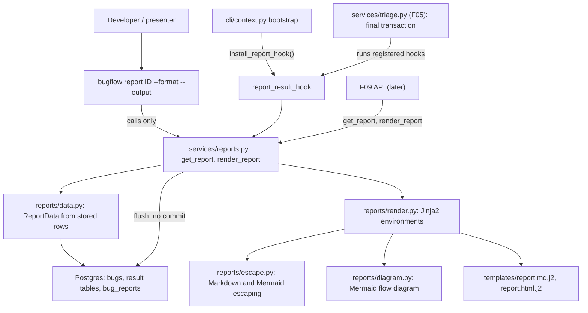
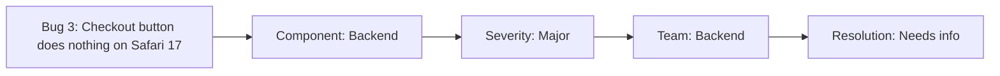

# Spec: F07. Report Rendering

**Complexity:** medium (one new template package with a Markdown and an HTML template, escaping helpers, a diagram builder, one new service module with a pipeline hook, one CLI command, one direct dependency already present in the environment; no new tables, migrations, endpoints or environment variables).

## 1. Technical Overview

**What.** Turn the data F05 stores for a triaged bug into a shareable report. A renderer builds one structured `ReportData` object from stored rows only (bug fields, the five result tables, the titles of referenced similar bugs), then renders it through two templates: a Markdown report and a standalone HTML report. Both embed a Mermaid flow diagram (bug -> component -> severity -> assigned team -> resolution status) that the code generates from the structured data. The renderer plugs into the F05 result-hook registry, so the Markdown and the HTML are written into `bug_reports` inside the same transaction as the five result rows, before the bug becomes `processed`. The feature also adds the services `render_report(session, bug_id)` and `get_report(session, bug_id, format)`, an idempotent `install_report_hook()`, and the CLI command `bugflow report <id> [--format md|html] [--output PATH]`.

**Why.** F09 serves reports over HTTP and F11 shows and downloads them, so the report must exist exactly when the other results exist and must never contain content that is not in the stored data. The original project's report defects (a Markdown off-by-one, LLM-written HTML and Mermaid that were never validated, a hard-coded "resolved" status) are removed by construction: the LLM only supplies plain prose, all markup comes from templates and code, every value is escaped for the format it lands in, and the status text comes from the stored plan.

**Scope.**

Included:
- `ReportData` loader: reads the stored rows of one bug (no LLM, no network, no clock except the stored completion timestamp).
- Escaping helpers for Markdown text, Markdown fenced blocks, HTML (template auto-escaping) and Mermaid labels.
- Mermaid flow-diagram builder with a fixed five-node shape.
- Markdown and HTML templates (Jinja2, strict undefined variables).
- `render_report`, `get_report`, `ReportFormat`, `RenderedReport`, `ReportRead`, `ReportRenderError`.
- The result hook `report_result_hook`, its idempotent installation `install_report_hook()` and its call from the CLI bootstrap.
- CLI `report` command registered in the F03 command registry.
- Dependency declaration: `jinja2` as a direct dependency (already present in the environment through `crewai`).

Excluded:
- Calling any LLM, writing any text with an LLM, or accepting markup from the LLM (AG5 output stays plain prose, stored by F05).
- HTTP endpoints, the JSON report format and the rendered report tab (F09, F11); reopen and deletion of reports (F08); background execution (F06).
- Offline-capable HTML (the Mermaid library loads from a CDN; PRD Out of Scope).
- A new table, column, migration or environment variable; any report history (one current report per bug).
- PDF or other formats, theming, localization (English only).

**Cross-cutting concerns integrated:** English-only text; secret safety (the renderer reads no settings and no secret can reach a report or an error message); the F03 service conventions (services take a session, return Pydantic models, flush and never commit); the F05 hook contract (hooks run inside the final transaction after the five rows are inserted and before the status update; a hook failure rolls everything back and fails the bug).

## 2. Architecture Impact

Affected components:

- `backend/src/bugflow/reports/` (new package: `data.py`, `escape.py`, `diagram.py`, `render.py`, `templates/report.md.j2`, `templates/report.html.j2`)
- `backend/src/bugflow/services/reports.py` (new)
- `backend/src/bugflow/cli/commands/report.py` (new); `cli/__init__.py`, `cli/context.py` (modified)
- `backend/pyproject.toml`, `backend/uv.lock` (modified: `jinja2`)
- `backend/tests/` (new unit and integration tests, helpers)

`services/triage.py`, `services/runs.py`, `db/models.py` and the F05 stand-in are not modified.



Data flow (triage): F05 inserts the five result rows and flushes, then calls each registered hook with the open session. `report_result_hook` calls the same core as `render_report`: it loads `ReportData` through the session (the just-flushed rows are visible), renders both formats, and sets `bug_reports.markdown` and `bug_reports.html` on the existing row. F05 then updates the status and commits. If anything raises, F05 rolls back and fails the bug.

Data flow (command): `bugflow report 3` opens a session, calls `get_report`, which returns the stored text (rendering and storing it first when the stored text is missing), commits only when it had to store, and prints the text.

## 3. Technical Decisions

| Decision | Chosen Approach | Alternative Considered | Trade-off |
|----------|----------------|----------------------|-----------|
| Template engine | Jinja2 with `StrictUndefined`, two environments (Markdown without auto-escape, HTML with auto-escape) | Python `string.Template` or hand-built f-strings | Real templates for loops and conditions and mature HTML auto-escaping; one more direct dependency (already installed through `crewai`) |
| Where the renderer runs | A F05 result hook, installed by an idempotent function that the CLI bootstrap calls | Auto-register on import; edit `services/triage.py` | F05's own contract (a service call without hooks leaves `markdown` and `html` null) stays true; no edit to the shared triage module; each process entry point opts in |
| Source of data | Stored rows only, read through the session (the hook sees uncommitted rows of its own transaction) | Use the in-memory `TriageResults` | One code path for the hook, `render_report` and re-rendering; guarantees "built only from stored data" |
| Completion date | UTC calendar date of `bug_reports.created_at` (set by the database when the final transaction inserts the row) | Date at render time; `runs.finished_at` | Stored, stable and identical on every re-render; `runs.finished_at` is not set yet when the hook runs |
| Verbatim bug text in Markdown | Description and reproduction steps go in fenced code blocks whose fence is longer than any backtick run in the text | Backslash-escape every special character | The text is a verbatim substring of the report and no character can be interpreted as Markdown; shown as code in viewers |
| Short text in Markdown | One escaping function (`md`) that collapses whitespace and backslash-escapes a fixed character set | Escape only table pipes | Safe in headings, list items and table cells with one rule; raw text of special characters differs from the input, the rendered text equals it |
| Mermaid labels | Always double-quoted; metacharacters become numeric entity codes (`#60;`) | Strip special characters; quote only when needed | Nothing is lost and no character can end the label or start a comment; labels with special characters look encoded in raw text |
| Mermaid validity | Fixed diagram shape, only label text varies, labels encoded; verified by a strict structural validator over the full enum cross product | Run the real Mermaid parser in tests | No Node toolchain in a Python project; the proof is "fixed shape plus encoded labels", checked exhaustively |
| Missing stored text | `get_report` renders and stores it when `markdown` or `html` is null | Fail with "no report" | Bugs processed before the hook was installed still get a report; the CLI commits that write |

### Assumptions and Decisions (review and override as needed)

1. **Dependency (Auto-Accept: new technology, confirmed).** Add `jinja2>=3.1,<4` to `backend/pyproject.toml` `dependencies`. Version 3.1.6 and `markupsafe` are already in `uv.lock` (pulled in by `crewai`), so `uv lock` only records the direct dependency. No other dependency is added. Verify the Jinja2 APIs (`Environment`, `FileSystemLoader`, `StrictUndefined`, `select_autoescape`) against the installed version.
2. **Package layout.** Rendering logic lives in the new package `bugflow/reports/` (pure functions, no database access except `data.py`), mirroring how `agents/` sits beside `services/triage.py`. The service module `services/reports.py` owns sessions, storage, errors and the hook. Templates are plain files in `reports/templates/` found relative to the module file (not through the process working directory), so a console-script run from any directory works.
3. **Report hook and installation.** `report_result_hook(session, bug_id, results)` matches F05's `ResultHook` signature and ignores `results` (it reads stored rows). `install_report_hook(render=None)` first calls F05's `unregister_result_hook(report_result_hook)` and then `register_result_hook(report_result_hook)`, which makes it idempotent without changing `services/triage.py`; the optional `render` argument replaces the renderer (this is the F07-scoped test mechanism used to force a rendering failure). The CLI bootstrap (`cli/context.py::bootstrap`) calls `install_report_hook()` so every CLI process that can triage renders reports; F09's application startup must do the same (a note for that feature, not a dependency). Service-level callers of `triage_bug` that do not install the hook keep F05's behavior (`markdown` and `html` null).
4. **Rendering failure.** Any exception inside the renderer (template error, missing data, the replacement renderer) is raised as `ReportRenderError` with the message `Report rendering failed: <first line of the cause>`. F05 turns a hook error into `Result hook failed: <message>`, so the bug text is `Result hook failed: Report rendering failed: <cause>`, all rows roll back, the bug becomes `failed` and the five step rows stay as recorded. The cause text comes from template and data errors, never from settings; it is still passed through F05's redaction.
5. **Completion date.** "Run completion date" is the UTC calendar date of the stored `bug_reports.created_at` of the bug. The database sets it to the start time of the final transaction (`now()`), i.e. the moment the five agents finished and results were written. Reading it back after the flush keeps re-rendering stable (a later `render_report` shows the same date) and independent of the server's time zone. A reopen deletes the row, so a new triage gets a new date. The report states it as `Report completed` in ISO form (`2026-03-30`).
6. **Deadline.** `completed_on + target_days` days, as an ISO date (`2026-04-04`), computed by code from the stored `target_days`. No agent output is parsed for a date, and a plan with the maximum 90 days crosses month boundaries correctly through `datetime.date` arithmetic.
7. **Resolution status.** The report shows the canonical English label of the stored `resolution_status` (`Needs info`, `Won't fix`, ...) through `bugflow.enums.label_of`. Neither template contains the word "resolved" in any casing. The bug's lifecycle status is not printed: inside the triage transaction it is still `processing`, and the resolution plan status is the only status a report states.
8. **Report layout (Markdown).** In order: first line `# <title>` (escaped), the executive summary paragraph, `## Bug details` (table), `## Description` and `## Reproduction steps` (fenced blocks), `## Classification` (component with justification, severity with justification and user impact), `## Technical analysis` (root cause, technical impact, debugging approach as a numbered list, proposed solution, side effects as a list or `None identified`, similar bugs referenced as `#<id> <title>` items or `No similar bugs referenced`), `## Resolution plan` (table), `## Flow diagram` (a ```` ```mermaid ```` block), `## Summary` (key takeaways and next steps as lists). The text starts with the `#` of the heading: no byte order mark, no blank line, no leading whitespace ("no stray first character"). The file ends with exactly one newline. Section order and the table row labels are part of the contract of this spec; wording of static headings beyond them is the implementer's, in English, without the word "resolved".
9. **Details tables.** `Bug details` rows: `Bug ID`, `System version`, `Environment` (label), `Reporting team` (label), `Opened` (`YYYY-MM-DD HH:MM UTC`), `Report completed`. `Resolution plan` rows: `Resolution status`, `Assigned team` (label), `Assignee profile` (`<role> (<Seniority label>), skills: <skill>, <skill>`), `Priority` (label), `Target` (`<n> day(s)`, singular for 1), `Deadline`, `Notes` (`None` when empty). Rows are `| <label> | <value> |` with a header row `| Field | Value |`.
10. **Markdown escaping (`md`).** Whitespace runs (including newlines) collapse to one space and the value is trimmed. Then `&` becomes `&amp;` and each of `` \ ` * _ [ ] < > | ~ `` is prefixed with a backslash. Quotes and other characters stay as they are. The same function is used for headings, list items, paragraphs and table cells, so a pipe can never split a cell. Every `{{ ... }}` expression in the Markdown template must end in `md`, `md_block` or a numeric/date value filter; a unit test fails on any other expression.
11. **Fenced blocks (`md_block`).** The text is emitted unchanged inside a block opened and closed by a run of backticks that is at least 3 and one longer than the longest backtick run inside the text, with the info string `text`. A text that itself contains the fence candidate is therefore still one block.
12. **HTML.** Standalone document (`<!DOCTYPE html>`, `<meta charset="utf-8">`, inline CSS, `<title>` set to the escaped bug title), same sections as the Markdown, built from the same `ReportData`. All values go through Jinja2 auto-escaping (`& < > " '`). Description and reproduction steps are `<pre>` blocks. The diagram is `<pre class="mermaid">` whose text is auto-escaped like any value (browsers and Mermaid decode the entities back). Only one `<script>` element exists, a module script importing Mermaid and calling `initialize` with `securityLevel: "strict"` and `startOnLoad: true`; without network access the diagram source stays visible as text.
13. **Mermaid CDN pin.** The module constant `MERMAID_VERSION` is an exact version (`11.4.1` at spec time) and the template builds `https://cdn.jsdelivr.net/npm/mermaid@<version>/dist/mermaid.esm.min.mjs`. The implementer verifies that the URL resolves before pinning and records the version in the report. No `latest`, no range, no second CDN. Subresource integrity is not added (a hash cannot be verified offline); this is a known limit of a demo-grade report.
14. **Mermaid diagram shape.** Exactly this text (nodes `bug`, `component`, `severity`, `team`, `resolution`; no reserved word such as `end`, `graph`, `subgraph` is used as an identifier):

    ```
    flowchart LR
        bug["Bug <id>: <title>"] --> component["Component: <label>"]
        component --> severity["Severity: <label>"]
        severity --> team["Team: <label>"]
        team --> resolution["Resolution: <label>"]
    ```

    Each label is the fixed prefix plus the canonical enum label (or the bug id and title) with every character of the set `" # % & ' ( ) ; < > [ ] \ ` { | }` and the backtick replaced by `#<decimal code>;` (for example `"` becomes `#34;`, `<` becomes `#60;`, `|` becomes `#124;`, `'` becomes `#39;`). The title is whitespace-collapsed first; control characters become spaces. Because `#` itself is encoded, a decoder can never confuse a code with text. The title is not truncated (at most 120 characters).
15. **How validity is verified for every combination.** The diagram's structure never depends on data: the five node lines are fixed and only quoted label text varies, and that text has no character able to close a label, start a comment (`%%`), open a shape or start HTML. A strict structural validator in the test suite (exact line shapes, one quoted label per node, no raw metacharacter inside a label, entity codes well formed) runs over the full cross product of `Component` x `Severity` x `Team` x `ResolutionStatus` (8 x 3 x 8 x 4 = 768 diagrams, a superset of the PRD's component x severity matrix) and over hostile titles. The Mermaid parser itself is not run in the suite; a manual check in a Mermaid viewer of a few reports is part of the readiness step.
16. **`render_report(session, bug_id) -> RenderedReport`.** Loads `ReportData`, renders both formats, sets `bug_reports.markdown` and `.html`, flushes and returns `RenderedReport(bug_id, markdown, html, completed_on, deadline)`. Never commits. Re-rendering the same stored data returns identical text. Raises `NotFoundError("Bug <id> not found")` for an unknown bug and `NotFoundError("Bug <id> has no report; triage it first")` when the bug has no `bug_reports` row (any bug that is not `processed`, including `failed` and `open`; after F08 reopen the rows are gone, so the same message applies).
17. **`get_report(session, bug_id, format) -> ReportRead`.** `format` is `ReportFormat` (`md` or `html`; `json` is the F09 endpoint's own concern and is built from `ReportData`, which F07 exposes as `load_report_data`). Returns `ReportRead(bug_id, format, content)` with the stored text. When the stored text of the requested format is null it calls `render_report` first (stored in the session, not committed). Same not-found errors as `render_report`.
18. **CLI behavior.** `bugflow report ID [--format md|html] [--output PATH]`, format default `md`, an invalid format is a usage error (exit 2, nothing printed on stdout). Without `--output` the report text is written to stdout unchanged (no extra line). With `--output` the file is written as UTF-8 (overwriting an existing file, creating no directories) and stdout shows `Report written to <path>`; the report text is not printed. A write failure prints `Cannot write report to <path>: <reason>` on stderr and exits 1, with no partial file left. A service not-found error prints its message on stderr and exits 1 (`Bug 3 has no report; triage it first`). The command opens its own session and commits only when `get_report` had to store a missing report. It needs no API key and makes no LLM call.
19. **Registration.** `cli/commands/report.py` exposes `register(app)` like the other commands and is added to `COMMAND_MODULES` in `cli/__init__.py` (the F03 comment already reserves this slot for F07). The command has no business logic: arguments, a service call, printing and exit codes.
20. **Services conventions reused.** Sessions are injected; models are frozen Pydantic classes; errors derive from `ServiceError` (`ReportRenderError`) or reuse `NotFoundError`; a unit test checks that `services/reports.py` never calls `commit`.
21. **Quality gates (Auto-Accept: detected gates included).** From `backend/`: `uv run ruff format .`, `uv run ruff check .`, `uv run pytest`. No wrapper script exists. Integration tests run only on request (`uv run pytest -m integration`) and use `TEST_DATABASE_URL`.
22. **Contract surfaces (Auto-Accept: every surface with a PRD signal).** `Service` (named consumer: F09 consumes `render_report` and `get_report` per PRD Section 8), `CLI`, and `Repository` (template content rules). No HTTP, UI, Worker or Event signal exists in the F07 PRD block.
23. **Conventions reused.** Pytest layout `tests/{unit,integration,mocks}`; the `integration` marker; the `initialized_db` and `stand_in` fixtures of `tests/integration/conftest.py`; per-test schema reset; persistent state created through helper functions that INSERT through the F02 models (`tests/tests_helpers.py` style); CLI items run as child processes with `DATABASE_URL` set explicitly and no root `.env`; to avoid merge conflicts with the other wave-6 features, F07's integration fixtures live in a new `tests/integration/reports/conftest.py` and its helpers in a new `tests/report_helpers.py`, and `tests/fixtures/` is not used (no static input files are needed).
24. **No static inputs.** Reports are produced from database rows, so the contract has no `Static inputs`; rows are created directly through the F02 tables (the Preparation Pattern: no triage run is needed to obtain a processed bug with results).

### PRD Traceability

| PRD block | Where it lands in this spec |
|---|---|
| Consumes: F05 bug fields, stored results, AG5 prose, pipeline hook | §2 data flow, §3 assumptions 3 and 5, §5.1 |
| Provides: Markdown and HTML stored in `bug_reports` | §3 assumptions 3, 16, 17; §6 |
| Provides: `render_report`, `get_report` | §5.2 |
| Capabilities: templates, stored data only, no markup from the LLM | §3 assumptions 1, 8 to 12; §5.1 |
| Capabilities: content, resolution status from the plan | §3 assumptions 7 to 9 |
| Capabilities: deadline | §3 assumptions 5 and 6 |
| Capabilities: Mermaid diagram | §3 assumptions 14 and 15; §5.3 |
| Capabilities: standalone HTML with a pinned CDN script | §3 assumptions 12 and 13 |
| Capabilities: CLI | §3 assumptions 18 and 19; §5.4 |
| Capabilities: tests | §7 |
| Experience | §3 assumption 8 (first line) and §5.4 |
| Error Handling | §3 assumptions 4, 10, 11, 16; §5.5 |

## 4. Component Overview

**Backend (`backend/`)**

| File Path | New/Modified | Purpose | Key Responsibilities |
|-----------|--------------|---------|---------------------|
| `backend/pyproject.toml` | Modified | Dependencies | Add `jinja2` |
| `backend/uv.lock` | Modified | Lock file | Regenerated by `uv lock` |
| `backend/src/bugflow/reports/__init__.py` | New | Package marker | |
| `backend/src/bugflow/reports/data.py` | New | Report data | `ReportData` model, `load_report_data(session, bug_id)`, completion date and deadline computation |
| `backend/src/bugflow/reports/escape.py` | New | Escaping | `md`, `md_block`, `mermaid_label`, label decoding helper for tests |
| `backend/src/bugflow/reports/diagram.py` | New | Mermaid | `build_flow_diagram(data)` with the fixed shape |
| `backend/src/bugflow/reports/render.py` | New | Renderer | Cached Jinja2 environments, `render_markdown`, `render_html`, `MERMAID_VERSION` |
| `backend/src/bugflow/reports/templates/report.md.j2` | New | Markdown template | Sections in the order of assumption 8 |
| `backend/src/bugflow/reports/templates/report.html.j2` | New | HTML template | Standalone page, Mermaid loader |
| `backend/src/bugflow/services/reports.py` | New | Report services | `render_report`, `get_report`, `ReportFormat`, `RenderedReport`, `ReportRead`, `ReportRenderError`, `report_result_hook`, `install_report_hook` |
| `backend/src/bugflow/cli/commands/report.py` | New | `report` command | Options, output or file, exit codes |
| `backend/src/bugflow/cli/__init__.py` | Modified | Registry | Add the module to `COMMAND_MODULES` |
| `backend/src/bugflow/cli/context.py` | Modified | Bootstrap | Call `install_report_hook()` |

**Tests (`backend/tests/`)**

| File Path | New/Modified | Purpose |
|-----------|--------------|---------|
| `tests/report_helpers.py` | New | Functions that INSERT the processed-bug states (bug plus five result rows plus a succeeded run) through the F02 models |
| `tests/unit/test_report_escape.py` | New | Markdown, fence and Mermaid escaping |
| `tests/unit/test_report_diagram.py` | New | Diagram shape and the 768-combination validator |
| `tests/unit/test_report_templates.py` | New | Template lint (escaped expressions, no "resolved", pinned CDN) |
| `tests/unit/test_report_render.py` | New | Rendering of a plain `ReportData` without a database |
| `tests/unit/test_report_services.py` | New | No-commit rule, hook installation idempotency, error wrapping |
| `tests/unit/test_cli_report.py` | New | Command behavior with fake services |
| `tests/integration/reports/conftest.py` | New | Fixtures for the processed-bug handles and the probing hook |
| `tests/integration/reports/test_report_render_db.py` | New | `render_report` and `get_report` on a real database |
| `tests/integration/reports/test_report_hook.py` | New | Hook inside the triage transaction with the stand-in |
| `tests/integration/reports/test_report_escaping_db.py` | New | Hostile text end to end |
| `tests/integration/reports/test_cli_report_process.py` | New | The CLI as a child process |

**Database:** no migrations. `bug_reports.markdown` and `bug_reports.html` (nullable text) and `bug_reports.created_at` already exist from F02.

## 5. Interface Contracts

F07 exposes no HTTP endpoints; its interfaces are Python modules (consumed by F09) and the CLI.

### 5.1 Report data (`bugflow.reports.data`)

`load_report_data(session, bug_id) -> ReportData` reads, through the given session, the bug row, the component, severity, analysis, plan and report rows, and the titles of the bugs listed in `referenced_similar_bug_ids`. `ReportData` carries: `bug_id`, `title`, `description`, `reproduction_steps`, `system_version`, `environment`, `reporting_team`, `opened_at`, `component` and its justification, `severity`, its justification and user impact, the analysis fields, `similar_bugs` (id and title; a referenced bug that no longer exists is listed as `#<id>`), the plan fields (status, assigned team, assignee role, seniority, skills, target days, priority, notes), the report prose (summary, takeaways, next steps), `completed_on` (UTC date of `bug_reports.created_at`) and `deadline` (`completed_on` plus `target_days`). Enums are held as members of the F02 enums; labels are looked up at render time.

### 5.2 Services (`bugflow.services.reports`)

| Function | Output | Behavior |
|---|---|---|
| `render_report(session, bug_id)` | `RenderedReport` | Load, render both formats, store on `bug_reports`, flush, return; never commits |
| `get_report(session, bug_id, format)` | `ReportRead` | Stored text of the format; renders and stores first when the stored text is null |
| `report_result_hook(session, bug_id, results)` | none | F05 hook; renders and stores; raises `ReportRenderError` on any failure |
| `install_report_hook(render=None)` | none | Idempotent registration; `render` replaces the renderer (tests) |

`RenderedReport`: `bug_id`, `markdown`, `html`, `completed_on`, `deadline`. `ReportRead`: `bug_id`, `format`, `content`.

### 5.3 Markdown report and diagram (example)

For a bug 3 titled "Checkout button does nothing on Safari 17" with component `backend`, severity `major`, team `backend`, status `needs_info`, 5 target days and a completion timestamp of 2026-03-30 23:30 UTC:

````markdown
# Checkout button does nothing on Safari 17

Clicking Place order does nothing on Safari 17 and no request is sent.

## Bug details

| Field | Value |
|---|---|
| Bug ID | 3 |
| System version | web 3.8.2 |
| Environment | Production |
| Reporting team | Support |
| Opened | 2026-03-01 10:00 UTC |
| Report completed | 2026-03-30 |

## Description

```text
Clicking Place order shows no response and no network call.
```

## Resolution plan

| Field | Value |
|---|---|
| Resolution status | Needs info |
| Assigned team | Backend |
| Assignee profile | Backend engineer (Senior), skills: Python, PostgreSQL |
| Priority | High |
| Target | 5 days |
| Deadline | 2026-04-04 |
| Notes | Waiting for browser logs. |

## Flow diagram


````

(Sections not shown follow the order of assumption 8.) With a hostile title the heading and the bug node become, for the title ``Crash on `save` | <b>bold</b> says "no"``:

```
# Crash on \`save\` \| \<b\>bold\</b\> says "no"
bug["Bug 7: Crash on #96;save#96; #124; #60;b#62;bold#60;/b#62; says #34;no#34;"] --> component[...]
```

### 5.4 CLI

| Command | Output (stdout) | Exit |
|---|---|---|
| `bugflow report 3` | The stored Markdown | 0 |
| `bugflow report 3 --format html` | The stored HTML | 0 |
| `bugflow report 3 --format html --output report.html` | `Report written to report.html` (file holds the HTML) | 0 |
| `bugflow report 3` on an unprocessed bug | stderr: `Bug 3 has no report; triage it first` | 1 |
| `bugflow report 999` | stderr: `Bug 999 not found` | 1 |
| `bugflow report 3 --format pdf` | usage error on stderr | 2 |
| `bugflow --help` | Lists `report` with a one-line English description | 0 |

### 5.5 Error table

| Situation | Result |
|---|---|
| Bug has no result rows (open, failed, processing, reopened) | `NotFoundError("Bug <id> has no report; triage it first")` |
| Unknown bug id | `NotFoundError("Bug <id> not found")` |
| Template or data error while rendering | `ReportRenderError("Report rendering failed: <cause>")`; inside triage: rollback, bug `failed`, text `Result hook failed: Report rendering failed: <cause>` |
| Special characters in bug text or agent prose | Escaped per assumptions 10 to 14; never an error |
| `--output` path not writable | stderr `Cannot write report to <path>: <reason>`, exit 1, no partial file |
| Database unreachable | Existing F03 database error mapping (message without the URL), exit 1 |

## 6. Data Model

F07 changes no schema.

| Table | Written by | Notes |
|---|---|---|
| `bug_reports` | `render_report`, `report_result_hook` (UPDATE of `markdown` and `html` on the row F05 inserted) | Null until rendered; `created_at` is the completion timestamp read by the renderer; never committed by the services |
| `bugs`, `component_classifications`, `severity_classifications`, `technical_analyses`, `resolution_plans` | not written | Read only |

## 7. Testing Strategy

Unit tests need no database or network. Integration tests (marker `integration`, run only with `uv run pytest -m integration`) use `TEST_DATABASE_URL` and, for the triage hook, the F05 stand-in server (`stand_in` and `get_client` fixtures). The persistent states are created by `tests/report_helpers.py` through the F02 models, so most tests need no triage run.

| Test File | Test Type | Target | Coverage Goal |
|-----------|-----------|--------|---------------|
| `tests/unit/test_report_escape.py` | Unit | `reports.escape` | 100% |
| `tests/unit/test_report_diagram.py` | Unit | `reports.diagram` | 100% |
| `tests/unit/test_report_templates.py` | Unit | template files | all rules |
| `tests/unit/test_report_render.py` | Unit | `reports.render` | 95% |
| `tests/unit/test_report_services.py` | Unit | `services.reports` | 90% |
| `tests/unit/test_cli_report.py` | Unit (`CliRunner`) | `cli.commands.report` | 95% |
| `tests/integration/reports/test_report_render_db.py` | Integration | services on a real database | all branches |
| `tests/integration/reports/test_report_hook.py` | Integration | hook in the triage transaction | all branches |
| `tests/integration/reports/test_report_escaping_db.py` | Integration | hostile text | all branches |
| `tests/integration/reports/test_cli_report_process.py` | Integration (child process) | the CLI | n/a |

**`test_report_escape.py`**

| Test Function | Description | Assertions |
|---------------|-------------|------------|
| `test_md_escapes_the_fixed_character_set` | Every character of the set | each is prefixed by a backslash; `&` becomes `&amp;` |
| `test_md_collapses_whitespace_and_newlines` | Multi-line text | one line, single spaces, trimmed |
| `test_md_leaves_quotes_and_plain_text_alone` | Quotes, digits, punctuation outside the set | unchanged |
| `test_md_pipe_cannot_split_a_table_cell` | Text with `\|` | the row keeps its cell count |
| `test_md_block_fence_longer_than_any_backtick_run` | Texts with 0, 2, 3 and 5 backticks in a row | fence length is max(3, run + 1) and the text is a verbatim substring |
| `test_mermaid_label_encodes_the_metacharacter_set` | Every character of the set | each becomes `#<code>;`, none remains raw |
| `test_mermaid_label_round_trip` | Decode helper | decoding the encoded label returns the original (whitespace-collapsed) text |
| `test_mermaid_label_controls_become_spaces` | Tabs, newlines, control characters | no control character remains |

**`test_report_diagram.py`**: exact diagram text for a plain case; `test_every_enum_combination_is_valid` loops the 768 combinations through a strict validator (first line `flowchart LR`, five lines in the fixed order, node identifiers fixed, each label double-quoted and containing no raw metacharacter, entity codes well formed, canonical label decodes back from the label); hostile and long titles; `Won't fix` and `UI/UX` labels; no reserved word used as a node identifier.

**`test_report_templates.py`**: every expression of `report.md.j2` ends in an allowed filter; neither template contains `resolved` in any casing (static text); the HTML template references exactly one CDN URL with an exact `major.minor.patch` version; the Markdown template starts with `# ` at byte 0; `StrictUndefined` makes a missing variable raise.

**`test_report_render.py`**: Markdown first line and layout for a plain `ReportData`; description and steps verbatim inside fences; table rows exact; status label for each `ResolutionStatus`; `None identified` and `No similar bugs referenced`; HTML parsed with the standard-library parser: one script element, balanced tags, the `<pre>` text equals the description, hostile title escaped; singular `1 day`; deterministic output for equal data.

**`test_report_services.py`**: the module never calls `commit` (checked on a fake session); `install_report_hook` twice leaves exactly one occurrence of the hook in the registry and keeps registration order of other hooks otherwise; the replacement renderer's error is wrapped as `ReportRenderError` with the exact text; `get_report` renders only when the stored text is null.

**`test_cli_report.py`**: default format; `--format html`; `--output` writes the file and prints the confirmation; invalid format exits 2; not-found and no-report messages on stderr with exit 1; write failure message; commit only when a report had to be stored; imports no `openai` or `crewai` at module import.

**`test_report_render_db.py`** (processed-bug states): title first line; verbatim description and steps; status label and absence of "resolved"; deadline for 5 and 90 days from a stored 23:30 UTC completion; stored text present after commit and invisible to another connection before it; stored text returned unchanged by `get_report`; backfill when the stored text is null; error messages for an unprocessed and an unknown bug; referenced similar bug titles; every enum combination applied to stored rows renders a valid diagram.

**`test_report_hook.py`** (stand-in): with the hook installed, a triaged bug has non-empty Markdown and HTML and status `processed`; a probing hook registered after the report hook sees both texts non-null and the status still `processing`; the failing replacement renderer fails the bug with the exact text, leaves no result row and five succeeded steps; the stored deadline equals the UTC date of the stored `created_at` plus the plan's target days.

**`test_report_escaping_db.py`**: the hostile state (backticks, a triple-backtick run, `<script>`, pipes, quotes, ampersands in the bug text and agent prose) renders to HTML with a single script element and exact `<pre>` text, to Markdown with exact heading, verbatim fenced text and exact table rows, and to a valid diagram with the encoded bug label.

**`test_cli_report_process.py`** (child process): `--help` lists `report`; stored Markdown and HTML printed; `--output` file; backfill; no report; unknown bug; invalid format; unwritable path; `triage --bug` through the CLI leaves stored Markdown and HTML; all with an explicit `DATABASE_URL`, no root `.env`.
