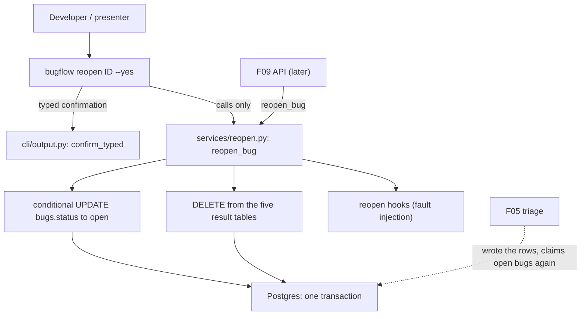

# Spec: F08. Reopen

**Complexity:** simple (one new service module, one CLI command, no new tables, no migrations, no new dependency, no HTTP endpoints).

## 1. Technical Overview

**What.** Add `reopen_bug`, the operation that returns a `processed` or `failed` bug to `open` so the demo can run again on the same bug. In one database transaction it moves the status to `open` and deletes the bug's rows in `component_classifications`, `severity_classifications`, `technical_analyses`, `resolution_plans` and `bug_reports`. Embeddings (`bug_embeddings`) and run history (`runs`, `run_steps`, `run_logs`) are never touched, and the operation creates no run record. A `processing` bug and an already `open` bug are rejected with a state-conflict error; an unknown id is a not-found error; any failure while deleting rolls everything back. The CLI command `bugflow reopen <id> [--yes]` asks for a typed confirmation that names what will be deleted, then prints `Bug <id> reopened`.

**Why.** F05 refuses to triage a `processed` bug ("reopen it first") and writes one row per result table, so the only way to repeat a triage is to remove those rows and reset the status without losing the audit trail. F09 exposes the same operation as `POST /bugs/{id}/reopen`. The deletion and the status change must be one unit so a bug is never `open` with stale results, nor `processed` with half its rows gone.

**Scope.**

Included:
- `reopen_bug(engine, bug_id)` in a new `services/reopen.py`: conditional status update, deletion of the five result tables, an in-transaction hook registry used to inject faults, rollback on any failure, typed errors.
- CLI `reopen` command with the `--yes` flag, the typed confirmation prompt and the abort path, registered in the F03 command registry.
- Test support: integration fixtures that build triaged, failed, processing and open bugs with run history directly through the F02 tables, and reopen hook fixtures.

Excluded:
- The REST route `POST /bugs/{id}/reopen` and its `confirm` body (F09); any UI (F11).
- Deleting runs, steps, logs or embeddings; creating a run for the reopen; re-triaging automatically after reopen.
- Reopening in bulk, reopening an `open` bug as a no-op, undo of a reopen.
- Schema changes, migrations, new environment variables, new dependencies.

**Cross-cutting concerns integrated:** the F03 service conventions (typed errors, fixed English messages without secrets, administrative operations own their transaction), the F03 CLI error mapping and typed-confirmation helper, parameterized statements only (AGENTS.md SQL rule), English-only text.

## 2. Architecture Impact

Affected components:

- `backend/src/bugflow/services/reopen.py` (new)
- `backend/src/bugflow/cli/commands/reopen.py` (new); `backend/src/bugflow/cli/__init__.py` (modified: registry)
- `backend/tests/` (new unit and integration tests; fixtures in `tests/integration/conftest.py` and `tests/tests_helpers.py`)

Data flow: the CLI asks for confirmation (unless `--yes`), builds the engine through the F03 bootstrap and calls `reopen_bug`. The service opens one transaction, runs the conditional status update (which also locks the bug row), deletes the five result tables for that bug, runs the registered hooks, and commits. Any exception before the commit rolls the whole transaction back. The service then reads the bug through `get_bug` and returns it with `status` `open` and no component or severity.

## 3. Technical Decisions

| Decision | Chosen Approach | Alternative Considered | Trade-off |
|----------|----------------|----------------------|-----------|
| Transaction ownership | `reopen_bug(engine, bug_id)` opens, commits and rolls back its own transaction | `reopen_bug(session, bug_id)` that flushes and leaves the commit to the caller | Matches `claim_bug` and the other operations that must be atomic by themselves; F09 and the CLI cannot forget the commit. The PRD writes `reopen_bug(bug_id)`; the engine is the same kind of context argument every service takes |
| Race with a concurrent claim or reopen | First statement is `UPDATE bugs SET status='open' ... WHERE id = :id AND status IN ('processed','failed') RETURNING id` | Read the status, then write | The update takes the row lock, so a concurrent `claim_bug` or second reopen waits for the commit and then sees the new status; no read-then-write window |
| Order inside the transaction | Status update first, then deletions, then hooks, then commit | Deletions first | Locking the bug row first serializes against `claim_bug` before any row is deleted; a failure at any later point rolls back both effects |
| Source statuses | Derived from `ALLOWED_TRANSITIONS` (the statuses that allow a move to `open`) | Hard-coded `('processed','failed')` | One rule table (F03) stays the single source of the lifecycle; a unit test pins the derived set |
| Observable failure during deletion | A hook registry in the service (`register_reopen_hook`), run inside the transaction after the deletions, mirrors the F05 result hooks | Monkeypatching SQLAlchemy, a database trigger, a test-only environment variable | Same proven mechanism as F05; no production code path depends on tests; hooks are empty in production |
| Error text on failure | Fixed message `Reopen of bug <id> failed; nothing was changed` (original error chained, never printed) | Pass the database or hook error text through | Fixed secret-free messages are the F03 convention; the cause stays available in the exception chain for debugging |
| What is deleted | Explicit allowlist of the five ORM models, `DELETE ... WHERE bug_id = :id` per model | Cascade by deleting the bug, or a loop over table names | Hard-coded allowlist satisfies AGENTS.md; run history and embeddings are never reachable by the statements |

### Assumptions and Decisions (review and override as needed)

1. **Scope.** The PRD block has no Core and Full split; the whole feature is in scope (Auto-Accept scope row).
2. **Quality gates** (auto-included, detected from AGENTS.md section 4 and `backend/pyproject.toml`), all run from `backend/`: `uv run ruff format .`, `uv run ruff check .`, `uv run pytest`. No wrapper script exists in `scripts/` that consolidates them. Integration tests run only on request with `uv run pytest -m integration`.
3. **Contract surfaces.** The PRD block has signals for a programmatic interface (`reopen_bug`, consumed by F09 per PRD Section 8) and for the CLI. There is no HTTP, UI, Worker or Event signal in F08 (the API route belongs to F09). Emitted: `Service` and `CLI`. No `Repository` surface is emitted.
4. **Signature.** `reopen_bug(engine, bug_id) -> BugRead`, administrative style (decision table). The returned model is the F03 `BugRead` read after the commit, so it shows `status` `open` and null `component` and `severity`.
5. **Source statuses and rejections.** Allowed from `processed` and `failed` (the statuses whose `ALLOWED_TRANSITIONS` set contains `open`). Rejections raise `StateConflictError` with fixed messages: `Bug <id> is being processed and cannot be reopened` for `processing`, `Bug <id> is already open` for `open`. Unknown id raises `NotFoundError("Bug <id> not found")` (the F03 wording). The status is read only after the conditional update changed zero rows, to choose the message. A rejected reopen changes nothing, including `updated_at`.
6. **Concurrency semantics.** Two simultaneous reopens of one bug have exactly one winner; the loser gets `Bug <id> is already open`. A reopen racing a claim on a `failed` bug ends in one of two valid orders: reopen first (the claim then sees `open` and claims it; results are already gone) or claim first (reopen sees `processing` and is rejected). Neither order can leave results next to an `open` bug.
7. **Updated timestamp.** The status update refreshes `bugs.updated_at` with `clock_timestamp()` like `claim_bug`.
8. **Hooks.** `register_reopen_hook(hook)`, `unregister_reopen_hook(hook)` and `clear_reopen_hooks()`; a hook is `Callable[[Session, int], None]` receiving the open transaction's session and the bug id. Hooks run in registration order after the five deletions and before the commit. A hook exception rolls back and surfaces as the failure error of assumption 9. With no hook registered nothing extra happens. The registry exists for fault injection and for in-transaction observation by tests; production code registers none.
9. **Failure handling.** Any exception raised inside the transaction after it started (a database error during a deletion, a hook error) rolls the transaction back and raises `ReopenFailedError` (a `ServiceError` defined in `services/reopen.py`) with the message `Reopen of bug <id> failed; nothing was changed`, chained to the original. `StateConflictError` and `NotFoundError` are not wrapped. An unreachable database raises `DatabaseUnavailableError` exactly as `claim_bug` does (an `OperationalError` or `InterfaceError` on the first statement).
10. **No run record, no audit row.** Reopen writes nothing to `runs`, `run_steps` or `run_logs` (PRD). One application log line `bug <id> reopened` is written through the `logging` module (not the run log). Old result rows reference the run that produced them; they are deleted, the runs stay.
11. **Confirmation text.** The CLI prompt is exactly `This deletes the results and report of bug <id>. Type 'yes' to continue:` (PRD Experience), read with the F03 `confirm_typed` helper (only the case-insensitive word `yes` confirms; end of input or any other answer means no). Declining prints `Aborted: nothing was deleted` on stdout (the wording of `db reset`, reused for consistency) and exits 1 (PRD Error Handling: exit code 1). The confirmation happens before the service is called, so an unknown or ineligible id still prompts first and is then rejected with the service message (the CLI holds no state logic).
12. **CLI output.** Success prints `Bug <id> reopened` and exits 0. Service errors print the message on stderr and exit 1 through the F03 `guarded` decorator. A missing id is a Typer usage error with exit code 2. The id is a required integer argument.
13. **Result tables.** The deletion allowlist is `ComponentClassification`, `SeverityClassification`, `TechnicalAnalysis`, `ResolutionPlan`, `BugReport` (F02 models). A unit test compares this allowlist with the set of F02 tables that have a `bug_id` primary key and a `run_id` column, so a future result table cannot be forgotten silently. `BugEmbedding` is deliberately excluded.
14. **Test data without F06 or F07.** Integration fixtures create bugs, runs, run steps, run logs, embedding rows and result rows directly through the F02 models (the F03/F05 `add_bug` helper convention), so reopen is verifiable with F05 and its dependency closure only. The report row is created with Markdown and HTML text present, as F07 would leave it, using only F02 columns.
15. **Re-triage after reopen** is verified with the F05 `triage_bug` service and the OpenAI stand-in of F04/F05 (default valid role replies), asserting a new run next to the old one.
16. **Conventions reused:** pytest layout (`tests/unit`, `tests/integration`, `tests/mocks`), the `integration` marker, `TEST_DATABASE_URL`, per-test schema reset fixtures (`initialized_db`), `tests_helpers.py` helpers, child-process CLI tests with a scrubbed environment and `DATABASE_URL` set explicitly, no root `.env` file, `TZ=UTC`. No dependency is added.
17. **Fixture names.** F08 uses its own handles (`triaged-bug`, `neighbor-bug`, `failed-triaged-bug`, `busy-bug`, `untriaged-bug`) so it never redefines the F05 fixtures `open_bug`, `failed_bug`, `processing_bug` and `processed_bug`.

### PRD Traceability

| PRD block | Where it lands in this spec |
|---|---|
| Consumes: F05 result tables, bug status lifecycle | §3 assumptions 5, 13; §6 |
| Provides: `reopen_bug` service (used by F09) | §5.1 |
| Capabilities: one transaction, kept history, allowed statuses, no run record, CLI | §3 decisions and assumptions 4 to 12; §5 |
| Experience: prompt and result line | §3 assumptions 11, 12; §5.2 |
| Error Handling: unconfirmed, processing, failure during deletion, unknown id | §3 assumptions 5, 9, 11; §5.3 |

## 4. Component Overview

**Backend (`backend/`)**

| File Path | New/Modified | Purpose | Key Responsibilities |
|-----------|--------------|---------|---------------------|
| `backend/src/bugflow/services/reopen.py` | New | Reopen service | `reopen_bug`, hook registry, `ReopenFailedError`, result-table allowlist |
| `backend/src/bugflow/cli/commands/reopen.py` | New | `reopen` command | Argument and `--yes` parsing, typed confirmation, abort path, result line |
| `backend/src/bugflow/cli/__init__.py` | Modified | Registry | Add the module to `COMMAND_MODULES` (shared file: F07 adds its own module on the same line) |

**Tests (`backend/tests/`)**

| File Path | New/Modified | Purpose |
|-----------|--------------|---------|
| `tests/tests_helpers.py` | Modified | Helpers that add runs, steps, logs, embedding rows and result rows for a bug, and snapshot the tables reopen must keep |
| `tests/integration/conftest.py` | Modified | Fixtures for the F08 handles and reopen hooks; autouse hook cleanup |
| `tests/unit/test_reopen_rules.py` | New | Allowlist, derived statuses, messages, hook registry |
| `tests/unit/test_cli_reopen.py` | New | Command behavior with a fake service |
| `tests/integration/test_reopen.py` | New | Successful reopen and what is kept |
| `tests/integration/test_reopen_rejections.py` | New | Rejected states and unknown id |
| `tests/integration/test_reopen_atomic.py` | New | Rollback and in-transaction visibility |
| `tests/integration/test_reopen_concurrency.py` | New | Simultaneous reopens |
| `tests/integration/test_reopen_retriage.py` | New | Triage after reopen with the stand-in |
| `tests/integration/test_cli_reopen_process.py` | New | The CLI as a child process |

**Database:** no migrations. Existing F02 tables are used as created.

## 5. Interface Contracts

F08 exposes no HTTP endpoints. Its interfaces are a Python function (consumed by F09) and the CLI.

### 5.1 Reopen service (`bugflow.services.reopen`)

| Function | Output | Behavior |
|---|---|---|
| `reopen_bug(engine, bug_id)` | `BugRead` | One transaction: conditional status update to `open`, deletion of the five result tables for the bug, hooks, commit. The returned bug has status `open` and null `component` and `severity` |
| `register_reopen_hook(hook)` / `unregister_reopen_hook(hook)` / `clear_reopen_hooks()` | none | Hook registry of assumption 8 |

Error table:

| Situation | Result |
|---|---|
| Bug `processed` or `failed` | Reopened |
| Bug `processing` | `StateConflictError("Bug <id> is being processed and cannot be reopened")`, nothing changed |
| Bug `open` | `StateConflictError("Bug <id> is already open")`, nothing changed |
| Unknown id | `NotFoundError("Bug <id> not found")` |
| Failure or hook error during the transaction | Rollback; `ReopenFailedError("Reopen of bug <id> failed; nothing was changed")` |
| Database unreachable | `DatabaseUnavailableError` |

### 5.2 CLI

| Command | Output |
|---|---|
| `bugflow reopen 3` (typed `yes`) | stdout: `This deletes the results and report of bug 3. Type 'yes' to continue:` then `Bug 3 reopened`; exit 0 |
| `bugflow reopen 3 --yes` | `Bug 3 reopened`; exit 0, no prompt |
| `bugflow reopen 3` (any other answer or closed input) | `Aborted: nothing was deleted`; exit 1; nothing changed |
| `bugflow reopen 3 --yes` on a `processing` bug | stderr `Bug 3 is being processed and cannot be reopened`; exit 1 |
| `bugflow reopen 3 --yes` on an `open` bug | stderr `Bug 3 is already open`; exit 1 |
| `bugflow reopen 999999 --yes` | stderr `Bug 999999 not found`; exit 1 |
| `bugflow reopen` | Usage error, exit 2 |
| `bugflow --help` | Lists `reopen` with a one-line English description |

### 5.3 Error handling summary

| PRD error | Handled by |
|---|---|
| Unconfirmed reopen: nothing deleted, exit 1 | CLI abort path (assumption 11) |
| `processing` bug rejected, data untouched | Conditional update matches no row (assumption 5) |
| Failure during deletion rolls back | Single transaction (assumption 9) |
| Unknown bug id | `NotFoundError` (assumption 5) |

## 6. Data Model

F08 changes no schema.

| Table | Effect of `reopen_bug` |
|---|---|
| `bugs` | `status` set to `open`, `updated_at` refreshed; only for `processed` and `failed` bugs |
| `component_classifications`, `severity_classifications`, `technical_analyses`, `resolution_plans`, `bug_reports` | Rows with the bug's id deleted (primary key is `bug_id`, so at most one row each) |
| `bug_embeddings` | Untouched |
| `runs`, `run_steps`, `run_logs` | Untouched; no row added. Deleted result rows were the only rows pointing at their run through `run_id` |

Statement shapes: one `UPDATE bugs ... RETURNING id` with a status allowlist from `ALLOWED_TRANSITIONS`, then one `DELETE` per allowlisted ORM model filtered by `bug_id`, all with bound parameters.

## 7. Testing Strategy

Unit tests need no database. Integration tests (marker `integration`, run only with `uv run pytest -m integration`) use `TEST_DATABASE_URL` through the existing fixtures; the re-triage test also starts the stand-in server fixture.

| Test File | Test Type | Target | Coverage Goal |
|-----------|-----------|--------|---------------|
| `tests/unit/test_reopen_rules.py` | Unit | `services.reopen` | 100% of non-database logic |
| `tests/unit/test_cli_reopen.py` | Unit (`CliRunner`) | `cli.commands.reopen` | 95% |
| `tests/integration/test_reopen.py` | Integration | success paths | all branches |
| `tests/integration/test_reopen_rejections.py` | Integration | rejections | all branches |
| `tests/integration/test_reopen_atomic.py` | Integration | transaction | all branches |
| `tests/integration/test_reopen_concurrency.py` | Integration | race | exactly one winner |
| `tests/integration/test_reopen_retriage.py` | Integration | reopen then triage | main path |
| `tests/integration/test_cli_reopen_process.py` | Integration (child process) | the CLI | n/a |

**`test_reopen_rules.py`**

| Test Function | Description | Assertions |
|---------------|-------------|------------|
| `test_deleted_tables_are_the_five_result_tables` | Compare the allowlist with the F02 metadata | Equals the tables with a `bug_id` primary key and a `run_id` column; excludes `bug_embeddings` |
| `test_source_statuses_derive_from_the_transition_table` | Derive from `ALLOWED_TRANSITIONS` | Exactly `processed` and `failed` |
| `test_rejection_messages_are_fixed_text` | Build the error texts | Exact strings of §5.1; no placeholder left unformatted |
| `test_hook_registry_order_and_clear` | Register, unregister, clear | Registration order kept; clear empties; unregister of an unknown hook is a no-op |
| `test_statements_use_only_allowlisted_models` | Inspect the module | The deletions iterate the allowlist only; no string-built SQL |

**`test_cli_reopen.py`** (service faked): `--yes` skips the prompt and prints `Bug 3 reopened`; typed `yes` (any case) confirms and the prompt text is exact; `no`, empty answer and closed input abort with `Aborted: nothing was deleted`, exit 1, and never call the service; a `StateConflictError` and a `NotFoundError` print their message on stderr with exit 1; a missing id is exit 2; importing the module does not import `openai` or `crewai`.

**`test_reopen.py`**: reopening `triaged-bug` removes the five rows, returns status `open` with null component and severity, refreshes `updated_at`; run, step, log and embedding rows are identical before and after (snapshot comparison); the run count does not change; `neighbor-bug` keeps all of its rows; reopening `failed-triaged-bug` returns `open` and keeps its history.

**`test_reopen_rejections.py`**: `busy-bug` and `untriaged-bug` raise the exact messages and every table, including `updated_at`, is unchanged; unknown id raises the not-found message; a rejected call opens no run.

**`test_reopen_atomic.py`**: a failing hook leaves status and all five rows exactly as before with `ReopenFailedError`; a recording hook sees status `open` and zero result rows inside the transaction while a second connection still sees `processed` and one row each; after the commit the second connection sees the new state; hooks run in registration order; a database error forced by a hook that executes an invalid statement is also rolled back.

**`test_reopen_concurrency.py`**: two threads reopen `triaged-bug` together (barrier): exactly one returns, the other raises `Bug <id> is already open`, result tables are empty, status is `open`.

**`test_reopen_retriage.py`**: after reopening `triaged-bug`, `triage_bug` with the stand-in returns `processed`, the five rows exist again with the new run's id, the old run and its five steps are unchanged, and two `triage` runs now exist for the bug.

**`test_cli_reopen_process.py`** (child process, scrubbed environment, `DATABASE_URL` explicit): `--help` lists `reopen`; typed `yes` prompt and result line; `--yes`; `no` answer; closed standard input; `busy-bug`; `untriaged-bug`; unknown id; `failed-triaged-bug`; missing id; database observations after each command; no root `.env` file exists.
